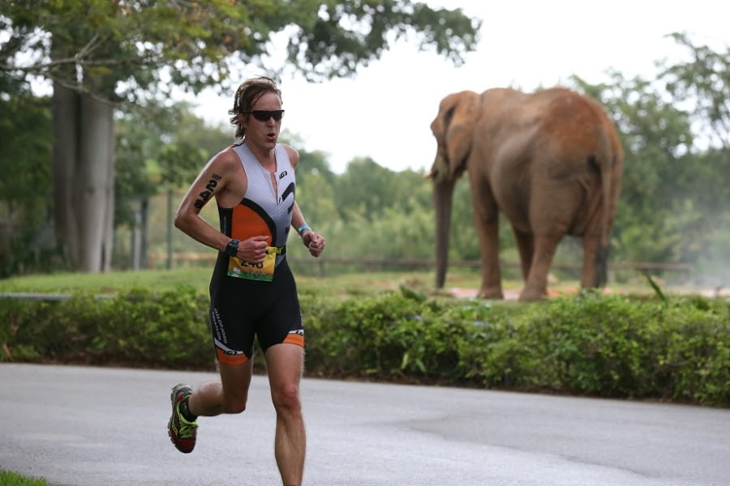

# Race Report Florida Tri 2015
Nei, harru sett på makan. Alle tilfeldigheters mor ville det sånn at jeg skulle til Miami samtidig som VM i dyrehagetriatlon ble arrangert på samme sted. Og harru sett på makan igjen, jammen kan jeg ikke fra nå av titulere meg regjerende europamester i dyrehagetriatlon. Her er en liten fortelling om hvordan det gikk til.

Etter Ironman Mallorca i september var jeg ganske sikker på at min triatlonkarriere var over. Og det var den også i 7 uker. Men da jeg fant nettsiden til “Miami Man Triathlon” så kunne jeg ikke dy meg. Jeg er (sånn noenlunde) mann, jeg skulle til Miami og jeg visste hva triatlon var. Jeg meldte meg på sporenstreks. Det eneste jeg stusset over var at det var to distanser å velge mellom; halv ironman og “international”. Aldri hørt om international, det virka som om den var ca halvparten av en halv. Trodde de at internasjonale deltagere ikke var like tøffe som de nasjonale, kanskje? Jeg lot meg ikke lure og meldte meg på den halve jernmannen. Ikke noe puslete “international” her, nei.

Og etter alt for lite trening etter Mallorca var det klart for “Miami Man Triathlon” en søndag i november. Jeg hadde angret veldig de siste par ukene, for det viste seg at denne konkurransen ikke akkurat var egnet for en mann med zoofobi. Store deler av konkurransen skulle nemlig foregå inne i en dyrehage! Og som om ikke det var nok, så skulle syklingen foregå ut mot Everglades. Og vi vet alle hva som skjuler seg i sumpene og på hvert gatehjørne i Everglades, ikke sant? Nettopp, alligatorer. Og sikkert et og annet sumpuhyre som intet menneske har møtt og overlevd møtet med (hvilket jo langt på vei er et bevis på at de faktisk finnes).

Zoofobi er ikke noe man tuller med. For min del går det på frykt for alt fra edderkopper til hester. Og de dukker med jevne mellomrom opp i kjelleren hjemme. Edderkopper, altså. Hester har jeg ennå ikke sett, men det er jo ikke et bevis på at de ikke løper og gjemmer seg bak vedstabelen når jeg slår på lyset. Jeg har aldri turt å kikke bak den vedstabelen. 

Edderkoppene i vår kjeller er så store at man kan høre dem gå over gulvet. Min kone påstår at det bare er tull, men jeg kontrer med å si at jeg har usedvanlig god hørsel og at Luftforsvaret i sin tid prøvde å overtale meg til å bli jagerpilot ene og alene pga. denne utmerkede hørselen. Jeg takket dog nei siden jeg faktisk har sett Top Gun og det er en film om heltemod og kameratskap, men du finner alltid en usedvanlig ufyselig fyr som heter Iceman og som gjør livet som jagerpilot til alt annet enn en dans på roser. Og da himler min kone med øynene og later som om hun ikke hører mer og jeg setter henne sjakk matt ved å påpeke at når hun ikke hører hva jeg sier nå så er det kanskje ikke så rart at hun heller ikke hører monsteredderkoppene som tramper rundt på gulvet vårt.

Så jeg gikk og grua meg ganske mye før jeg skulle ut på en halv ironman i zoologiske omgivelser. Helt unødvendig, skulle det vise seg.

Når man skal reise til Florida så har jeg hørt at det er lurt å ta med solkrem, badebukser og muligens en t-skjorte. Sett i ettertid burde jeg heller ha pakket sydvest, gummistøvler og lynavleder. For natten før konkurransen våknet jeg sånn i 4-tiden av at det bøtta ned og at lynet slo ned i senga mi. Heldigvis var den jorda, så det gikk greit, men jeg undret litt på hvor trygt det var å svømme og sykle på de flate slettene innover mot Everglades når lynet sprutet fra himmelen. Greit nok med god hjulgummi, men høyeste punktet ville uansett være hodet.

Jeg led kvaler og funderte på å krype enda lenger inn under dyna, men etterhvert roet de verste lynnedslagene seg litt. Det sammenfattes kanskje best i arrangørens egen beskrivelse: “At 4:00 a.m. our crew was dodging lightning bolts inside the park. It seemed we were in serious jeopardy of not having a race, but it turned out to be a great day for triathlon“.

Jeg kom meg etterhvert avgårde mot start med en ivrig Uber-sjåfør som ikke kunne skjønne hvorfor jeg ikke tok veksthormoner. Alle på hans treningsstudio brukte nemlig det og han kunne ikke se noe annet enn fordeler. Jeg var for trøtt til å motsi ham, men da han ivrig trakk fram noen mystiske preparater fra hanskerommet takket jeg høflig nei. Så ivrig var han at han missa en avkjørsel og jeg endte opp med å bli satt av på et mørkt gatehjørne et godt stykke fra der jeg egentlig skulle være. Kanskje var det en straff for at jeg ikke hadde takket ja til tilbudet hans. Kanskje var det et forvarsel om hva som skulle komme. Eller kanskje var det bare uflaks. Det skal man nemlig ikke se bort ifra. Alt har ikke en dypere mening, iblant skjer ting helt av seg selv, uten noen som helst sammenheng og uten at noens karma blir påvirket. Jeg trodde mest på det siste og fant riktig retning i regnet. Jeg havnet på en trang sti innover i en park der det var helt umulig å holde seg tørr på beina. Så jeg endte opp med å ta av meg skoa som skulle brukes til løping og vandret barbeint i regnet og nynnet lykkelig på Olle Adolphsons fine vise “Trubbel”:

Nu lyser ängarna av sommarns alla blommor
Nu surrar bin, och fåglar sjunger överallt
Nu stryker vinden genom trädens höga kronor
men i min trädgård är det visset, mörkt och kallt.

Egentlig en trist sang, men med en glad melodi og jeg så det absurde i situasjonen. Jeg blir alltid litt glad av det absurde, så humøret steg for hvert skritt og for hver regndråpe. Jeg begynte å glede meg til det som skulle komme og all tvil var blåst bort. Jeg fant startområdet, rigget meg opp i skiftesonen og tuslet bort mot svømmestarten ved en liten innsjø i Miami Zoo.

Vi har jo som kjent ikke noe annet å frykte enn frykten selv, men at vi i det hele tatt skulle svømme i den sjøen syntes å være så langt fra sunn fornuft som man kunne komme. Det var så mange skilt som advarte om at det ikke var lov å svømme der og at det var forbundet med “Danger!” å bare stikke tåa uti. Det var en smule uklart hva denne faren var, men fantasien løp løpsk. Jeg tenkte hardt på “De dødes tjern” og det var ikke grenser for hva jeg forestilte meg var skjult i det bunnløse mørket i denne tilsynelatende rolige innsjøen. 

Man kan sikkert si mye rart om amerikanere, men positive og glade er de! De er såpass positive at de delte ut finisher-trøyene før konkurransen startet. Og på de trøyene stod det like godt skrevet “I survived the Zoo”. Så det burde jo gi en indikasjon på farlighetsgraden her. Det handlet altså om å overleve. Noe jeg mistenkte kom til å bli lettere sagt enn gjort.

Men så feil kan man altså ta. Ting er ikke så ille når man først har kommet i gang. Svømmingen var fin, den. Vi startet i aldersgrupper, med 5 minutters mellomrom, så ikke noe mas var det heller. Med totalt 300+ halv IM-deltagere fordelt ut over ca. en halvtime ble det veldig rolig og fint. Vannet var såpass varmt at våtdrakt ikke var tillatt, men ingen syntes å bry seg noe særlig om det. Rart det der, hvor påvirket man blir av andres holdning. Før IM Mallorca var det knapt snakk om noe annet enn om det ble med eller uten våtdrakt og mine forberedelser ble også preget av det. Hvordan skulle det gå om vi ikke kunne svømme med våtdrakt? Mens her i Florida ble det hele møtt med et skuldertrekk og dermed bekymret ikke jeg meg noe særlig over det heller. 

Et par runder i en ikke altfor skummel dam og ferdig med det. Uvant å ikke måtte dra av seg våtdrakta i skiftesonen, men jeg klaga ikke. Jeg stålsatte meg heller for hva som måtte komme av beist og uhyrer på de lange, flate veiene ut mot Everglades. For sikkerhets skyld hadde jeg putta et par rå biffer i lomma på ryggen for å bruke som avledningsmanøver om beista ble for nærgående. I tillegg hadde jeg blitt fortalt av en kollega at man skulle bevege seg i sikksakkmønster for å forvirre eventuelle forfølgende alligatorer. Det liker de nemlig ikke, de blir svimle og har lyst til å gå og legge seg og ta seg en lur. Jeg syntes det hørtes troverdig ut og la avgårde i sikksakk da jeg nærmet meg sumpene. Det må jeg si funket utmerket, for jeg så ingen alligatorer, men jeg var ikke spesielt høy i hjelmen og ble rimelig glad da jeg etter sånn 5 mil ble stoppa av en sinna Race Marshal på motorsykkel som spurte hva i huleste jeg holdt på med. Jeg mumla noe om “criss-crossing the alligators” og viste meget pedagogisk med armene hvordan alligatoren da ville bli svimmel og ta seg en lur. Det virket som om det overbeviste ham og jeg følte vi hadde funnet en god tone da han plutselig pekte på rygglomma mi og lurte på “what’s that in your pocket there!?”. Jeg sa som sant var at “I am very happy to see you, but I have to save that one for the alligators”. Og da var jeg liksom ikke kompisen hans mer og han dro avgårde fortere enn jeg klarte å si biff. Snakk om usympatisk type.

Jeg så heldigvis ikke noen skumle dyr der ute i sumpene, så tankene fikk vandre fritt. Min venstre hjernehalvdel var meget fornøyd med startnummeret jeg tilfeldigvis hadde fått; 248. En vakker geometrisk rekke med konstant = 2 og uendelig potensiale. Å sykle ørten mil kan jo ofte bli litt ensformig, men tanken på 248 gjorde dagen litt lysere. Jeg utvidet rekken utallige ganger, men kom egentlig aldri lenger enn 2^16 før jeg begynte å nærme meg sivilisasjonen igjen.

Et par mil før skiftesonen tenkte jeg at det var lurt å kvitte seg med den biffen, for jeg hadde ikke så lyst til å løpe rundt med den blant ville dyr i en dyrehage. Så jeg stoppa sykkelen utenfor et hus og kasta den fra meg i en sånn søppelkassa de har i USA, med en sånn arm som står opp når den kan tømmes. Der har vi noe å lære, for de er veldig rene og pene alle de søppelkassene og jeg tror de tømmes umiddelbart når den armen går opp. Det eneste jeg har å utsette på dem er at de er litt små.

I skiftesonen var jeg rask som lynet som vanlig og husket til og med å ta av meg hjelmen. La ut i 4:00-tempo, noe jeg klarte å holde i ca. 125 meter. Akkurat lenge nok til at det gikk et sus gjennom publikum da de innså at her kommer vordende europamester i dyrehagetriatlon.

Etter første sving var det hverken mer publikum eller fart i beina og jeg sank sammen til et labert tempo, men åpenbart ikke så labert som resten av gjengen ute i løypene og jeg plukka løper etter løper. Det er jo alltid inspirerende, men det overskygget ikke frykten for det som nå skulle komme. Jeg hadde unnsluppet sumpene, men nå var jeg på god vei inn et sted der de med vilje hadde samla en masse ville dyr. Uvisst av hvilken grunn. Hva skal det være godt for?

Nå er jeg som sagt ikke spesielt glad i dyr. Ikke har jeg satt meg så veldig inn i forskjellige dyrearter heller. Det begrenser seg stort sett til at jeg vet hva en hest er. Og så er alt annet avarter av det. Det gjelder å forenkle det man kan her i livet. Så sånn sett var det ikke overraskende at løpingen inneholdt å besøke både en meget stor hest med snabel, en litt mindre hest med striper og en merkelig liten hest med meget korte bein og skall på ryggen. Kan det ha vært en islandshest? Litt underholdning var det. Og ikke var det skummelt heller. Sikkerhetsvakter med store køller stod mellom oss og de ville dyra. Som om en kølle hadde hatt en sjanse mot en snabel. Noen ganger er de i overkant naive, disse transatlanterne.

Men etter godt over 5 timer var det plutselig over. Jeg spurta ned Richard Cardosi på oppløpet og kom i mål på en meget respektabel 5. plass i min klasse. Synd for deg det, Cardosi. Det var nemlig bare premie til de 5 første i hver klasse. Og hadde ikke han derre Race Marshalen stoppa meg et par minutter uti løypa hadde jeg jammen tatt James Gassenheimer også. Og Gassenheimer er ingen smågutt har det blitt meg fortalt. Det går gjetord om hans bedrifter både på og utenfor triatlonbanen. 

Så det var med en tåre i øyekroken og halvråttent okseblod rennende ned fra rygglomma jeg segnet om i målområdet med visshet om at ingen europeer var blant de 36 som hadde passert mållinjen før meg. Jeg kunne titulere meg europamester i dyrehagetriatlon. 

Og verden var med ett et godt sted å være. I survived the Zoo.

