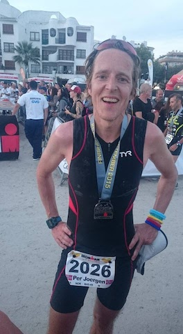

# Ironman Mallorca 2015
Jeg har et ambivalent forhold til fulle Ironman-distanser. Det er fantastisk morsomt, men samtidig utmattende på så mange plan. Jeg gjorde min første i 2007 og ble fryktelig lei etter det. Fant igjen piffen og gjorde et par til i 2012, men så gikk lufta ut av ballongen igjen. I fjor høst begynte jeg nok en gang å lese race reports og kunne ikke fatte at jeg ikke holdt på med dette lenger. Og da min kone ymtet frampå at det hadde vært fint å reise på høstferie og jeg oppdaget at Ironman Mallorca var første helg i høstferien 2015, var det bare å bestille. Konkurranse på meg, etterfulgt av en uke all inclusive og Lollo og Bernie. Pose, sekk og julaften på en gang. 

En av fordelene ved å ha vært med noen år er jo at jeg stort sett har det utstyret jeg trenger. Så bortsett fra nye hjul (17 000), ny GPS-klokke (4 000), ny våtdrakt (3 000) og div (11 000) har jeg nesten ikke brukt penger på dette i år. I tillegg hadde jeg griseflaks da en kompis var i USA og kunne kjøpe med seg nye bremseklosser til sterkt rabatterte priser. Og så skal man heller ikke stikke under en stol at det nesten er gratis å melde seg på disse konkurransene. 5 000 kroner i påmeldingsavgift snyter man jo lett ut av nesa på en godværsdag. Så alt i alt må jeg si at dette har vært en sunn økonomisk investering som med relativt høy sannsynlighet vil gi betydelig avkastning på sikt.

I følge Strava-loggen syklet jeg årets første langturer i påska. Våryr og full av ambisjoner husker jeg at jeg drømte om ære, berømmelse og kvalifisering til Hawaii. Planene var lagt for en lengre famileferie på andre siden av jordkloden da virkeligheten innhentet meg og jeg ble forbisyklet av en lite sympatisk mann på terrengsykkel. Jeg godt planta i tempobøylen og han med krumbøyd nakke og ondskap i blikket. Jeg gjorde selvsagt det som enhver fornuftig person i min situasjon ville gjort; jeg la meg på hjul og da jeg merket at han mistet litt av farten, la jeg meg ut og syklet elegant forbi. Samtidig som jeg fisket opp drikkeflaska for å understreke hvor lite det kosta meg. Rundt neste sving var det heldigvis en busslomme hvor jeg avmålt kunne stoppe og gjespe litt for å vise hvem som var sjefen. Rent fysiologisk er det ikke så lett å gjespe når man er tett oppunder makspuls, men vil man nok så får man det til. Tenker jeg vant den duellen ganske overlegent.

Og sånn fortsatte det. Utover våren og sommeren fikk jeg selvsagt trent litt mindre enn jeg ønsket og jeg skjønte at hver treningstime var hellig. Skulle dette gå, måtte jeg benytte enhver anledning til å bade i min egen uovervinnelighet. En dag i mai foreslo jeg for min kone at vi kanskje burde trekke barna ut av skolen så vi minimerte risikoen for at jeg skulle bli smittet av ubehagelige sykdommer og dermed ikke kunne få trent. Det var lite gehør å få, selv om jeg kunne referere til flere nettsider som fortalte om idrettsmenn og kvinner som med stort hell hadde gjennomført samme regime i tiden før viktige mesterskap. Jeg mumlet noe om at jeg syntes dette var i overkant egoistisk fra hennes side, men dette var det heller ikke noe særlig gehør for.

Så da gjør man det beste ut av situasjonen. Sykler i grålysningen og løper den siste mila på vei til hytta. Øver flytestilling i badekaret og blar i en gammel utgave av “Best når det gjelder”. Utover sommeren deltok jeg ganske flittig på Bogstad treningstri, og jeg nærmet meg med jevne skritt det (relativt beskjedne) nivået jeg var i 2007 og 2012. Helt frem nådde jeg aldri, men trøstet meg med at det var alderen som tok ut sin rett.

Avreisedagen kom plutselig. Jeg følte meg ikke klar i det hele tatt. Dro ned to dager før konkurransen for å rekke alt det obligatoriske. Fryktelig mye obligatorisk og regler med sånne store konkurranser, spør du meg. Men det må kanskje til når det er over 2 000 ivrige mennesker som står på startstreken samtidig. For på startstreken kom jeg meg til slutt. Det var en strålende dag, med ca 24 grader i vannet og tillatt våtdrakt. Proffsa starta først, alle uten våtdrakt av en eller annen grunn. Deretter var det puljestart med hjelp av selvseeding. Tok ca en halvtime å få alle over startstreken, og så vidt jeg kunne bedømme så gikk det ganske så smertefritt. Jeg hadde stilt meg i 1:00-1:15-gruppa der jeg la meg langt bak. Lite stress, sola gikk opp og startskuddet gikk.

Det finnes en helt spesiell stillhet i møtet med vann og det føltes godt å endelig komme i gang. Det var færre spisse albuer enn jeg hadde fryktet, men helt uten drama var det ikke. Noen slo av meg svømmebrillene, men det gjorde ingenting. Jeg smilte litt for meg selv og tenkte at det er sånn det skal være. Hadde lyst til å gi vedkommende en god klem, øse av min enorme mengde kjærlighet og si at alt kom til å gå bra. Men visse grenser får det være. Jeg nøyde meg med å ikke kjøre albuen tilbake i tinningen hans.

Opp av vannet på 1:10 etter en særdeles fin start på dagen. Ut på sykkel i en fei og der var det trangt så det holdt. Det var vanskelig å holde 10 meter avstand og man trenger ikke være rakettforsker for å skjønne at det er fysisk umulig å holde 10 meter avstand mellom enhver av de 2 000 deltagerne. Det bedret seg allikevel gradvis etterhvert som det ble større strekk i feltet. Eventuelt fordi jeg falt lenger og lenger bak. For første halvdel gikk finfint, men derfra og til mål gikk det ikke finfint i det hele tatt. Jeg hadde spist energibarer og drukket energidrikke til den store gullmedalje og det likte tydeligvis ikke magen så godt. Den protesterte og fortalte resten av kroppen at den skulle protestere også. Det begynte å gå saaakte og da vi etter ca 10 mil skulle over verdens høyeste fjell, var det nesten full stopp. For ikke visste jeg at verdens høyeste fjell ligger på Mallorca. Men det gjør det faktisk. Det er 10 km rett opp! Altså 1 152 m høyere enn Mount Everest for den som bryr seg om slikt. Jeg funderte på hvordan man kan ha gått glipp av en slik detalj. Geografibøkene må jo åpenbart skrives om og jeg bestemte meg for å skrive et brev om jeg kom i mål. Jeg var litt usikker på hvem som skulle motta brevet, men etter litt fundering kom jeg på at National Geographic burde være en egnet mottaker av slik informasjon. De bestemmer sikkert på dette området og man trenger fortsatt ikke være rakettforsker for å skjønne at 10 000 er større enn 8 848. Det burde til og med de forstå om jeg forklarte det på en pedagogisk og lettforståelig måte.

Jeg rullet og trillet nærmere og nærmere mot T2 og etter 6:12 var jeg framme. Jeg forbannet magen og verdens høyeste fjell, for jeg hadde hatt som mål å komme godt under 6 timer.

Min sterkeste disiplin i triatlon er utvilsomt T2. Der fyker jeg forbi de andre på sporet av den tapte tid. Og jeg har hørt at man skal trene på det man er god på, så jeg har trent masse T2 i sommer. Jeg har eksperimentert med å både sykle med joggesko og løpe med hjelm. Det har vist seg å hjelpe; jeg kniper noen sekunder i T2 på det. Dessuten er det ikke så dumt å løpe med hjelm som man tror. Plutselig faller man og da er det ikke lett å vite hva som skjer. Helsetjenester i utlandet skal man visstnok også være forsiktig med. Det er derfor ikke overraskende at jeg lot hjelmen være på i hele T2 og på god vei ut på løpinga. Derimot var det en strek i regninga at en funksjonær stoppet meg og påpekte at jeg hadde på meg hjelm. Skjønte han ingenting? Her stod det om sekunder og jeg prøvde å vri meg unna, men han insisterte på at jeg hadde på meg hjelm. Jeg ropte noe sånn som “tell me something I don’t know!” og var fristet til å legge til “you bastard”, men klarte å beherske meg. Heldgivis. For ut av T2 med hjelm var det tydeligvis ikke mulig å komme. Jeg vurderte en kort stund å kaste den i bakken foran den onde funksjonæren og rope såret “ARE YOU HAPPY NOW!?”. Og kanskje legge til “you bastard” der også. Men atter en gang ble den fornuftige delen av hjernen aktivert og jeg gikk hele veien tilbake for å legge fra meg den fordømte hjelmen. Jeg følte meg urettferdig behandlet og såret og verdens undergang var nær. Istedenfor å knipe sekunder, gikk dyrbar tid til spille. Og jeg visste hvem sin skyld det var. Så på vei ut av T2 for andre gang, denne gang uten hjelm, koblet den fornuftige delen av hjernen endelig ut og jeg endte opp med å rekke tunge til den onde funksjonæren. Really. Det føltes godt i ett sekund, men resten av konkurransen angret jeg som en hund og bestemte meg for å prøve å finne ham etter målgang for å skvære opp. Kanskje jeg kunne by ham på en restitusjonsdrikk eller to. Jeg bestemte meg for at han het Ricardo og jeg kunne introdusere ham til familien og vi kunne bli godt kjent med ham og hans familie. Kanskje kunne vi bli bestevenner og vi kunne feriere i familiens eksklusive villa ved sjøen på Mallorca neste sommer. Jeg ble i godt humør av alle disse tankene, men magen lot seg ikke lure av det. Den var fortsatt gretten og det var ikke mulig å løpe. Så fra å trille og rulle gikk jeg over til å spasere og spankulere. 

Hele familien stod og ventet på meg rett borti gata og det føltes en smule skamfullt å være ute å spasere og spankulere mens de andre rundt meg løp i verdensrekordtempo. Det var allikevel utrolig hyggelig å se dem og jeg fikk oppdateringer på hvilken is som foreløpig var den beste, hvor mange trappetrinn det var opp til 5. etasje og hvor store Lollo og Bernie faktisk var. Det var umulig å ikke bli litt gladere inni seg av det og jeg vurderte en stund å fortelle dem om Ricardo og at vi sikkert skulle reise tilbake neste år og låne det fine huset deres, men jeg klarte ikke å formulere noen fornuftige setninger foruten “Grynt!” og “Snøft!”. I den grad det er mulig å tolke noe fornuftig ut fra det. Etterhvert fant barna ut at det var ny is å teste og jeg ble overlatt til meg selv igjen. Litt løpende innimellom, ihvertfall så lenge magen sa at det var greit.

Det skal spaseres/løpes flere runder på Mallorca. Ca. 4, om jeg husker rett. Og så får man en strikk hver gang man passerer et kontrollpunkt. Jeg hadde spasert, spankulert og løpt 3 runder da jeg oppdaget at jeg manglet en strikk. Hvor var den røde strikken min!? Den var da nettopp her!? Jeg skjønte fort at noen hadde rappet den og da en lumsk fyr som lignet mistenkelig på Ricardo passerte meg med en rød strikk rundt håndleddet skjønte jeg lunta. Det var broren til Ricardo. De var ute etter meg, det var en ting som var sikkert. Jeg løp etter ham og ropte “YOU HAVE TAKEN MY RED STRICK!”. Han tittet forundret på meg samtidig som det virket som om han tviholdt på strikken sin. Jeg ville ikke gi meg uten kamp og la på sprang etter ham. Det virket som om det skremte ham, for han satte opp et veldig tempo og plutselig var han 20 meter foran meg. Åpenbart hadde han meget dårlig samvittighet for å ha stjålet strikken min. Jeg innså raskt at jeg bare måtte la strikk være strikk og ta en ekstra runde, men jeg var fortsatt innenfor hørevidde, så jeg ville ikke la ham slippe helt ustraffet unna. Han skulle vite at jeg var på sporet av ham. Jeg stoppet derfor opp og ropte så høyt jeg kunne “YOU AND YOUR BROTHER ARE EVIL PEOPLE!”. Publikum var helt tydelig på min side, det kunne jeg se. De ristet på hodet og så triste ut. Dessuten satte strikktyven ekstra fart, bare for å understreke at han visste han var avslørt. 

Jeg er jo en løsningsorientert og tilpasningsdyktig type, men jeg bestemte meg allikevel for at nok et klagebrev var på sin plass. Ricardo og broren hans burde straffes for sin usympatiske væremåte. Jeg funderte lenge på hvem mottaker av brevet skulle være og kom til slutt fram til at fellesnevneren for Spania og Norge er at vi er med i Schengen. Og Schengen er opptatt av at alle skal være venner og ikke være sinte på hverandre så vidt jeg har forstått. Jeg regnet med at de ville være svært takknemlige for å motta en fortelling om en Schengen-borgers opplevelser i et annet Schengen-land, for sånn kan vi nemlig ikke ha det; at Schengen-borgere blir dårlig behandlet av andre Schengen-borgere! Ikke av noen, for den saks skyld. 

I mellomtiden viste det seg at jeg hadde begynt å spasere og spankulere igjen. Det hadde jeg jammen ikke merket der jeg gikk og forbannet både det ene og det andre. Jeg hadde vel egentlig gitt opp. Målet om å komme under 11 timer var oppgitt for lengst. Men selv om jeg ikke er rakettforsker så klarte jeg å regne meg fram til at 12 timer var innen rekkevidde om jeg bare anstrengte meg litt. På tross av at jeg måtte ta en runde ekstra. Så jeg gjorde det da. Anstrengte meg litt. Og plutselig var jeg i mål på 11:57. Det snodige var at klokka viste 42 km, så jammen var det ikke krøll med GPS-systemet også! Jeg hadde jo beviselig beveget meg minst 10 km ekstra, så her fant jeg ut at flere brev måtte skrives. GPS-myndighetene skulle få høre dette. Snakk om dårlig system som har en feilmargin på mer enn 20 %.

Det går rykter om at lykken er smertens opphør. I mitt tilfelle stemte ikke det i det hele tatt. Jeg gikk i mål uten noe som helst drama, som om det var noe jeg gjorde hver dag, som om jeg akkurat hadde betalt i kassa på Kiwi og skulle ta med meg handleposen med nypesuppe og blomkål hjem. Jeg opplevde en viss lettelse over at det hele var over, men den helt store gleden som jeg så andre oppleve uteble. Jeg tenkte mest at nå er jeg ferdig med det her. For godt. Aldri mer. Jeg må finne en bedre balanse i livet. For dette her gidder jeg ikke mer. Så mye tid, så mange forsakelser. Og så er dette klimaks? Ikke verdt det. Ganger hundre.

Og den følelsen har holdt seg siden. Ikke verdt det. Ganger femti. Og jeg tenkte på Per Fugellis kronikk i Aftenposten jeg leste på flyet ner. Han siterer en ikke helt fjern fyr som heter Sartre: “Jeg har ett mål med mitt liv: Å få være et vanlig menneske. Jeg streber etter å være hvem som helst”. Og jeg slår meg til ro med det. Men først må jeg skrive brev.

“Dear GPS, National Geographic and Schengen,
I have to complain now. Ricardo and his brother made a hard day for me in Mallorca this year. They refused my helmet and stole my strick. I think they should be punished for this. Please send your best to take them. If I can choose, I would like Mr Derrick to handle this. He has proven to handle big criminals and he always solves the case!

There is another thing about Mallorca. The GPS-system is corrupted! It said 42, but I am sure it was 50 or more! In Norway we don’t hassle the hoff. We are a fear and peas-loving country. So don’t think I only complain to complain. You should fix this immediately, at least before next year so we don’t get confused again.

And to you National Geographics people out there. It’s all wrong and I have found it out! It’s the highest mountain here! 10 000 meters up and up. That’s 10 000 meters in the metric system. I dunno what it’s in your imperialist foots system! My foot is 45. JFGI! Djeez, how hard can it be!?

Thank you,
PJ

PS! Please save the wales, too!”

