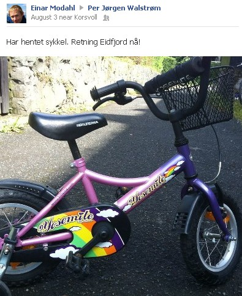
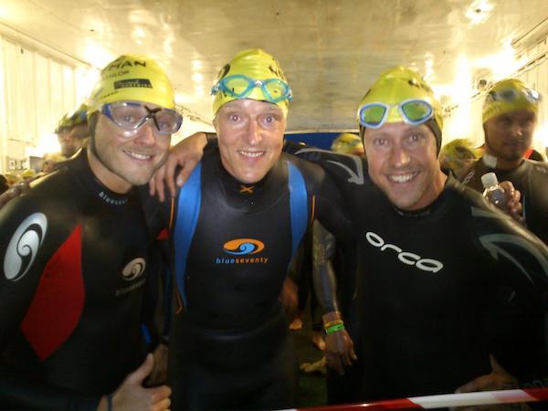
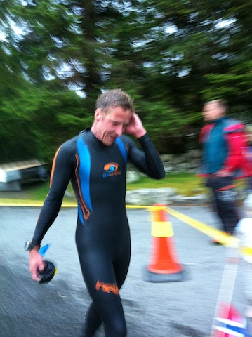
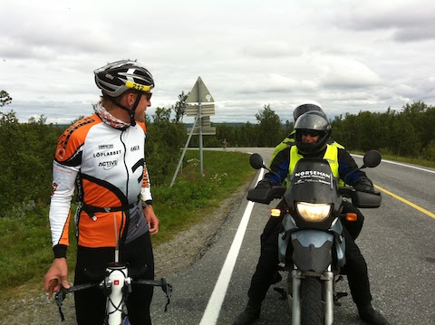
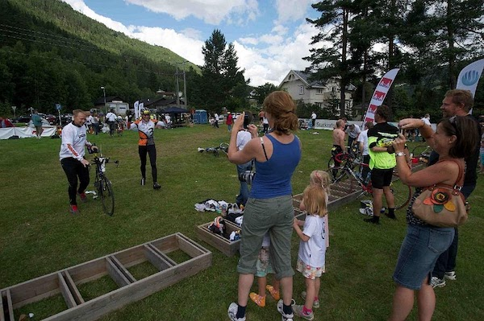
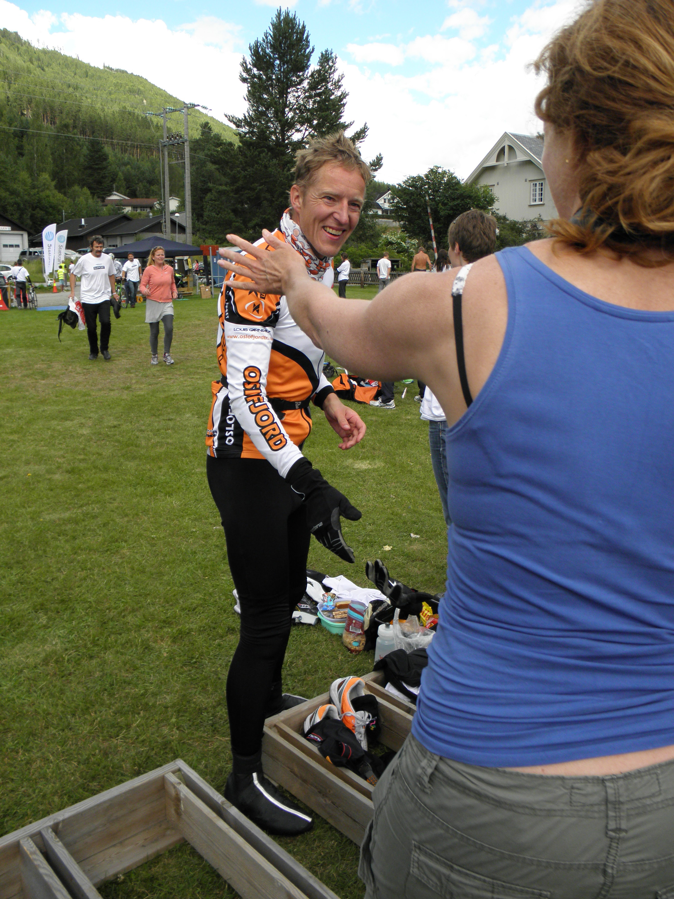
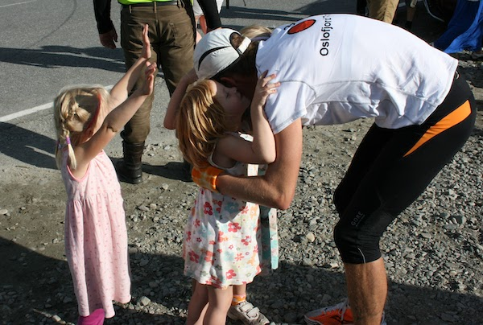
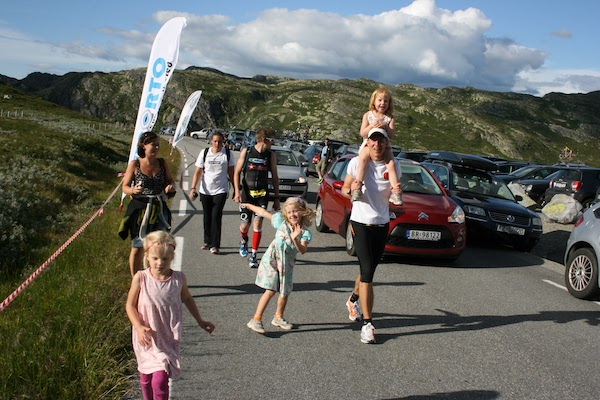
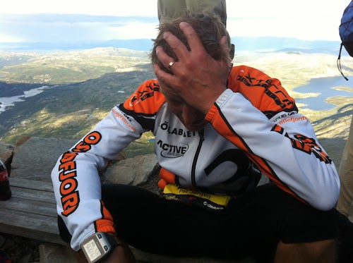
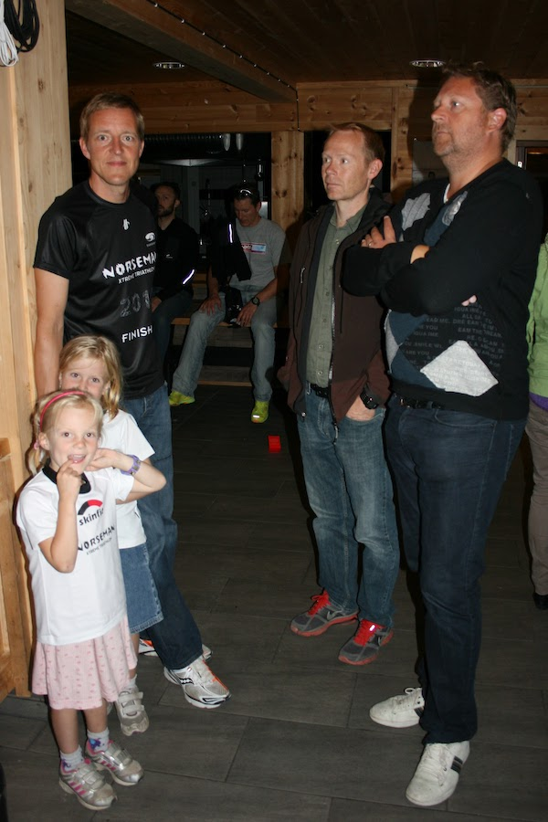

# Race Report Norseman 2012
Jeg ankom egentlig Eidfjord allerede den 4. november 2011. Det var den kvelden jeg mottok en e-post med tittelen “We welcome You to Norseman 2012”. Siden den tid har Norseman alltid vært et sted i tankene mine. 9 måneder er lang tid, og det er fristende å skrive noe om svangerskap, men jeg nøyer meg med å si at nå er det over, nå kan jeg komme tilbake til det vanlige livet igjen, nå er ego-trippen slutt. Med tre barn i barnehagealder har det vært utfordrende å få dette til å gå rundt. Familieliv er ikke helt forenlig med langtur på sykkel en søndag formiddag. Jeg har spurt meg selv mange ganger om det virkelig er verdt det. Bare for å tilfredsstille mitt ego, bare for å kunne ikle meg en svart t-skjorte? Trening er sunt, mestring er bra, å ha et mål med treningen er motiverende. Men det finnes grenser. 

9 måneder etter nevnte e-post ankom jeg også fysisk i Eidfjord. Tog Oslo-Geilo, deretter buss Geilo-Eidfjord torsdag formiddag. På bussen klarte jeg å glemme mobiltelefonen og en luring plukka den opp og begynte å poste meldinger i mitt navn på Facebook. “Nå skal det bli godt med en skikkelig grøftefyll!” stod det. I mitt navn. På Facebook. Sånn i ettertid ser jeg humoren i det, men der og da ble jeg litt stressa av at en ukjent person hadde full tilgang til telefonen min og alle tilknytta kontoer. Da han til slutt skrev “Heia Brann!” var det nok. Fikk tak i ham og han lovet å levere telefonen et sted jeg kunne hente den. Vet ikke om det var en del av spøken, men den endte opp på en thai-restaurant i Odda. Og det var ikke helt enkelt å få eieren av restauranten til å sende den hjem til meg. Først da jeg lovet å ta med hele familien på Odda-ferie og spise thai-mat hele uka, sa han seg villig å hjelpe meg. Så da er sommerferien neste år i boks, for et avgitt løfte må holdes.

Torsdag og fredag i Eidfjord var hyggelig og avslappende. Mange kjente folk og mye å snakke om. Jeg brukte en månedslønn i butikken til Kaja og hadde gode dager. Deltok på svømmesamlingen på fredag og oppdaget at 13,5 grader i vannet ikke var så ille som jeg hadde fryktet. Pre-race ble gjennomført på en meget profesjonell måte av Kalle og co og et par timer etter ankom endelig Raymond og Einar, mitt eget vakre og fantastiske support-team. De hadde fått i oppdrag å hente sykkelen min, men tidligere meldinger sådde tvil om deres sykkelhentingskompetanse. Alt så dog ut til å være i den skjønneste orden og jeg pustet lettet ut. Vi hadde mye å snakke om og planlegge for morgendagen og selskapet var som nektar for sommerfuglene i magen. Målsetningen og planen var klar: å være blant de 160 første etter 32,5 km løping og dermed få lov til å fortsette til toppen av fjellet. Det fantes ingen Plan B.

Jeg prøvde å legge meg rundt 22, men det var jo OL og håndballkamp på TV. Norge - Danmark, tror jeg det var. Og Raymond er over gjennomsnittet interessert i håndball og måtte få med seg kampen. Hadde full forståelse for dette og vi inngikk et kompromiss der TV’en var på og lyden var av. Så da lå jeg der og slumret da, bare avbrutt av Rays lavmælte banning og sparking i senga hver gang Danmark scoret eller Norge misset. Jeg lå og småhumra for meg selv og tenkte at disse gutta er jeg så utrolig glad i. Og at de gjør dette sammen med meg betyr mye. Jeg hadde lyst til å gå bort til Raymond og gi ham en klem der i gjenskinnet fra TV’en, men avstod i frykt for enda mer banning. Fikk med meg at Norge vant med ett mål og tenkte at det var et godt tegn. Sovna etter det og sov en 3-4 timer før klokka ringte 02:40. 

Hjelp! Hva skjer? Det var veldig fristende å trykke “Snooze” akkurat der og da. Late som ingenting, sove over hele greia og gå inn i historien som han som forsov seg til Norseman. Vurderte det seriøst, men tenkte at jeg ville få kjeft av både Einar og Raymond. At mamma ville gråte bitre tårer over sin udugelige sønn og at Oda ville få et forklaringsproblem i barnehagen. Så som den pliktoppfyllende mann jeg er, stod jeg opp, dytta i meg et par brødskiver og la i vei ned mot kaia. Einar ble med meg, mens Raymond lå og sov og drømte om håndballpiker.

Da jeg var support for Einar i 2009, fikk jeg lov til å være med på ferga ut. Så jeg hadde vært med før, visste hva det handlet om. Hadde visualisert den fergeturen inne i hodet mitt så mange ganger. Hadde stått nervøs i dokø, hadde stått på kanten, hadde hoppa i vannet, hadde flydd en runde over båten, hadde blitt stående igjen på kanten, hadde sunket i vannet og blitt spist av en hai. Dette øyeblikket visste jeg var dagens mest kritiske. Klarte jeg dette, klarte jeg alt. For her er det på sin plass å avsløre at jeg har et snev av høydeskrekk, er ganske så mørkeredd og lider av sterk vannskrekk. Ikke takler jeg kulde noe særlig bra heller. Så hvem i huleste hadde kommet på at jeg skulle hoppe fra en båt ut i en kald og mørk fjord!? Midt på natten! Det eneste som manglet, var at noen kom fram og krevde at jeg plutselig skulle gi blod. For er det noe jeg frykter mer enn høyder, mørket og vann, er det sprøyter og sprøytestikk. Jeg kan besvime om jeg ser en sprøyte. En synål gjør meg svimmel. Jeg begynte å tenke at det mystiske dokumentet jeg underskrev dagen før, “Release from Liability” eller hva det nå het, at det dokumentet egentlig var en erklæring som godkjente blodgivning på ferga før start. At det skulle utføres forskning og jeg var valgt ut til å hjelpe verden fremover. Forskning som utvilsomt skulle utføres av det samme teamet som ønsket å utsette meg for gastroskopi etter endt Oslo maraton for en del år siden. Og Raymond hadde skrevet under på det dokumentet også! Han skulle liksom være min venn, så går han bak min rygg og donerer kroppen min til forskning! Jeg bestemte meg for å ta en alvorsprat med Raymond om jeg overlevde dette. Han skulle få høre det!

På ferga var det heldigvis kjente fjes. Øyvind, Martin og Trude var der. Takk for at dere var der. Dere var en stor dose Prozac rett i våtdrakta. Trude nevnte at hun hadde tippa Øyvind som nummer tre på dagens konkurranse. Vi lo alle litt av det. Pallen, liksom?

Tiden går fort når man har det hyggelig og plutselig var det 10 minutter til start. Baugen var åpen og vannet kalte. Vannet var Sauron og jeg var ringen. Jeg lot meg lokke, jeg lot meg lure. Nærmere og nærmere kanten. Mordor, Dommedagsbergets glødende masser, Saurons vrede. Men det var flere enn meg som var ukomfortable; like foran meg var det en kvinnelig deltager som ropte at hun ikke turte. En fra crewet, jeg tror det var Espen L, forsikret henne om at dette kom til å gå bra, at hun skulle holde på svømmebrillene og hoppe. Det hjalp, og hun hoppet. Det hun ikke så, men som jeg tydelig så, var at Espen stod klar med blodgiverutstyret sitt. Og han var på vei mot meg. Valget var lett. Her skulle det ikke ofres en dråpe blod, og jeg svevde ut i vannet. Eller sveve er kanskje ikke det riktige ordet. Flakse er nok mer beskrivende. Det deles heldigivs ikke ut stilpoeng i hopp fra baug under Norseman.

13,5 grader i vannet er egentlig ikke så ille når man har våtdrakt på. Lammelse i ansikt og hender det første minuttet, deretter bare et stikkende ubehag som lett lar seg avfeie når man har en fjord som ramme rundt seg. For et fint sted å være. Jeg er tilstede i øyeblikket, jeg er her og nå. Jeg er en del av noe større og jeg føler meg viktig. Viktig for meg selv, for support, for familien, for alle som tror på meg og som følger meg og som deler denne drømmen med meg. Zen and the Art of Jumping Off a Ferry. Dette har jeg venta på, dette har jeg trent for så lenge og det er nå det skjer. En av disse stundene i livet der alt er på plass og ingenting kan gå galt. Jeg nynner litt på “Just i dag är jag stark” og vet at dette blir en fin dag. Jeg gleder meg til å svømme, til å treffe Einar og Raymond i skiftesonen, til å fly over Hardangervidda til familien som venter i T2, til å ta fatt på Zombie Hill og til å hilse på toppen. Jeg vet alt blir bra. Jeg er klar.

Men det er dessverre et flyktig øyeblikk og virkeligheten innhenter meg igjen. Jeg hadde snakka med Hårek dagen før om hans opplevelse av Runner’s High, og kjente at dette var i samme gate. Men der Hårek hadde opplevd et par timer med lykke og styrke, begrenset min opplevelse seg til kanskje et par minutter. Tvilen kom sigende tilbake, men den fikk ikke slå rot, for plutselig kom signalet om at det hele var i gang. 

Og da var det egentlig bare å legge på svøm og gjøre det beste ut av det. Jeg tenkte at det fikk bære eller briste. Uansett så er jo svømmingen bare en liten oppvarming for det som senere skulle komme. Og svømmingen på Norseman er egentlig ganske grei. Navigering går av seg selv siden det bare er å følge stranden hele veien. Og ikke er det noe mas i vannet heller, til det er antallet deltagere for få. Så da jeg sjangla på land etter 1:20 var jeg fortsatt ved godt mot, men kald som krokanis i følge Einar. Ikke klarte jeg å snakke, ikke klarte jeg å gå rett, ikke klarte jeg å kle hverken av eller på meg. Hadde svømt med ørepropper for å forhindre det kalde vannet å sive inn i ørene mine og påvirke balansenerven, men svimmel var jeg allikevel. Jeg måtte ha hjelp til det meste og jeg fikk en fremtidsvisjon av meg selv på gamlehjemmet; stiv, sta, gretten og ikledd neopren. Pleiernes skrekk og de andre pasientenes plage. Heldigvis forsvant visjonen og jeg var tilbake i skiftesonen. Ble heiet på av Morten og Sindre på vei ut. Mitt hode var ikke på plass og jeg ropte til Sindre og spurte hvorfor han stod der og ikke her og skiftet sammen med meg. Han skulle jo være med og det tok noen sekunder før jeg kom på at det ikke var før dagen etter han skulle i ilden. Jeg var forvirret, jeg var kald og jeg var på vei ut på 18 mil sykling. 

Opp Måbødalen ble jeg syklet forbi av mange. Tim kom susende forbi litt for tidlig. Vi hadde blitt enige om at han skulle ta meg igjen på syklingen, og så kunne jeg ta ham igjen på løpingen. Ihvertfall så var jeg enig i at jeg skulle ta ham igjen på løpingen. Men allerede nå? Etter én times sykling? Tim fløy opp bakkene og jeg ante at han hadde noe på gang. Det var det siste jeg så til ham i dag, tenkte jeg, og studerte bakken foran meg enda mer inngående. For det ble omfattende studier av asfalt denne dagen. Veldig varierende er den asfalten. Både i farge, mønster og grovhet. Visste ikke at det var så spennende å se ned i bakken så lenge, men det er det altså. Fosser, vidder, fjell og landskap kan gå og legge seg. Det er asfalt som gjelder. Her får øynene ro, hvile og balsam.

Ute i buskene lurte plutselig Dag med et kamera og jeg begynte å nynne på Barry Manilow. Jeg trodde han lekte gjemsel og ropte og vinket for å vise at jeg hadde sett ham. Dag senket kameraet og sa noe om at han ikke tok bilder av folk som prøvde å gjøre seg til. Jeg forbannet meg selv og tenkte at der røyk muligheten for å bli Norseman cover-boy. Ingen five minutes of fame denne gangen heller.

Jeg forbannet sykkelen og min manglende sykkelevne også. Hadde jeg hatt en barberhøvel innen rekkevidde, hadde jeg gått av sykkelen og barbert beina der og da. Jeg så for meg at jeg kunne kutte en sykkeltime eller to med det grepet. Men så kom jeg til å tenke på The Brownlees. Triatlonbrødrene fra Leeds som ikke barberer beina i frykt for nærmiljøets reaksjon. Og jeg fant ut at jeg var helt på linje med The Brownlees her. “You just can’t walk around with shaven legs on the mean streets of Ullevål Hageby”. Ikke hadde jeg barberhøvel heller.

På Dyranut stod Raymond og Einar. Jeg fikk påfyll av mat og drikke og fikk byttet litt klær. Hadde tenkt å spørre om jeg kunne få ta på meg den sexy underbuksa mi med leopardmønster utenpå sykkelbuksa, men skjønte at dens aerodynamiske egenskaper var begrensede og jeg lot det være. Jeg ga til gjengjeld Raymond en skyllebøtte for det der med blodgivningen og forsikret ham om at dette ikke ville bli glemt. Hvorpå han ga meg en PowerBar i hånda og ønsket meg god tur videre. Jeg forundret meg over hans manglende evne til anger og bestemte meg for at den påfølgende alvorspraten skulle bli veldig alvorlig.

Jeg syklet som en vind til Geilo og tok igjen et par hundre stykker. Etter mine beregninger måtte jeg være i ledelsen da jeg passerte Geilo. Stor var derfor overraskelsen da jeg så en syklist som kom ut fra parkeringen på Hotell Vestlia. Hva hadde han gjort der inne? Der hadde jeg vært på bryllup en gang og visste at hotellets eier var innehaver av en av verdens viktigste Munch-samlinger i privat eie. Jeg hadde spist middag i samme sal som både Madonna, To kvinner ved stranden, Syk pike og Angst. Jeg fikk en plutselig trang til å svinge innom og hilse på Angst. Hei du Angst, her er jeg. Husker du meg? Jeg har vært her før, men jeg var ikke alene da. Nå er jeg alene, men det gjør ikke så mye. Jeg har ikke så veldig mye å snakke med deg om, så det får bli en annen gang. Sånn gikk tankene og før jeg visste ordet av det så traff jeg bakken opp til Kikut. Og alle de to hundre som jeg hadde syklet forbi til Geilo syklet forbi meg igjen. Og sånn gikk det opp og ned, opp og ned. Det var morsomt i utforkjøringene og jeg hadde opp mot 80 km/t. Jeg syntes bilene var sinker og hadde jeg hatt ringeklokke, hadde de fått høre den. 

På Dagali var det stopp og mer påfyll av mat og drikke. Jeg gikk ut i grøfta og latet vannet og da jeg snudde meg stod jammen en Race Marshall der. Han hadde en stor blinkende sheriffstjerne på MC-vesten. Jeg gikk ut i grøfta og gjemte meg igjen, for jeg tenkte at her ble det både gule og røde kort og utvisning og skam. Men det kom ingen kort og jeg våget meg nærmere. Det viste seg at det var Øystein G som hadde lyst til å slå av en prat. Han var en meget blid dommer og kunne fortelle at han ikke hadde fått vist det gule kortet sitt en eneste gang. Han ønsket meg god tur videre og kom med oppmuntrende ord. Hadde det vært opp til meg, hadde vi satt oss ned i veikanten og drukket en kopp te og spist butterkjeks, men Raymond og Einar maste og jeg gikk motvillig på sykkelen igjen.

Så var det Imingfjell da. Det er en lang bakke. Nederst i bakken satt et par lokale, eldre herremenn som knegga og lo da jeg spurte om det var langt til toppen og de fikk anledning til å fortelle meg at det bare var 7 km. Jaja, jeg tenkte at kommer jeg meg opp denne bakken, så er det meste gjort. Da er det nedover til T2 og jeg er i praksis i mål på toppen her. Jeg sjekka girspakene for å se om det kanskje hadde sneket seg inn et enda lettere gir siden siste bakke, men det hadde det dessverre ikke. Det gikk tungt og det gikk treigt. Raymond og Einar stod midt i bakken og jeg fikk skryt for at jeg kjørte fornuftig og tok det rolig i oppoverbakkene. De skulle bare visst. Jeg viste sprøytetegn til Raymond og skulte olmt på ham. Han så ut som et spørsmålstegn og jeg skjønte at sprøytetegnet nok var litt utydlig med sykkelhansker på. 

Et par hundre syklister sykla forbi meg opp mot Imingfjell og i følge mine beregninger lå jeg nå helt sist. Det var litt deprimerende. Ikke hjalp det at Barry Manilow kom snikende inn fra sidelinjen igjen heller.

Så bakken opp til Imingfjell er 7 km. Men det er jo ikke akkurat flatt etter det heller. På toppen venter nemlig 10 km slakt oppover over vidda. Det er tunge kilometer for de som tror de er på toppen. Men belønningen kommer raskt etter det. De siste 30 km til skiftesonen er nedover. På grusomme, teleødelagte veier går det fort og farlig utfor. Her gjelder det å holde seg fast til sykkelen mens vannflasker og annet løst gods forsvinner bak deg på veien. Jeg tror mine indre organer ikke helt var forberedt på dette og flere av dem protesterte høylytt. “Hjelp!” ropte nyrene. “Nåde!” ropte hjertet. “Fortere!” ropte hjernen. Eller det som var igjen av hjernen, for den hadde gått på sparebluss noen mil nå og reptiltilstanden var ikke langt borte. Jeg var primitiv, udødelig og hadde et viktig stevnemøte i T2. Ingenting kunne stoppe meg og jeg syklet forbi et par tusen. Snart måtte jeg ha tatt igjen fjorårets deltagere, tenkte jeg. Jeg opphevet både tyngdekraften og jeg reiste i tiden. 

Jeg nærmet meg T2 med stormskritt og da jeg kunne skimte Tinnsjøen der fremme, tok jeg steget ut av Twilight Zone og tilbake inn i virkeligheten. Jeg gledet meg til å gå av sykkelen og få på meg løpeskoene. Og jeg gledet meg til å treffe familie og venner i T2. En hel delegasjon stod og ventet på meg da jeg kom inn i T2 og jeg var blid som en sol. Hanne og barna var der og jeg fikk noen sårt etterlengtede klemmer fra de som står meg nærmest.

 

I T2 skjedde forøvrig en underlig ting. En deltager som stod ved siden av meg hadde ankommet før sitt eget support-team. Han fikk låne en telefon og etter en liten stund dukket support-teamet opp. Bare for å oppdage at de ikke hadde med joggesko. Det er greit at Norseman er tøft, men joggesko må man ha. Du kan ikke løpe barbeint opp til Gaustatoppen. Heldigvis hadde jeg både ekstra sko og sokker. Og heldigvis passet de sånn noenlunde. Sånn endte det opp at jeg hadde to par sko som gikk opp på Gaustatoppen den dagen. For i lånte sko kom han til toppen. Og det er vel ikke å avsløre for mye at jeg kom meg til toppen etterhvert selv også.

Ut fra T2 var jeg rundt nummer 110 og jeg var ganske sikker på å klare å være blant de 160 første ved 32,5 km løping. Min plan var å løpe de første 25, for deretter å spasere til toppen i de tunge bakkene fra 25 og opp. Det gikk helt greit fram til 20 og jeg tok igjen veldig mange løpere. Holdt rundt 4:45 per km og det føltes behagelig. Ved 20 ble det nok, og km-tidene gikk opp, men jeg klarte å komme meg til bunnen av Zombie Hill med æren i behold. Den siste kilometeren inn mot Zombie Hill, hadde jeg selskap med Trude. Vi småskravlet litt og ble enige om at vi hadde nok margin til svart trøye. 

Jeg nådde Zombie Hill i god tid til barne-tv. Det var smågodt på matstasjonen, cola fra support og klemmer fra de små. Skulle hatt litt popcorn også, men det at jeg nå ikke trengte å løpe lenger men kunne hengi meg til spasering lindret savnet etter popcorn. Det var godt å slutte å løpe. Jeg så Trude forsvinne opp bakken, snart var hun bare en liten prikk i det fjerne. Kanskje hun hadde fått popcorn? Jeg bannet litt for meg selv og sverget på at neste gang skulle jeg ha popcorn i Zombie Hill. Neste gang?

Opp Zombie Hill begynte Einar å mase om at jeg måtte huske navnet mitt til legesjekken ved 32,5 km. Jeg avfeide det hele med at navnet mitt jo stod på nummerlappen. Om de ikke kunne lese ved 32,5 så var ikke det mitt problem. “Men etternavnet da, mann”, sa Einar. “Etternavnet må du huske”. Jeg gikk motvillig med på at han nok hadde et poeng og gikk inn i meg selv for full konsentrasjon. Dypt inne i meg et sted visste jeg at etternavnet mitt lå. Jeg fant det et fjernt sted og tok det med ut og viste det stolt til Einar. Det virket ikke som om han ble særlig imponert, for snart var han i gang igjen. “Da jeg var med på Norseman”, sa Einar, “da var det Jørgen Melau som stod for legesjekken ved 32,5. Og du kødder ikke med Jørgen Melau”! Nei, jeg sa meg enig i det. Du kødder ikke med Jørgen Melau. “Og på legesjekken da”, sa Einar, “da krevde Jørgen at jeg måtte ta i bakken med strake bein”. Jeg ymtet litt spakt at det kunne jeg ikke huske. Jeg minnet ham på at det var jeg som var support den gang og om han hadde hatt henda i bakken med strake bein, så hadde jeg jammen husket det. Det var Einars tur til å avfeie og jeg begynte å tvile. Javel, tenkte jeg, er det sånn det skal ende? Jeg går glipp av svart trøye fordi jeg er stiv som en stokk. Nå får jeg ta regninga for at jeg har forsømt min åpenbare plikt til å utføre yoga og pilates. Hadde jeg en god dag, rakk jeg kanskje litt ned på leggen, men helt i bakken? Nei, det gikk ikke. Jeg var fortapt og Angst kom krypende opp ved siden av meg. Sinnet ble mørkt og 32,5 nærmet seg faretruende. En sving til, så var vi der. Jeg prøvde å tøye litt i den svingen, prøvde å strekke meg framover, prøvde å få armene til å bli lengre. Jeg følte meg som departementsråd i Silly Walks, men ante at det hjalp lite.

Jørgen var ikke der. Han var ikke å se noe sted ved 32,5. Jeg så i øyekroken at Einar gliste bredt. Og jeg tror jeg gliste bredt selv også. “Skal dere ikke spørre hva jeg heter”, ropte jeg til sekretariatet. “HÆ!? Spør meg hva jeg heter da vel!” Men det ville de ikke. De mente at jeg så ut til å være i fin form, så det var bare å fortsette opp mot fjellet. Move along. Jeg må innrømme at jeg ble litt skuffa over at ingen ville vite det fine navnet mitt, men samtidig så ufattelig glad for å få lov til å gå 10 km til opp på et fjell. Jeg ville klemme noen, men det var ingen innenfor en radius av én meter og lenger orket jeg ikke å strekke meg, så jeg lot det hele fare. Nå var det fjellet som gjaldt.

Vi tuslet videre, Einar og jeg. Raymond møtte oss halvveis opp til Stavsro og fortalte at han allerede hadde sjekket inn sekkene våre. Det var bare å plukke dem opp og vandre oppover. For en service, tenkte jeg. Opp mot Gaustatoppen på Business Class. Vi tok igjen Martin med følge og skravla litt med dem på vei oppover. Vi var alle enige om at det var en fin dag. Sola skinte og alle var glade.

På Stavsro stod jentene mine igjen. Det var overraskende og fint. Nye klemmer og lykkeønskninger. Jeg var sterk og spurtet litt fram og tilbake med Nina på skuldrene. Hanne tittet bekymret på og var nok ikke helt trygg på stødigheten min. 

Sekkene stod der Raymond hadde lovet, og vi tok fatt på veien mot toppen. Det var som sagt en fin dag, så det var mange i fjellet. Mange som heiet og mange som ga oppmuntrende ord underveis. Vi fløy opp fjellet og før vi visste ordet av det, var vi på toppen. Einar holdt seg i bakgrunnen og jeg fikk krysse mållinjen alene. For å nyte øyeblikket og motta ære og berømmelse.

Å krysse mållinjen er egentlig ikke så mye å skrive hjem om. Javisst, jeg var glad og fornøyd, men det var ingen eufori eller seiersdans. Jeg gikk og satte meg ned på en stein og tenkte at det var det. Been there, done that. Av alle følelser, var nok lettelse den sterkeste akkurat der og da. Lettelse over å ha klart det, lettelse over at det var over, lettelse over at livet kunne vende tilbake, lettelse over å ikke skuffe.

Jeg fant dog raskt ut at dette ikke var et sted å være så alt for lenge. Jeg ville ned og dele dagen med de andre. Og jeg ville ned og pusse tenna. Er det noe du er klar for etter 14 timer med å dytte i deg søte drikker og søt mat, er det tannpuss.

Inne på turisthytta fant vi Trude, som hadde forsvunnet som en rakett opp bakken etter at vi var sammen ved inngangen til Zombie Hill. Hun hadde stått for en fantastisk prestasjon og blitt nummer 4 blant kvinnene. Vi ble enige om at vi skulle komme oss ned sammen. Jeg var så oppspilt og innstilt på å komme meg til Gaustabanen at jeg nesten løp fra Trude ned til inngangen. Beklager det, Trude, jeg var litt ute av meg sjæl.

Banen ned var spektakulær. Dypt inne i fjellet, mørk og trang. Det var en fin og verdig avslutning på konkurransen og det var en merkelig stemning i vogna. Har endorfiner lukt? Jeg tror det. Det er en blanding av svette, sportsdrikk, fukt, tilfredshet og svovel. 

Nede ventet Raymond. Vi hadde alvorspraten i bilen tilbake til Gaustablikk. Jeg sa at det var greit, vi kunne sette en strek over det med sprøytene, for makan til venner skulle man lete lenge etter. Jeg ble sentimental og jeg var mer takknemlig enn jeg klarte å gi uttrykk for. Vi ga hverandre en klem og var sentimentale og nære begge to.

Det ble etterhvert mange klemmer med alle som hadde gjort dette mulig for meg. Hanne og jentene. Raymond og Einar. Hele Norseman-crewet burde også fått en. Noen ganger er ikke ord nok. Noen ganger må det klemmer til.

